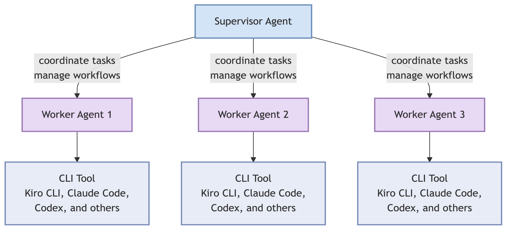
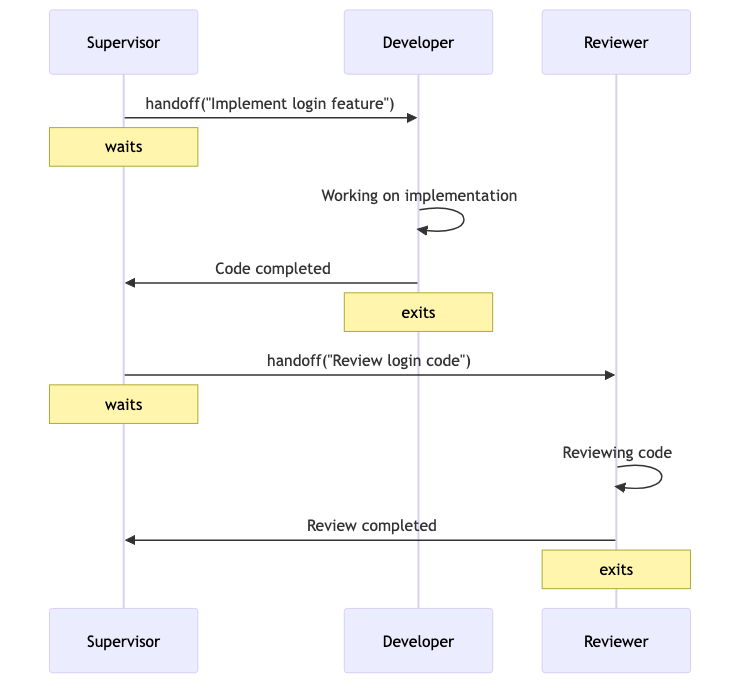
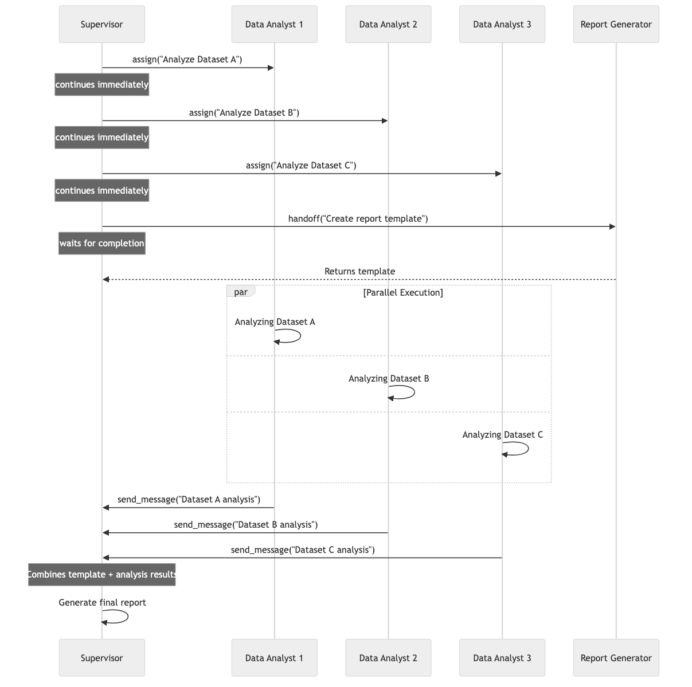
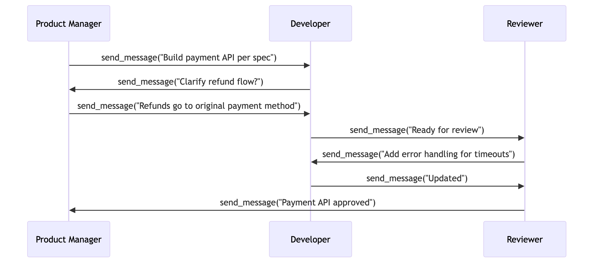

# CLI Agent Orchestrator

[](https://deepwiki.com/BSTester/cli-agent-orchestrator)

CLI Agent Orchestrator（CAO，读作 “kay-oh”）是一套轻量级编排系统，用于在 tmux 终端中管理多个 AI Agent 会话，通过 MCP server 实现多智能体协作。

## 分层多智能体系统

CLI Agent Orchestrator (CAO) 采用分层多智能体体系结构，让专长明确的 CLI 开发者 Agent 分工协作，解决复杂问题。



### 关键特性

* **分层编排**：监督者 Agent 负责调度工作流并把任务分派给专门的工作 Agent，在保持全局上下文的同时让各 Agent 聚焦其领域。
* **会话隔离**：每个 Agent 在独立 tmux 会话中运行，通过 MCP server 实现安全的消息和状态同步，既能并行也能协调。
* **智能分派**：按需求、专长和依赖将任务路由给合适的 Agent，三种编排模式灵活切换：
    - **Handoff**：同步移交并等待完成
    - **Assign**：异步派工并行执行
    - **Send Message**：向现有 Agent 直接通信
* **灵活工作流**：可在顺序编排和并行执行间自由切换，兼顾开发效率与质量。
* **Flow 定时运行**：基于 cron 的定时编排，自动完成例行或监控任务。
* **上下文控制**：监督者只传递必要上下文，避免信息污染同时保持协同。
* **直接干预**：用户可直接与工作 Agent 交互，实时纠偏与补充指令。
* **高级 CLI 集成**：支持各类开发者 CLI 的高级特性，如 Claude Code 的 [sub-agents](https://docs.claude.com/en/docs/claude-code/sub-agents)、Amazon Q Developer CLI 的 [Custom Agent](https://docs.aws.amazon.com/amazonq/latest/qdeveloper-ug/command-line-custom-agents.html) 等。

项目结构与架构细节见 [CODEBASE.md](CODEBASE.md)。

## 控制面板三层架构

CAO 提供面向浏览器的控制面板层，形成 Next.js → 控制面板 → CAO Server 的三层结构：

* **Next.js 前端（端口 3000，目录 `frontend/`）**：渲染 UI，并通过 `/api/cao/[...path]` 路由将浏览器请求代理到控制面板；使用 `CAO_SERVER_URL`（默认 `http://localhost:8000`）配置目标。
* **FastAPI 控制面板（端口 8000，命令 `cao-control-panel`）**：处理 CORS、健康检查并把请求转发到后端，可通过 `CONTROL_PANEL_HOST`、`CONTROL_PANEL_PORT`、`CAO_SERVER_URL` 配置。
* **CAO Server（端口 9889，命令 `cao-server`）**：负责终端生命周期、会话管理和消息路由。

完整运行方式与生产注意事项见 [ARCHITECTURE.md](ARCHITECTURE.md)。

## 安装

### 环境需求

- **Python 3.10 或更高版本** — 见 [pyproject.toml](pyproject.toml)
- **tmux 3.3+** — 提供 Agent 会话隔离
- **[uv](https://docs.astral.sh/uv/)** — 快速的 Python 包与虚拟环境管理工具

### 1. 安装 Python 3.10+

若尚未安装，可用系统包管理器：

```bash
# macOS (Homebrew)
brew install python@3.12

# Ubuntu/Debian
sudo apt update && sudo apt install python3.12 python3.12-venv

# Amazon Linux 2023 / Fedora
sudo dnf install python3.12
```

验证版本：

```bash
python3 --version   # 需 ≥ 3.10
```

> **提示：** 推荐使用 [uv](https://docs.astral.sh/uv/) 管理虚拟环境与 Python 版本，避免系统级安装带来的干扰。

### 2. 安装 tmux（需 3.3+）

```bash
bash <(curl -s https://raw.githubusercontent.com/BSTester/cli-agent-orchestrator/refs/heads/main/tmux-install.sh)
```

### 3. 安装 uv

```bash
curl -LsSf https://astral.sh/uv/install.sh | sh
```

### 4. 安装 CLI Agent Orchestrator

```bash
uv tool install git+https://github.com/BSTester/cli-agent-orchestrator.git@main --upgrade
```

### 本地开发

克隆仓库并安装依赖：

```bash
git clone https://github.com/BSTester/cli-agent-orchestrator.git
cd cli-agent-orchestrator/
uv sync             # 创建 .venv/ 并安装依赖
uv run cao --help   # 校验安装
```

开发流程、测试与代码质量检查见 [DEVELOPMENT.md](DEVELOPMENT.md)。

## 前置准备

在使用 CAO 前，需安装至少一个受支持的 CLI Agent 工具：

| Provider | 文档 | 认证方式 |
|----------|------|----------|
| **Kiro CLI**（默认） | [Provider docs](docs/kiro-cli.md) · [Installation](https://kiro.dev/docs/kiro-cli) | AWS 凭证 |
| **Claude Code** | [Provider docs](docs/claude-code.md) · [Installation](https://docs.anthropic.com/en/docs/claude-code/getting-started) | Anthropic API Key |
| **Codex CLI** | [Provider docs](docs/codex-cli.md) · [Installation](https://github.com/openai/codex) | OpenAI API Key |
| **Q CLI** | [Installation](https://docs.aws.amazon.com/amazonq/latest/qdeveloper-ug/command-line.html) | AWS 凭证 |
| **Qoder CLI** | [Installation](https://www.npmjs.com/package/@qoder-ai/qodercli) | Qoder 账号/令牌 |
| **OpenCode CLI** | [Installation](https://opencode.ai/docs/cli/) | 模型提供商凭证 |
| **CodeBuddy CLI** | [CLI docs](https://www.codebuddy.ai/docs/cli/cli-reference) | CodeBuddy 账号/令牌 |
| **GitHub Copilot CLI** | [Getting started](https://docs.github.com/en/copilot/how-tos/copilot-cli/cli-getting-started) | GitHub Copilot 权限 |

## 快速开始

### 1. 安装 Agent 配置

安装监督者（负责分派任务的编排 Agent）：

```bash
cao install code_supervisor
```

可选安装额外工作 Agent：

```bash
cao install developer
cao install reviewer
```

也可从本地文件或 URL 安装：

```bash
cao install ./my-custom-agent.md
cao install https://example.com/agents/custom-agent.md
```

自定义 Agent 配置详见 [docs/agent-profile.md](docs/agent-profile.md)。

### 2. 启动后端

```bash
cao-server
```

### 3. 启动监督者

在另一终端运行：

```bash
cao launch --agents code_supervisor

# 指定 Provider
cao launch --agents code_supervisor --provider kiro_cli
cao launch --agents code_supervisor --provider claude_code
cao launch --agents code_supervisor --provider codex
cao launch --agents code_supervisor --provider qoder_cli
cao launch --agents code_supervisor --provider opencode
cao launch --agents code_supervisor --provider codebuddy
cao launch --agents code_supervisor --provider copilot

# 跳过工作区信任确认
cao launch --agents code_supervisor --yolo
```

监督者会按需协调并派发任务给工作 Agent（developer、reviewer 等），应用上述编排模式。

### 4. 关闭会话

```bash
# 关闭全部 CAO 会话
cao shutdown --all

# 关闭指定会话
cao shutdown --session cao-my-session
```

### tmux 会话小抄

所有 Agent 都运行在 tmux 中，常用命令：

```bash
# 列出所有会话
tmux list-sessions

# 附着会话
tmux attach -t <session-name>

# 断开（tmux 内）
Ctrl+b, 然后 d

# 切换窗口（tmux 内）
Ctrl+b, 然后 n          # 下一个窗口
Ctrl+b, 然后 p          # 上一个窗口
Ctrl+b, 然后 <number>   # 跳转到编号窗口（0-9）
Ctrl+b, 然后 w          # 窗口列表

# 删除会话
cao shutdown --session <session-name>
```

**窗口列表（Ctrl+b, w）：**


## MCP 工具与编排模式

CAO 提供本地 HTTP 服务处理编排请求，CLI Agent 通过 MCP 工具与之交互。

### 工作方式

每个 Agent 终端都会分配唯一的 `CAO_TERMINAL_ID`，服务端依此：

- 路由 Agent 间消息
- 追踪终端状态（IDLE、PROCESSING、COMPLETED、ERROR）
- 通过收件箱管理终端间通信
- 协调整体编排操作

当 Agent 调用 MCP 工具时，服务端会根据 `CAO_TERMINAL_ID` 识别调用方并执行编排。

### 编排模式

三种编排模式：

> **说明：** 所有模式都可在设置 `CAO_ENABLE_WORKING_DIRECTORY=true` 后使用可选的 `working_directory` 参数，详见 [Working Directory Support](#working-directory-support)。

**1. Handoff** —— 同步移交并等待完成

- 创建带指定 Agent 配置的新终端
- 发送任务消息并等待完成
- 将结果返回给调用方
- 完成后自动退出 Agent
- 适用于需要同步结果的场景

示例：串行代码评审流程



**2. Assign** —— 异步派工并行执行

- 创建带指定 Agent 配置的新终端
- 携带回调指令发送任务
- 立即返回终端 ID
- Agent 在后台继续工作
- 完成后通过 `send_message` 把结果发回监督者
- 若监督者忙碌消息会排队（常见于并行场景）
- 适合异步或 fire-and-forget 任务

示例：监督者并行分派数据分析任务，同时串行生成报告模板，最后汇总结果。

完整示例见 [examples/assign](examples/assign)。



**3. Send Message** —— 与现有 Agent 通信

- 向指定终端的收件箱发送消息
- 消息在终端空闲时递送
- 便于 Agent 间持续协作
- 常用于多 Agent 动态协同（swarm）
- 适合迭代反馈或多轮对话

示例：多角色协作开发



### 自定义编排

`cao-server` 默认运行在 `http://localhost:9889`，提供会话管理、终端控制与消息 API。CLI 命令（`cao launch`、`cao shutdown`）及 MCP 工具（`handoff`、`assign`、`send_message`）都是对这些 API 的包装。

可将上述三种模式自由组合，或基于底层 API 构建全新编排以适配你的场景。

完整 API 文档见 [docs/api.md](docs/api.md)。

## Flows - 定时 Agent 会话

Flows 基于 cron 表达式自动运行 Agent 会话。

### 前置条件

先安装需要使用的 Agent 配置：

```bash
cao install developer
```

### 快速体验

示例 Flow：每天 7:30 AM 询问一条世界趣闻。

```bash
# 1. 启动 cao server
cao-server

# 2. 在另一终端添加 flow
cao flow add examples/flow/morning-trivia.md

# 3. 查看计划与状态
cao flow list

# 4. 手动运行（可选，用于测试）
cao flow run morning-trivia

# 5. 查看执行结果（运行后）
tmux list-sessions
tmux attach -t <session-name>

# 6. 完成后清理
cao shutdown --session <session-name>
```

**重要：** 需要保持 `cao-server` 运行，Flow 才能按计划执行。

### 示例 1：简单定时任务

静态提示、定期运行（无需脚本）：

**文件：`daily-standup.md`**

```yaml
---
name: daily-standup
schedule: "0 9 * * 1-5"  # 工作日早 9 点
agent_profile: developer
provider: kiro_cli  # 可选，默认 kiro_cli
---

Review yesterday's commits and create a standup summary.
```

### 示例 2：带健康检查的条件执行

监控服务，仅在异常时执行：

**文件：`monitor-service.md`**

```yaml
---
name: monitor-service
schedule: "*/5 * * * *"  # 每 5 分钟
agent_profile: developer
script: ./health-check.sh
---

The service at [[url]] is down (status: [[status_code]]).
Please investigate and triage the issue:
1. Check recent deployments
2. Review error logs
3. Identify root cause
4. Suggest remediation steps
```

**脚本：`health-check.sh`**

```bash
#!/bin/bash
URL="https://api.example.com/health"
STATUS=$(curl -s -o /dev/null -w "%{http_code}" "$URL")

if [ "$STATUS" != "200" ]; then
  # 服务异常，执行 Flow
  echo "{\"execute\": true, \"output\": {\"url\": \"$URL\", \"status_code\": \"$STATUS\"}}"
else
  # 服务正常，跳过
  echo "{\"execute\": false, \"output\": {}}"
fi
```

### Flow 命令

```bash
# 添加 flow
cao flow add daily-standup.md

# 列出所有 flow（含计划、下次运行时间、启用状态）
cao flow list

# 启用/禁用 flow
cao flow enable daily-standup
cao flow disable daily-standup

# 手动运行（忽略计划）
cao flow run daily-standup

# 移除 flow
cao flow remove daily-standup
```

## 工作目录支持

CAO 支持在移交/派工时指定工作目录。默认关闭以避免 Agent 臆造路径。

配置与用法详见 [docs/working-directory.md](docs/working-directory.md)。

## 安全

安全报告、扫描与最佳实践见 [SECURITY.md](SECURITY.md)。

## 贡献

贡献指南见 [CONTRIBUTING.md](CONTRIBUTING.md)。

## 许可证

本项目基于 Apache-2.0 许可证。
