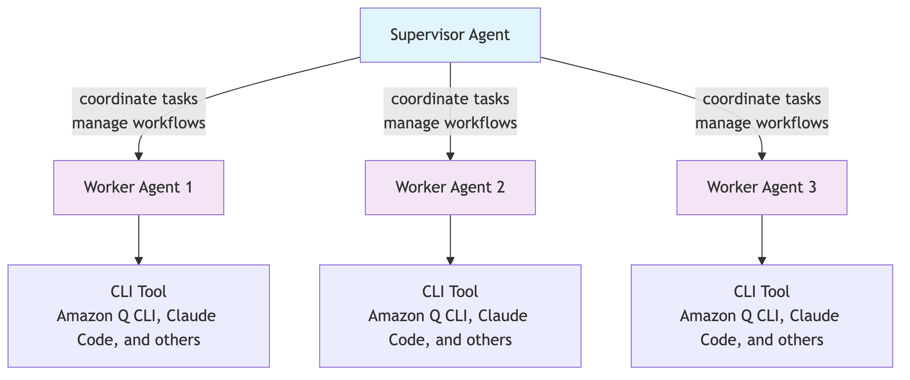
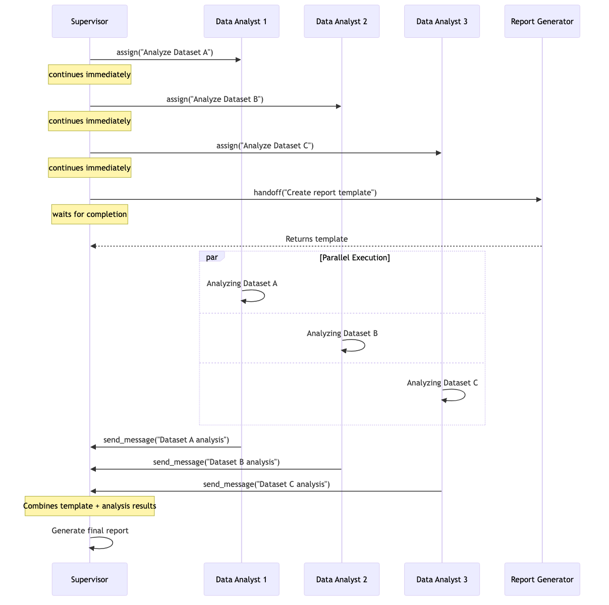

# CLI Agent Orchestrator

[](https://deepwiki.com/awslabs/cli-agent-orchestrator)

CLI Agent Orchestrator(CAO, pronounced as "kay-oh"), is a lightweight orchestration system for managing multiple AI agent sessions in tmux terminals. Enables Multi-agent collaboration via MCP server.

## Hierarchical Multi-Agent System

CLI Agent Orchestrator (CAO) implements a hierarchical multi-agent system that enables complex problem-solving through specialized division of CLI Developer Agents.



### Key Features

* **Hierarchical orchestration** – CAO's supervisor agent coordinates workflow management and task delegation to specialized worker agents. The supervisor maintains overall project context while agents focus on their domains of expertise.
* **Session-based isolation** – Each agent operates in isolated tmux sessions, ensuring proper context separation while enabling seamless communication through Model Context Protocol (MCP) servers. This provides both coordination and parallel processing capabilities.
* **Intelligent task delegation** – CAO automatically routes tasks to appropriate specialists based on project requirements, expertise matching, and workflow dependencies. The system adapts between individual agent work and coordinated team efforts through three orchestration patterns:
    - **Handoff** - Synchronous task transfer with wait-for-completion
    - **Assign** - Asynchronous task spawning for parallel execution  
    - **Send Message** - Direct communication with existing agents
* **Flexible workflow patterns** – CAO supports both sequential coordination for dependent tasks and parallel processing for independent work streams. This allows optimization of both development speed and quality assurance processes.
* **Flow - Scheduled runs** – Automated execution of workflows at specified intervals using cron-like scheduling, enabling routine tasks and monitoring workflows to run unattended.
* **Context preservation** – The supervisor agent provides only necessary context to each worker agent, avoiding context pollution while maintaining workflow coherence.
* **Direct worker interaction and steering** – Users can interact directly with worker agents to provide additional steering, distinguishing from sub-agents features by allowing real-time guidance and course correction.
* **Advanced CLI integration** – CAO agents have full access to advanced features of the developer CLI, such as the [sub-agents](https://docs.claude.com/en/docs/claude-code/sub-agents) feature of Claude Code, [Custom Agent](https://docs.aws.amazon.com/amazonq/latest/qdeveloper-ug/command-line-custom-agents.html) of Amazon Q Developer for CLI and so on.

For detailed project structure and architecture, see [CODEBASE.md](CODEBASE.md).

## Installation

### Requirements

- **Python 3.10 or higher** — CAO requires Python >=3.10 (see [pyproject.toml](pyproject.toml))
- **tmux 3.3+** — Used for agent session isolation
- **[uv](https://docs.astral.sh/uv/)** — Fast Python package installer and virtual environment manager

### 1. Install Python 3.10+

If you don't have Python 3.10+ installed, use your platform's package manager:

```bash
# macOS (Homebrew)
brew install python@3.12

# Ubuntu/Debian
sudo apt update && sudo apt install python3.12 python3.12-venv

# Amazon Linux 2023 / Fedora
sudo dnf install python3.12
```

Verify your Python version:

```bash
python3 --version   # Should be 3.10 or higher
```

> **Note:** We recommend using [uv](https://docs.astral.sh/uv/) to manage Python environments instead of system-wide installations like Anaconda. `uv` automatically handles virtual environments and Python version resolution per-project.

### 2. Install tmux (version 3.3 or higher required)

```bash
bash <(curl -s https://raw.githubusercontent.com/awslabs/cli-agent-orchestrator/refs/heads/main/tmux-install.sh)
```

### 3. Install uv

```bash
curl -LsSf https://astral.sh/uv/install.sh | sh
```

### 4. Install CLI Agent Orchestrator

```bash
uv tool install git+https://github.com/awslabs/cli-agent-orchestrator.git@main --upgrade
```

### Development Setup

For local development, clone the repo and install with `uv sync`:

```bash
git clone https://github.com/awslabs/cli-agent-orchestrator.git
cd cli-agent-orchestrator/
uv sync          # Creates .venv/ and installs all dependencies
uv run cao --help  # Verify installation
```

For development workflow, testing, code quality checks, and project structure, see [DEVELOPMENT.md](DEVELOPMENT.md).

## Prerequisites

Before using CAO, install at least one supported CLI agent tool:

| Provider | Documentation | Authentication |
|----------|---------------|----------------|
| **Kiro CLI** (default) | [Provider docs](docs/kiro-cli.md) · [Installation](https://kiro.dev/docs/kiro-cli) | AWS credentials |
| **Claude Code** | [Provider docs](docs/claude-code.md) · [Installation](https://docs.anthropic.com/en/docs/claude-code/getting-started) | Anthropic API key |
| **Codex CLI** | [Provider docs](docs/codex-cli.md) · [Installation](https://github.com/openai/codex) | OpenAI API key |
| **Q CLI** | [Installation](https://docs.aws.amazon.com/amazonq/latest/qdeveloper-ug/command-line.html) | AWS credentials |

## Quick Start

### 1. Install Agent Profiles

Install the supervisor agent (the orchestrator that delegates to other agents):

```bash
cao install code_supervisor
```

Optionally install additional worker agents:

```bash
cao install developer
cao install reviewer
```

You can also install agents from local files or URLs:

```bash
cao install ./my-custom-agent.md
cao install https://example.com/agents/custom-agent.md
```

For details on creating custom agent profiles, see [docs/agent-profile.md](docs/agent-profile.md).

### 2. Start the Server

```bash
cao-server
```

### 3. Launch the Supervisor

In another terminal, launch the supervisor agent:

```bash
cao launch --agents code_supervisor

# Or specify a provider
cao launch --agents code_supervisor --provider kiro_cli
cao launch --agents code_supervisor --provider claude_code
cao launch --agents code_supervisor --provider codex

# Skip workspace trust confirmation
cao launch --agents code_supervisor --yolo
```

The supervisor will coordinate and delegate tasks to worker agents (developer, reviewer, etc.) as needed using the orchestration patterns.

### 4. Shutdown

```bash
# Shutdown all cao sessions
cao shutdown --all

# Shutdown specific session
cao shutdown --session cao-my-session
```

### Working with tmux Sessions

All agent sessions run in tmux. Useful commands:

```bash
# List all sessions
tmux list-sessions

# Attach to a session
tmux attach -t <session-name>

# Detach from session (inside tmux)
Ctrl+b, then d

# Switch between windows (inside tmux)
Ctrl+b, then n          # Next window
Ctrl+b, then p          # Previous window
Ctrl+b, then <number>   # Go to window number (0-9)
Ctrl+b, then w          # List all windows (interactive selector)

# Delete a session
cao shutdown --session <session-name>
```

**List all windows (Ctrl+b, w):**


## MCP Server Tools and Orchestration Modes

CAO provides a local HTTP server that processes orchestration requests. CLI agents can interact with this server through MCP tools to coordinate multi-agent workflows.

### How It Works

Each agent terminal is assigned a unique `CAO_TERMINAL_ID` environment variable. The server uses this ID to:

- Route messages between agents
- Track terminal status (IDLE, PROCESSING, COMPLETED, ERROR)
- Manage terminal-to-terminal communication via inbox
- Coordinate orchestration operations

When an agent calls an MCP tool, the server identifies the caller by their `CAO_TERMINAL_ID` and orchestrates accordingly.

### Orchestration Modes

CAO supports three orchestration patterns:

> **Note:** All orchestration modes support optional `working_directory` parameter when enabled via `CAO_ENABLE_WORKING_DIRECTORY=true`. See [Working Directory Support](#working-directory-support) for details.

**1. Handoff** - Transfer control to another agent and wait for completion

- Creates a new terminal with the specified agent profile
- Sends the task message and waits for the agent to finish
- Returns the agent's output to the caller
- Automatically exits the agent after completion
- Use when you need **synchronous** task execution with results

Example: Sequential code review workflow


**2. Assign** - Spawn an agent to work independently (async)

- Creates a new terminal with the specified agent profile
- Sends the task message with callback instructions
- Returns immediately with the terminal ID
- Agent continues working in the background
- Assigned agent sends results back to supervisor via `send_message` when complete
- Messages are queued for delivery if the supervisor is busy (common in parallel workflows)
- Use for **asynchronous** task execution or fire-and-forget operations

Example: A supervisor assigns parallel data analysis tasks to multiple analysts while using handoff to sequentially generate a report template, then combines all results.

See [examples/assign](examples/assign) for the complete working example.



**3. Send Message** - Communicate with an existing agent

- Sends a message to a specific terminal's inbox
- Messages are queued and delivered when the terminal is idle
- Enables ongoing collaboration between agents
- Common for **swarm** operations where multiple agents coordinate dynamically
- Use for iterative feedback or multi-turn conversations

Example: Multi-role feature development


### Custom Orchestration

The `cao-server` runs on `http://localhost:9889` by default and exposes REST APIs for session management, terminal control, and messaging. The CLI commands (`cao launch`, `cao shutdown`) and MCP server tools (`handoff`, `assign`, `send_message`) are just examples of how these APIs can be packaged together.

You can combine the three orchestration modes above into custom workflows, or create entirely new orchestration patterns using the underlying APIs to fit your specific needs.

For complete API documentation, see [docs/api.md](docs/api.md).

## Flows - Scheduled Agent Sessions

Flows allow you to schedule agent sessions to run automatically based on cron expressions.

### Prerequisites

Install the agent profile you want to use:

```bash
cao install developer
```

### Quick Start

The example flow asks a simple world trivia question every morning at 7:30 AM.

```bash
# 1. Start the cao server
cao-server

# 2. In another terminal, add a flow
cao flow add examples/flow/morning-trivia.md

# 3. List flows to see schedule and status
cao flow list

# 4. Manually run a flow (optional - for testing)
cao flow run morning-trivia

# 5. View flow execution (after it runs)
tmux list-sessions
tmux attach -t <session-name>

# 6. Cleanup session when done
cao shutdown --session <session-name>
```

**IMPORTANT:** The `cao-server` must be running for flows to execute on schedule.

### Example 1: Simple Scheduled Task

A flow that runs at regular intervals with a static prompt (no script needed):

**File: `daily-standup.md`**

```yaml
---
name: daily-standup
schedule: "0 9 * * 1-5"  # 9am weekdays
agent_profile: developer
provider: kiro_cli  # Optional, defaults to kiro_cli
---

Review yesterday's commits and create a standup summary.
```

### Example 2: Conditional Execution with Health Check

A flow that monitors a service and only executes when there's an issue:

**File: `monitor-service.md`**

```yaml
---
name: monitor-service
schedule: "*/5 * * * *"  # Every 5 minutes
agent_profile: developer
script: ./health-check.sh
---

The service at [[url]] is down (status: [[status_code]]).
Please investigate and triage the issue:
1. Check recent deployments
2. Review error logs
3. Identify root cause
4. Suggest remediation steps
```

**Script: `health-check.sh`**

```bash
#!/bin/bash
URL="https://api.example.com/health"
STATUS=$(curl -s -o /dev/null -w "%{http_code}" "$URL")

if [ "$STATUS" != "200" ]; then
  # Service is down - execute flow
  echo "{\"execute\": true, \"output\": {\"url\": \"$URL\", \"status_code\": \"$STATUS\"}}"
else
  # Service is healthy - skip execution
  echo "{\"execute\": false, \"output\": {}}"
fi
```

### Flow Commands

```bash
# Add a flow
cao flow add daily-standup.md

# List all flows (shows schedule, next run time, enabled status)
cao flow list

# Enable/disable a flow
cao flow enable daily-standup
cao flow disable daily-standup

# Manually run a flow (ignores schedule)
cao flow run daily-standup

# Remove a flow
cao flow remove daily-standup
```

## Working Directory Support

CAO supports specifying working directories for agent handoff/delegation operations. By default this is disabled to prevent agents from hallucinating directory paths.

For configuration and usage details, see [docs/working-directory.md](docs/working-directory.md).

## Security

See [SECURITY.md](SECURITY.md) for vulnerability reporting, security scanning, and best practices.

## Contributing

See [CONTRIBUTING.md](CONTRIBUTING.md) for guidelines on contributing to this project.

## License

This project is licensed under the Apache-2.0 License.