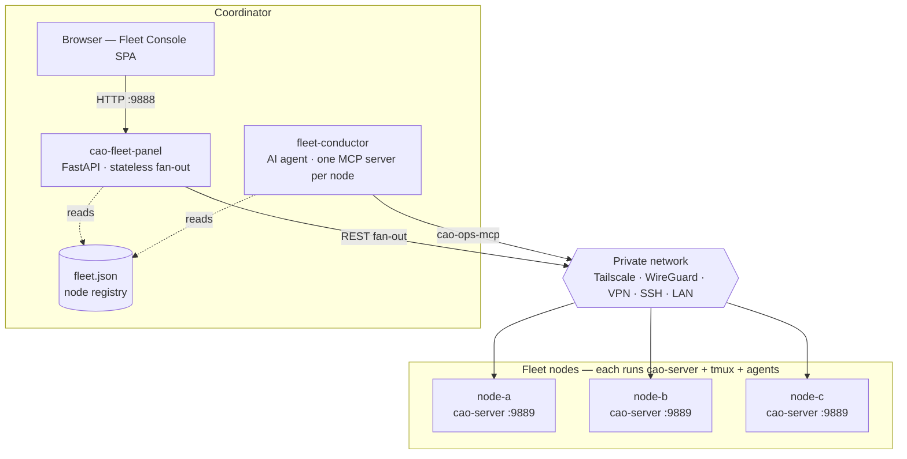
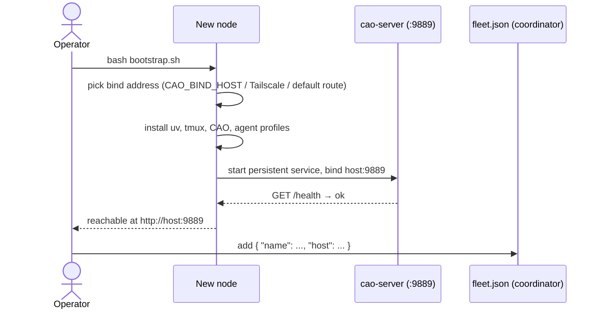
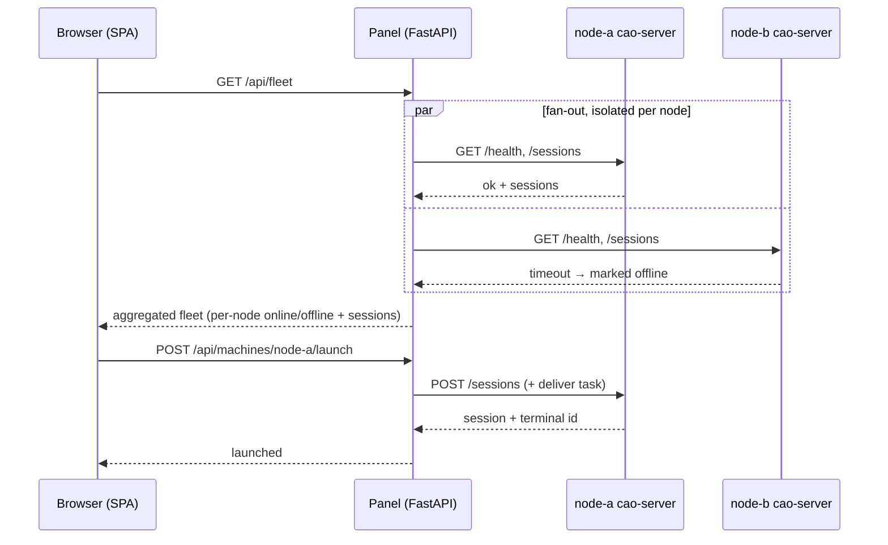
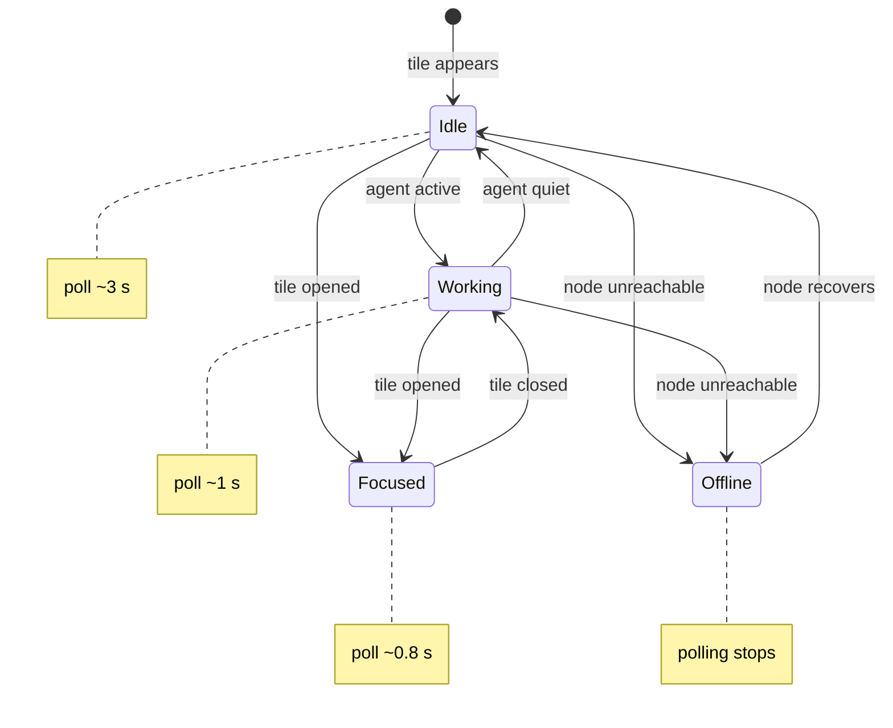
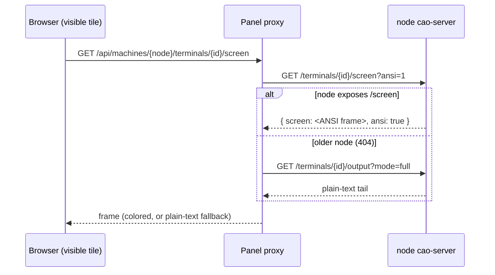
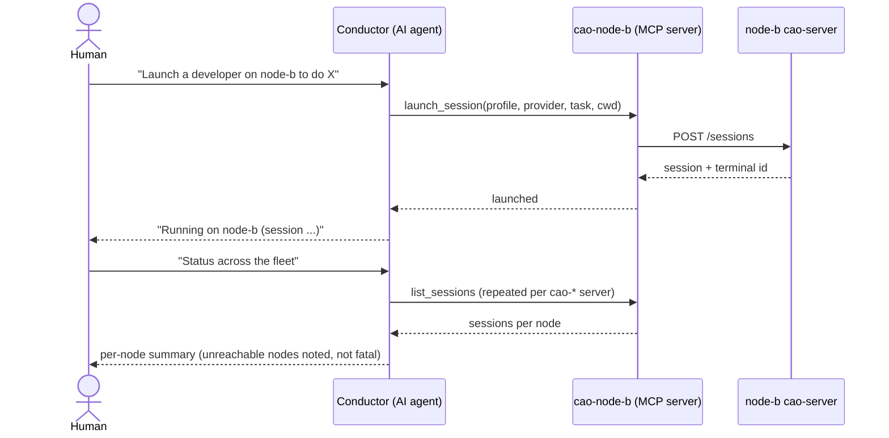

# Fleet coordinator — cross-node CAO

Run one CAO node per machine and coordinate the whole fleet from a single place.
This guide explains the architecture, the execution flows, and how to operate it.
The runnable code lives in [`examples/fleet/`](../examples/fleet/); this document is
the "why and how." It is the reference for issue
[#349](https://github.com/awslabs/cli-agent-orchestrator/issues/349).

- [What it is](#what-it-is)
- [Architecture](#architecture)
- [Execution flows](#execution-flows)
  - [1. Node bootstrap](#1-node-bootstrap)
  - [2. Web panel fan-out](#2-web-panel-fan-out)
  - [3. Live console screen mirror](#3-live-console-screen-mirror)
  - [4. AI conductor](#4-ai-conductor)
- [The node registry](#the-node-registry)
- [Transport and security](#transport-and-security)
- [Operate it](#operate-it)

## What it is

CAO already coordinates many agents on **one** machine (a supervisor delegating to
tmux-isolated workers). This layer coordinates many **CAO nodes**: each machine runs
its own `cao-server`, and a coordinator observes and commands all of them — node
health, installed providers, active sessions, and task delegation — without you
SSH-ing into every host.

Nothing about a node's local behavior changes. The coordinator is a thin, **stateless
client** of each node's existing HTTP API; there is no new database, no agent state on
the coordinator, and no change to how a node runs its own agents.

## Architecture

Two coordinator surfaces, one shared node registry, one shared per-node API:

- **Web panel** (`examples/fleet/panel/`) — a FastAPI app that fans out to every
  node's `cao-server` REST API and serves a browser SPA (a wall of live agent
  screens + a focused console).
- **AI conductor** (`examples/fleet/bin/fleet-conductor`) — a Claude Code agent
  wired to one `cao-ops-mcp` server per node, so one AI can drive the fleet in
  natural language.

Both read the same `fleet.json` (the node registry) and talk to the same
`cao-server` HTTP API on each node. Both are stateless: restart them any time.



## Execution flows

### 1. Node bootstrap

`deploy/bootstrap.sh` turns a fresh machine into a fleet node with one command. It is
transport-agnostic: it picks a bind address from `CAO_BIND_HOST`, then a Tailscale IP
if present, then the default-route IP — and binds `cao-server` there.



### 2. Web panel fan-out

The panel is a **stateless proxy**. `GET /api/fleet` fans out to every node
concurrently and **isolates failures per node** — an offline or slow node is reported
`offline`, never a 500 for the whole fleet. Control actions (launch, message,
shutdown) proxy straight through to the target node's `cao-server`.



### 3. Live console screen mirror

Click a tile and the console mirrors that agent's **rendered CLI screen** (colors,
spinners, boxes), like glancing at a `tmux attach`. The browser polls only visible
tiles, at a cadence tied to their state, through the stateless panel proxy — no SSE
multiplexer. Nodes that expose the `/screen` primitive return a colored ANSI frame;
older nodes fall back to the plain-text `/output` tail, so no tile is ever blank.



The screen poll itself is a two-hop proxy with graceful degradation:



### 4. AI conductor

The conductor is an AI agent given one MCP management surface per node.
`render-mcp-config.py` turns `fleet.json` into `conductor/.mcp.json`, where a node
named `node-b` becomes the MCP server `cao-node-b`. You then ask the conductor, in
plain language, to observe or act — and it calls the right node's tools.



## The node registry

`fleet.json` is the single source of truth for both surfaces. Copy
`fleet.example.json` to `fleet.json` (git-ignored) and list your nodes:

```json
{
  "port": 9889,
  "machines": [
    { "name": "node-a", "host": "100.64.0.11", "label": "coordinator",  "role": "central" },
    { "name": "node-b", "host": "100.64.0.12", "label": "worker-linux",  "role": "agent" },
    { "name": "node-c", "host": "100.64.0.13", "label": "worker-macos",  "role": "agent" }
  ]
}
```

- **`host`** is any address the coordinator can reach the node at — a Tailscale or
  WireGuard IP, a VPN or LAN IP, or a DNS name. (The example values are placeholders
  in the reserved `100.64.0.0/10` CGNAT range; replace them with your own.)
- **`port`** defaults to `9889` (CAO's server port) and can be overridden per node.
- **`name`** is how you refer to the node in `caoctl`, the panel, and the conductor.

## Transport and security

- **Any private network works.** The coordinator only needs to reach each node at
  `host:port`. Tailscale, WireGuard, a VPN, an SSH tunnel, or a trusted LAN are all
  fine — the transport is your choice, not a requirement of this example.
- **The network is the trust boundary.** Each node's `cao-server` is bound to its
  private-network address and its `CAO_ALLOWED_HOSTS`. **Do not expose a node's port
  to the public internet.** There is no per-request auth in this example; anyone who
  can reach the port can command the node.
- **Least privilege.** Run `cao-server` as a user that has only the agent access you
  intend. The raw PTY-attach WebSocket stays loopback-only by CAO's design; the
  coordinator uses the higher-level REST surface (message + a fixed set of control
  keys), not arbitrary keystroke injection.

## Operate it

Full setup is in [`examples/fleet/README.md`](../examples/fleet/README.md). In short:

```bash
# 1. On each machine — become a fleet node:
bash examples/fleet/deploy/bootstrap.sh

# 2. On the coordinator — register nodes:
cd examples/fleet && cp fleet.example.json fleet.json    # then edit

# 3a. Drive with the AI conductor:
python3 bin/render-mcp-config.py && bin/fleet-conductor

# 3b. …or the web panel:
cd panel && uv sync && uv run cao-fleet-panel            # http://127.0.0.1:9888
```

Ad-hoc, from the shell:

```bash
examples/fleet/bin/caoctl --list
examples/fleet/bin/caoctl node-b session list
```
