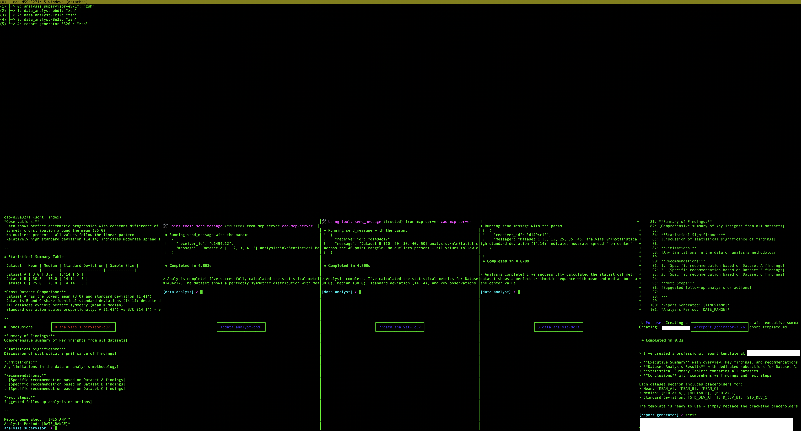

# Working with tmux Sessions

All CAO agent sessions run in tmux. You can attach directly to a session to watch or interact with agents in real time.

## Useful commands

```bash
# List all sessions
tmux list-sessions

# Attach to a session
tmux attach -t <session-name>

# Detach from session (inside tmux)
Ctrl+b, then d

# Switch between windows (inside tmux)
Ctrl+b, then n          # Next window
Ctrl+b, then p          # Previous window
Ctrl+b, then <number>   # Go to window number (0-9)
Ctrl+b, then w          # List all windows (interactive selector)

# Delete a session (cleanly, via CAO)
cao shutdown --session <session-name>
```

## Interactive window selector

**List all windows (Ctrl+b, w):**



## Forwarding env vars to spawned agents

By default, only a tight allowlist of env vars (`HOME`, `PATH`, `SHELL`, plus `CAO_*` / `KIRO_*` / `MISE_*` / `AWS_*` prefixes) reaches agents spawned inside tmux. The filter keeps the `tmux new-session -e` argv under the kernel limit and prevents nested-session loops when CAO itself runs inside a provider.

To forward additional vars to **the supervisor and every worker spawned later in the same session** (via `assign` / `handoff` / the web UI), pass `--env KEY=VALUE` to `cao launch`:

```bash
cao launch --agents code_supervisor \
  --env MNEMOSYNE_DIR=/root/mnemosyne \
  --env ISAAC_CHANNEL=room:engineering
```

The flag is repeatable. Values travel in the request body, not the URL, so secrets do not land in cao-server's HTTP access log.

Rejected at the CLI boundary:

- Keys matching `CLAUDE` / `CODEX_` / `__MISE_` (reserved for provider auth — the 6 `CLAUDE_CODE_USE_*` / `CLAUDE_CODE_SKIP_*` auth flags are explicitly allowlisted).
- Keys outside `[A-Za-z_][A-Za-z0-9_]*` (non-POSIX names break the shell).
- Values ≥ 2048 bytes (per-var cap that keeps the tmux argv under the kernel limit — see PR #246).

Forwarded vars are held in process memory on cao-server and dropped when the session is deleted. Restarting cao-server wipes them. The tmux sessions themselves outlive the server process, but workers spawned in them afterwards start without the vars. To restore them, see [Re-hydrating after a cao-server restart](#re-hydrating-after-a-cao-server-restart).

### Re-hydrating after a cao-server restart

`cao session set-env` re-registers forwarded vars for a live session, so workers spawned in it from then on inherit them again. You do not need to recreate the session:

```bash
cao session set-env cao-my-task \
  MNEMOSYNE_DIR=/root/mnemosyne \
  ISAAC_CHANNEL=room:engineering
```

- **Merge-on-top.** Each `KEY=VALUE` overwrites that key and leaves every other key the server holds for the session in place. The command prints the key names the session now holds, never values.
- **Future workers only.** A terminal that is already running keeps the environment its tmux window was created with, and set-env does not change it.
- **Same delivery as `--env`.** Values travel in the request body, not the URL, so they stay out of cao-server's HTTP access log.

It is a thin client over `POST /sessions/{session_name}/env`, which external launchers can call directly. The endpoint takes the body `{"env_vars": {"KEY": "value", ...}}` and requires the `cao:write` or `cao:admin` scope when auth is enabled. The session name is the prefixed one, as everywhere else. Responses:

| Status | Meaning |
|---|---|
| `200` | Merged. Body: `{"session_name": ..., "env_keys": [...]}` (key names only). |
| `400` | An entry breaks a validation rule (see below), or the session name is invalid. Nothing is stored. |
| `404` | No such session. |
| `503` | tmux could not be read, so it is unknown whether the session exists. Retry. |

The endpoint validates with the same shared validator as `cao launch --env` and the ops-MCP tool (`utils/forwarded_env.py`), so it rejects the same keys and values rather than letting the server drop them silently at window creation. It adds two checks of its own:

- **Code-execution vectors are denied.** Setting a var on a running session changes what every later worker in it inherits, so this endpoint also rejects `LD_*` and `DYLD_*` (dynamic linker), `BASH_ENV`, `ENV`, `PROMPT_COMMAND` and `ZDOTDIR` (shell startup), `NODE_OPTIONS`, `PYTHONPATH`, `PYTHONSTARTUP`, `PERL5OPT` and `RUBYOPT` (interpreter injection), and `PATH`. This is a denylist of well-known vectors, not a security boundary. It cannot be exhaustive, and with auth disabled (the default) anyone who can reach the API already has shell-equivalent access. `cao launch --env` and `POST /sessions` do not apply it.
- **The merged map is bounded.** Merges accumulate across calls, so the 256-entry and 128 KiB argv limits also apply to the session's map after the merge.

### From the ops-MCP `launch_session` tool

An external agent driving CAO through the `cao-ops` MCP server forwards the same
vars via an `env_vars` mapping on `launch_session` — the identical mechanism,
validation, and request-body delivery as `cao launch --env`:

```python
launch_session(
    agent_profile="code_supervisor",
    env_vars={
        "MNEMOSYNE_DIR": "/root/mnemosyne",
        "ISAAC_CHANNEL": "room:engineering",
    },
)
```

The same three rules are enforced at the tool boundary — blocked
`CLAUDE` / `CODEX_` / `__MISE_` prefixes (with the 6 `CLAUDE_CODE_USE_*` /
`CLAUDE_CODE_SKIP_*` flags allowlisted), non-POSIX keys, and values ≥ 2048 bytes
— so an entry the server would silently drop fails the tool call loudly instead
of vanishing. The CLI and the ops-MCP tool share one validator
(`utils/forwarded_env.py`) so the two paths cannot drift.

## Notes

- CAO session names are automatically prefixed with `cao-`. Use the prefixed name (e.g. `cao-my-task`) when referencing a session in `tmux attach`, `cao session send`, or `cao shutdown`.
- Prefer `cao shutdown` over `tmux kill-session`: `cao shutdown` exits each provider cleanly before tearing down the tmux session, which avoids leaked CLI processes.
