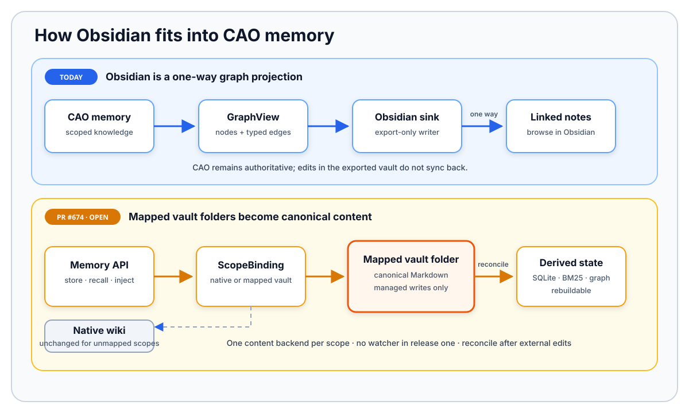

A coding agent can solve a hard problem. But its session is temporary. The next agent may
repeat the same investigation.

CAO memory gives agents a shared knowledge layer. It works across sessions, providers, and
models. It also gives operators clear control over scope and retention.

A useful memory system must answer five questions:

- Where does a fact apply?
- Who can read or change it?
- Which copy is authoritative?
- What happens when a write partly fails?
- Which facts should enter the prompt?

This post explains how CAO answers those questions. For commands and configuration, see the
[memory reference][memory-reference].

{/* truncate */}

> **Publication note:** This draft was checked against CAO commit `29b235cf`.
> PLACEHOLDER — replace or supplement that commit with the matching release before
> publication.

## Design constraints

CAO memory has five goals. It must be readable, searchable, scoped, recoverable, and small
enough for a prompt.

The base system stays local. It does not need embeddings, a remote database, or an LLM.
Those features can sit on top of the local store.

## Markdown content, SQLite state

CAO uses two stores:

```text
                         CAO memory
                             │
                ┌────────────┴────────────┐
                │                         │
        Markdown topic files             SQLite
        --------------------             ------
        article content                  scope identity
        timestamped entries              timestamps
        human-readable header            access counters
        rendered See Also links          provenance
                                         compilation state
                                         typed relationships
```

Markdown holds the content. Each topic has a stable key, a header, and timestamped entries.
An update adds a new entry to the same file.

SQLite holds query and lifecycle state. This includes timestamps, access counts,
provenance, token estimates, compilation state, and relationships.

The two stores have different authority:

| Concern | Authority |
| --- | --- |
| Topic text and history | Markdown |
| Search metadata and usage | SQLite |
| Relationship lifecycle and human decisions | SQLite |
| Human-readable index and `See Also` links | Generated views |

Some SQLite data can be rebuilt from Markdown. Some cannot. For example, a rejected
relationship is a human decision. That decision does not exist in the topic text.

This split keeps both paths simple. Humans can read the Markdown files. CAO can query
SQLite without parsing every article.

## Save first, organize later

A memory write follows this path:

```text
agent observation
       │
       ▼
validate scope, identity, and write policy
       │
       ▼
acquire a per-topic lock
       │
       ▼
write an append-form Markdown topic atomically
       │
       ├──────────▶ on eligible updates, schedule LLM compilation
       │
       ▼
update the Markdown index
       │
       ▼
upsert SQLite metadata
```

CAO writes to a temporary file first. It then replaces the topic file atomically. A
per-topic lock prevents two writers from losing each other's updates. The shared index has
its own lock.

A new topic does not use an LLM. An existing topic may use one when compile mode is `llm`.
The compiler can merge repeated entries and find related topics. This work runs in the
background. A slow model never blocks the initial save.

The compiler also checks for newer writes. It records the exact content that triggered the
job. Before publishing its result, it compares that content with the current file. If the
file changed, CAO drops the stale result.

The rule is simple: save the observation first. Improve its structure later.

## Partial writes are visible

The filesystem and SQLite cannot share one transaction. CAO handles that limit directly.

The topic file and Markdown index are written before SQLite metadata. If the SQLite write
fails, CAO raises `MemoryPartialWriteError`. The error includes the key, scope, file path,
and completed phases.

This tells the caller what happened. The content may already be safe on disk. Retrying the
same write could create a duplicate entry.

CAO can repair the missing projection. Reconciliation scans the topic files. It validates
their paths and headers. It then rebuilds missing metadata and index entries. It never
recreates topic content from SQLite.

## One memory contract across agents and providers

Scope belongs to CAO, not to a model or CLI. Switching from Kiro CLI to Claude Code or
Codex does not create a new project-memory store. A new agent can use the same eligible
memories.

A memory is identified by more than its key:

```text
(key, scope, scope_id)
```

CAO supports five scopes:

| Scope | Applies to | Retention |
| --- | --- | --- |
| `session` | One run | 14 days |
| `project` | One repository | 90 days |
| `global` | All projects | Permanent |
| `agent` | One agent profile | Permanent |
| `federated` | All projects on one machine | Permanent |

Memories of type `user` or `feedback` never expire. Cleanup runs when `cao-server` starts.
It is not a continuous background sweep.

Project, session, and agent scopes need an identity. CAO refuses the write if that identity
cannot be resolved. It does not fall back to a wider scope.

Project identity follows this order:

1. An explicit project ID.
2. A normalized Git remote.
3. `sha256(realpath(cwd))[:12]`.

The Git-based ID survives normal checkout moves. CAO also records a path-hash alias for
older stores. It never saves a raw remote URL because that URL may contain credentials.

Scope and type are separate. Scope says where a fact applies. Type says whether the fact is
a project note, user preference, correction, or reference.

## Put only useful memory in the prompt

CAO has two retrieval paths.

**Automatic injection** gives an agent a small starting set. It checks session, project,
and global memory in that order. Each scope gets at most ten entries and its own character
limit. Empty space from one scope is not reassigned to another.

CAO delivers the block in two ways. It updates the provider's project instructions. It also
prepends a `<cao-memory>` block to the first user message. This is a startup snapshot. It is
not updated on every turn.

**Explicit recall** searches beyond that snapshot. It supports metadata, BM25, and hybrid
search. Hybrid search returns metadata matches first. BM25 fills any remaining result slots.
Results can be sorted by recency, usage, or a combined score.

A successful recall may increase `access_count`. A failed counter update never blocks the
read.

CAO does not require embeddings. BM25 is local and predictable. It may miss a fact that uses
very different wording.

## Freeze memory for workflow replay

Memory can change a workflow's output. That makes memory an execution input.

Suppose a workflow reads a project rule today. The rule changes tomorrow. A replay should
not mix the old workflow inputs with the new rule.

CAO resolves memory once for a workflow run. It stores a redacted and size-limited copy in
the run manifest. The first run and every replay use those same bytes.

An empty stored block also has meaning. It says the original run saw no memory. A replay
must not fall back to the live store.

CAO saves the block before the terminal uses it. If that save fails, the run continues
without memory. This is safer than using context that cannot be reproduced.

## Keep relationships as governed data

CAO stores relationships as typed edges. It does not ask a model to rebuild the graph on
every read.

Each edge records:

- a type, such as `relates_to`, `contradiction`, or `supersedes`;
- an origin, such as `compiler`, `wiki_lint`, or `human`;
- a status, such as `active`, `proposal`, or `rejected`;
- optional confidence, rank, and evidence;
- the source memory's update time.

A producer can replace only its own edges. Compiler output cannot remove a human edge.
Rejected and deleted edges also survive recomputation.

CAO marks an edge stale when its source memory changes. A stale edge needs recomputation.
Reading it does not change it.

The Markdown `See Also` section is only a view of this graph. It is not another graph store.

CAO has two different promotion actions. Relationship promotion accepts a proposed edge.
Instruction promotion copies a lesson into an agent profile.

## Remote memory uses the same API

CAO uses local Markdown and SQLite by default. A distributed setup can point the same
operations at a memory API.

The API still uses terminal context to resolve scope. It also returns the same typed partial
write error. Without an API URL, CAO calls the local `MemoryService`.

The storage location changes. The memory contract does not.

## Treat import and export as boundaries

OKF export scans topic text and history for credential patterns. A matching topic is skipped
unless redaction is requested. The CLI needs `--include-private` for session or agent
memory. The HTTP endpoint refuses those scopes.

Import treats every bundle as untrusted. The operator chooses the target scope. CAO checks
paths and keys. It rejects path escapes and symlinks. It removes imported `See Also` views.
Accepted content goes through `MemoryService.store()`.

OKF is portable, but it is not a full backup. It does not keep scope IDs, UUIDs, usage
counts, provenance, or relationship decisions.

The exported files are a read-only mirror. CAO does not merge edits from that mirror back
into the live store.

The Markdown store is readable by design. It is not a secrets manager. Credentials belong
in a dedicated secrets system.

## How the opt-in learning loop works

CAO does not learn from every conversation. Learning is opt-in. A supervisor starts each
step of the loop.

```text
validated work
     │
     ▼
report_outcome ──▶ workflow_outcomes (SQLite)
                          │
                          ▼
supervisor hands off to the retrospector prompt
                          │
               list_outcomes + memory_recall
                          │
                          ▼
store_lesson ──▶ worker's agent-scope feedback memory
                          │
                   explicit recall
                          │
                          ▼
optional reviewed promotion ──▶ profile ## Learned Patterns
```

The flow has five steps:

1. A supervisor records an outcome after validation. The record contains success, an
   optional score, and short friction notes. It does not contain a transcript.
2. The supervisor hands work to the retrospector. This does not happen automatically at
   session end.
3. The retrospector reads outcomes and checks existing lessons. Its prompt asks for a short,
   reusable lesson. It also asks for an `Applies when:` trigger. These are prompt rules, not
   proof that the lesson is correct.
4. `store_lesson` writes the lesson to the worker's `agent` scope as `feedback`. A caller
   needs the `store_lesson` capability to write into another agent's scope.
5. The worker recalls the lesson later. Recall can increase `access_count`. After three
   recalls by default, the operator can review a promotion plan.

An unpromoted agent lesson requires explicit recall. The automatic injection path currently
uses only session, project, and global memory.

Promotion copies the lesson into the profile's `## Learned Patterns` block. It does not
delete the original memory. The operator must review the change like any other system
prompt update.

Recall count is only a rough signal. It shows that the lesson was used again. It does not
prove that the lesson improved quality. Use real benchmarks when they exist.

## Costs and savings

A good memory can replace repeated work. The agent may avoid another code search, document
read, web search, or user question. This can save tool calls, tokens, and time.

Memory also has costs:

- Markdown and SQLite need reconciliation after a partial write.
- BM25 can miss facts that use different words.
- Automatic injection can become stale during a long session.
- A stored fact can be wrong.
- More injected lessons use more prompt space.
- OKF does not preserve every internal field.

The useful comparison is simple. Is storing and checking the conclusion cheaper than
finding it again on every run?

## Take memory into Obsidian

CAO can export its memory graph to an Obsidian vault. The export contains one Markdown note
per node. Notes include YAML metadata, an H1 title, and `[[wikilinks]]` for relationships.

This export is one-way. CAO does not read edits back. Use OKF instead when you need portable
content that CAO can import.



[PR #674](https://github.com/awslabs/cli-agent-orchestrator/pull/674) adds a second model.
A mapped vault folder becomes the canonical Markdown source for a scope. Unmapped scopes
continue to use the native wiki. SQLite, BM25, and graph state become rebuildable views of
the vault notes.

CAO writes only inside one managed folder. Other mapped folders are read-only sources.
Release one has no file watcher. External edits need reconciliation before indexes and
relationships are current.

[memory-reference]: https://github.com/awslabs/cli-agent-orchestrator/blob/main/docs/memory.md
