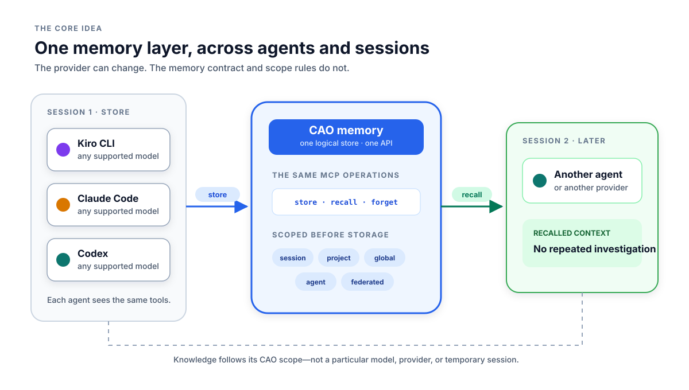
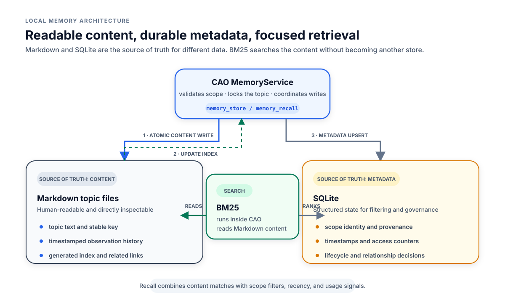
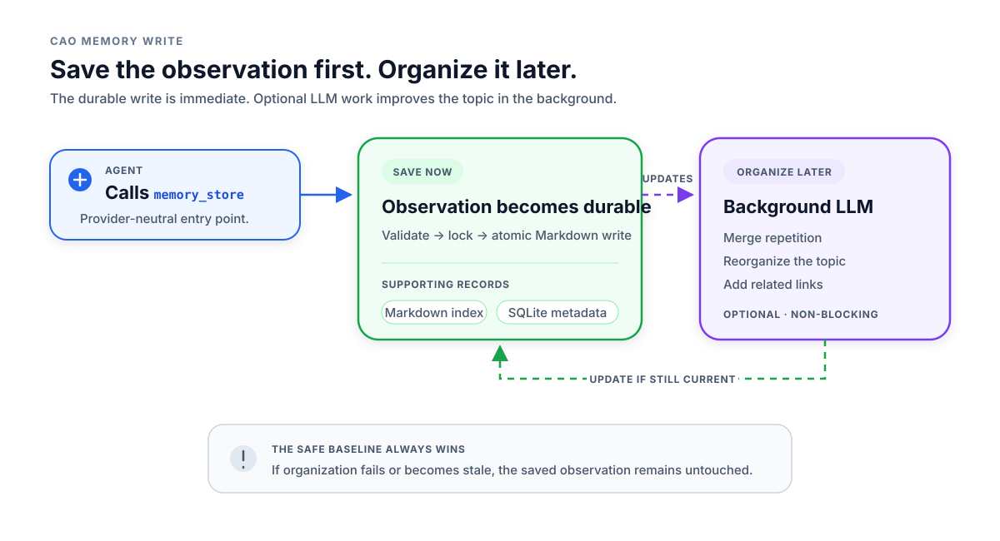
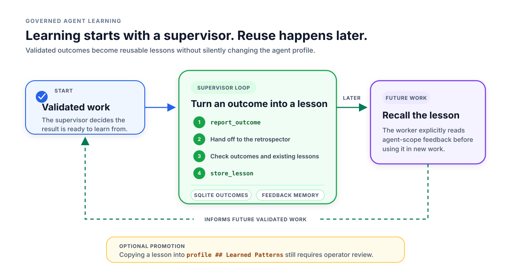
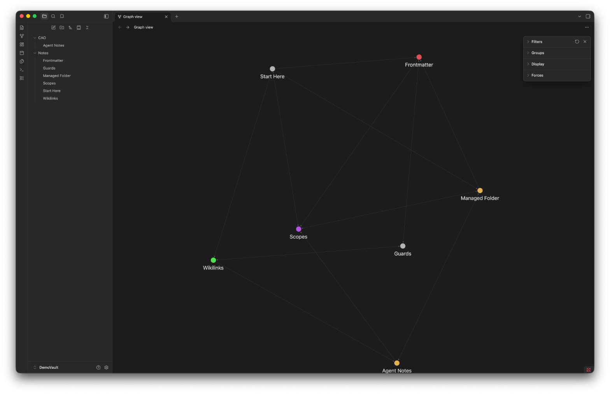
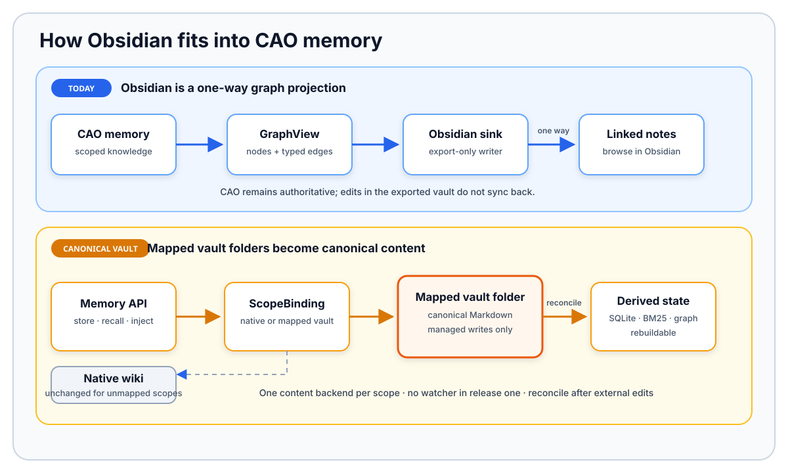

With Agentic context engineering, how an agent uses memory is critical in many aspects. It helps you
increase code quality, be more token efficient, and keep consistency across a long-running session or
session handoff.

Memory is not just giving the next session the conclusion or summary of the previous one.
CAO memory saves conclusions that make the next task faster. It is more than conversation
history. It can hold project decisions, user preferences, reusable instructions, document
findings, and workflow lessons.

The result is closer to a scoped project wiki than a transcript archive. The identity of CAO
memory is human readable markdown files. Search runs over an index backed
by a SQLite database, and a knowledge graph projects the relationships between memory nodes, both
in the CAO UI and in Obsidian.

CAO gives every supported agent the same memory tools. An agent can remember a fact with one
CLI provider and recall it later with another. The memory belongs to CAO, not to a specific
model or CLI, so your context (and code quality) survives handoffs.

This post explains how that shared layer works. For commands and configuration, see the
[original CAO memory reference](https://github.com/awslabs/cli-agent-orchestrator/blob/main/docs/memory.md).

{/* truncate */}

Everything below was run against CAO `v2.5.1`.

## Why CAO owns memory

CAO keeps one memory layer for every agent (agnostic to the harness / CLI provider) and sets out what that layer has to guarantee.

### One MCP memory layer for every agent

CAO exposes three core MCP operations:

- `memory_store` saves or updates a fact.
- `memory_recall` searches stored facts.
- `memory_forget` removes a fact.

These operations stay the same across Kiro CLI, Claude Code, Codex, and other CAO agents.
The provider may change. The model may change. The memory API and scope rules stay the same.

CAO resolves scope before it calls the provider. This gives every agent a consistent view
across scopes: project, session, global, agent, and federated memory. Access still follows the scope and
caller policy.

This is why CAO owns the memory layer at all. Lean on a provider-specific memory feature and
your knowledge fragments into separate stores; CAO keeps one store behind one API.



### What the design must do

The shared layer has five goals:

1. **Unified.** Every CAO agent uses the same MCP operations and scope rules.
2. **Readable.** People can inspect memory without a special database tool.
3. **Searchable.** Agents can find a fact without reading the whole store.
4. **Scoped.** A session note does not become a global rule.
5. **Recoverable.** A partial write can be detected and repaired.

The prompt also has a hard size limit. CAO must choose a small set of useful memories. It
cannot inject the whole store.

## How CAO stores a memory

CAO keeps memory local, splits content from metadata, and makes every write recoverable.
These sections cover where memory is stored, what triggers a save, the order CAO writes in,
and how it recovers when a write only partly succeeds.

### Local by default

CAO keeps memory on the machine by default. Markdown files hold the content under the CAO
home directory. The CAO SQLite database holds metadata and lifecycle state. BM25 search
runs inside the CAO process and reads the local Markdown files.

You get real benefits from keeping this local: memory works with no cloud service in the
loop, the files stay under your control, and reads are fast. You can open the files yourself
and see exactly what an agent may recall.

An LLM is not required for the first write or for BM25 search. CAO can use an LLM later to
organize an existing topic (optional).

A distributed CAO deployment can use remote memory. Setting `CAO_MEMORY_API_URL` routes the
same store, recall, forget, and context operations to a memory-owning CAO server. The MCP
contract does not change. Only the location of the store changes.

### Markdown stores content; SQLite tracks metadata

CAO uses two local stores:



Markdown holds the actual memory text. Each topic has a stable key. The key identifies the
topic and becomes part of its file name.

The file header records the memory ID, scope, type, and tags. Timestamped sections record
when each observation was added. When an agent updates the same key, CAO appends a new
timestamped section to that topic. It does not create a second memory with the same key and
scope. A topic file looks like this:

```markdown
# build-tooling
<!-- id: 7c1e9f20-... | scope: project | type: knowledge | tags: build,ci -->

### 2026-09-14T08:12:03Z
Run `make build` before every push; CI rejects an unbuilt tree.

### 2026-09-16T11:40:55Z
The build step now also regenerates the Rust bindings, so a stale
`target/` no longer breaks the wheel.
```

The `# <key>` line and the `<!-- id | scope | type | tags -->` comment are the header; each
`### <timestamp>` block is one observation. An update appends a new dated section rather than
rewriting the ones above it.

SQLite tracks data used for filtering, ranking, and lifecycle rules. This includes scope
IDs, timestamps, access counts, provenance, token estimates, and relationship state.
BM25 still searches the Markdown content. SQLite does not replace that content search.
See below [code](https://github.com/awslabs/cli-agent-orchestrator/blob/95a0975cc119caa2cfde4b2138721c7046369f0e/src/cli_agent_orchestrator/services/memory_service.py#L1848-L1858)
of how CAO lists a scope's topics from SQLite metadata, newest first:

```python
q = db.query(MemoryMetadataModel).filter(
    MemoryMetadataModel.scope == scope,
    MemoryMetadataModel.source_kind == source_kind,
)
if scope_id is not None:
    q = q.filter(MemoryMetadataModel.scope_id == scope_id)
else:
    q = q.filter(MemoryMetadataModel.scope_id.is_(None))
rows = q.order_by(MemoryMetadataModel.updated_at.desc()).limit(200).all()
```

Here is how Markdown and SQLite each represent memory differently:

| Data | Source of truth |
| --- | --- |
| Topic text and timestamped history | Markdown |
| Search metadata and usage counters | SQLite |
| Relationship state and human decisions (e.g. a rejected link) | SQLite |
| Human-readable index | Generated from the stores |
| `## See Also` related-topic links | Generated from relationship state |

`See Also` is a real section in a topic file. CAO writes normal Markdown links under the
`## See Also` heading. The links point to related memory topics. They are a readable view of
SQLite relationship state, not a second source of truth.

Some SQLite data can be rebuilt from Markdown. Some cannot. For example, a rejected
relationship is a human decision. That decision must remain in SQLite.

### What causes CAO to save a memory

CAO does not save every conversation by default. A memory is saved when an agent calls
`memory_store`. A user can trigger that call with a direct request such as, "Remember that
this project uses Python 3.12."

An agent can also save a reusable fact while working when its instructions allow that
action. The opt-in learning loop can store a lesson after a supervisor records a validated
outcome and starts retrospection. It does not run automatically at session end.

CAO has no general automatic conversation-capture step today. This avoids turning every
message, guess, or secret into long-lived memory.

### Save first, organize later

A CAO agent calls `memory_store`. The memory service then follows a fixed write path:



This first path is deterministic because it uses fixed code, not model output. CAO locks
the topic, writes a known append format, and publishes it with an atomic file replacement.
The same rules run for every write.

The shared Markdown index has its own lock. This prevents two topics from losing each
other's index updates.

**Compile mode** controls that optional second step. It has two settings:

- `append` -- CAO only ever appends the new timestamped section. No LLM is involved at any point.
  This keeps the file a plain, append-only log.
- `llm` (the default) -- CAO still writes the same append-form section first, then schedules a
  background compilation. That step calls an LLM to merge repeated entries and link related topics.

So the write path itself never calls an LLM, regardless of compile mode. The agent that
*calls* `memory_store` may of course be an LLM, but recording the observation is fixed
code, not a model deciding what to persist. An LLM only re-enters afterward, and only in
`llm` mode, to reorganize an existing topic. That compilation runs after the initial save.

The compiler checks for newer writes before it publishes a result. If the topic changed,
CAO drops the stale result. A slow or failed LLM never removes the saved observation.

The rule is strict, and it is deliberate: save the observation first, improve the structure
later. An LLM only touches that second step, and only when you turn it on.

### Partial writes are visible

CAO does not run the filesystem write and the SQLite commit in one transaction. They are two
independent durability domains: SQLite commits through its own write-ahead log, while a
Markdown file is published by writing to a temporary file and atomically renaming it into
place. There is no
common commit or rollback that spans both. If the SQLite commit fails after the files are
already renamed into place, nothing automatically un-writes those files. CAO owns that gap
directly rather than pretending it does not exist.

The topic file and Markdown index are written before SQLite metadata. If the SQLite write
fails, CAO raises `MemoryPartialWriteError`. The error lists the key, scope, scope ID, file
path, and completed phases, and names the repair command (`cao memory repair --apply`) to run.

This tells the caller what is already safe. Retrying the same write could add a duplicate
entry.

CAO can repair the missing metadata. Reconciliation scans the topic files, validates them,
and rebuilds missing rows or index entries. It never rebuilds topic text from SQLite.

### Scope tells CAO where memory applies

We define a memory with:

```text
(key, scope, scope_id)
```

The key names the topic. The scope says where the fact applies. The scope ID names the
specific project, session, or agent when needed.

| Scope | Applies to | Retention |
| --- | --- | --- |
| `session` | One run | 14 days |
| `project` | One repository | 90 days |
| `global` | All projects | Permanent |
| `agent` | One agent profile | Permanent |
| `federated` | All projects on one machine | Permanent |

The retention periods match the expected lifetime of each scope. Session memory is temporary,
so it expires first. Project memory lasts longer because project decisions often stay useful
across many sessions. Global, agent, and federated memory are designed to cross project or
session boundaries, so they do not expire. Cleanup runs when `cao-server` starts. It is not
a continuous sweep.

Scope is not the only thing that controls retention. Two memory types, `user` and
`feedback`, never expire regardless of scope, so a `feedback` lesson saved in `project`
scope is kept past the 90-day window.

The `federated` scope is machine-wide and shared, so it is credential-gated: a federated
write whose content matches a known secret pattern is rejected before anything is stored,
and only the matched pattern name is logged, never the content. This mirrors the credential
hygiene CAO already applies to remote URLs and Obsidian export.

Project, session, and agent scopes need an identity. CAO rejects the write if it cannot
resolve that identity. It never falls back to a wider scope.

Project identity follows this order:

1. An explicit project ID.
2. A normalized Git remote.
3. `sha256(realpath(cwd))[:12]`.

The Git-based ID survives normal checkout moves. CAO also records a path-hash alias for
older stores. It does not save raw remote URLs because they may contain credentials.

Scope and type are separate. Scope says where a fact applies. Type says whether the fact is
a project note, user preference, correction, or reference.

## How agents use memory

Storing a memory is only half the story. These sections cover how CAO selects what to put in
the prompt, keeps workflow replays reproducible, governs the relationship graph, and turns
validated work into reusable lessons.

### Put only useful memory in the prompt

CAO has two retrieval paths.

**Automatic injection** gives an agent a small starting set. It checks session, project,
and global memory in that order. Each scope gets at most ten entries and its own character
limit. Empty space from one scope is not given to another.

Every provider receives the same `<cao-memory>` content block on the first user message.
The block wraps a short, scope-ordered list of selected memories:

```text
<cao-memory>
## Context from CAO Memory
- [project] python-version: This project targets Python 3.12.
- [project] test-runner: Run the suite with `pytest -q`; CI blocks on it.
- [project] api-auth [related]: Endpoints under /v1 require a bearer token.
- [global] commit-style: Use Conventional Commits; keep subjects under 72 chars.
</cao-memory>
```

Each line is `- [scope] key: content`, and a `[related]` tag marks an entry pulled in by a
typed relationship rather than selected directly. Built-in provider plugins also write the
block into the file that provider reads:

- Claude Code: `.claude/CLAUDE.md`
- Codex: `AGENTS.md`
- Kiro CLI: `.kiro/steering/cao-memory.md`

The file path is provider-specific. The memory selection and scope rules are not. Injection
is a startup snapshot, not a live update on every turn.

**Explicit recall** searches beyond that snapshot. It supports metadata, BM25, and hybrid
search. Hybrid search returns metadata matches first. BM25 fills the remaining result slots.
Results can be sorted by recency, usage, or a combined score.

A successful recall may increase `access_count`. A failed counter update never blocks the
read.

### Keep CAO workflow replays consistent

[CAO workflows](https://github.com/awslabs/cli-agent-orchestrator/issues/583)
are a separate feature. They run repeatable, multi-step jobs. Memory matters
to workflows because a recalled fact can change the result.

Suppose a workflow reads a project rule today. The rule changes tomorrow. A replay should
not mix the old workflow inputs with the new rule.

CAO resolves memory once for a workflow run. It stores a redacted and size-limited copy in
the run manifest (a JSON file that defines how a workflow was launched).
The first run and every replay use those same bytes.

CAO saves the block before the terminal uses it. If that save fails, the run continues
without memory. This is safer than using context that cannot be reproduced.

### Keep relationships as governed data

CAO stores relationships as **typed edges**. It does not ask a model to rebuild the graph on
every read.

Typed means each link carries a relationship type saying what kind of link it is. An edge is a
stored link between two memory topics (topic A → topic B). Each edge records a type, origin,
status, and source update time, and may also carry confidence, rank, and evidence.

A producer can replace only its own edges. Compiler output cannot remove a human edge.
Rejected and deleted edges survive recomputation.

CAO marks an edge stale when its source memory changes. A stale edge needs recomputation.
Reading it does not change it.

CAO has two promotion actions. Relationship promotion accepts a proposed edge. Instruction
promotion copies a lesson into an agent profile.

### How the opt-in learning loop works

CAO does not learn from every conversation. Learning is opt-in. A supervisor starts each
step of the loop.



The flow has five steps. The first four form the supervisor loop in the diagram; recall
(step 5) happens later, which is why the diagram draws it as a separate step outside the loop.

1. A supervisor records an outcome after validation. The record contains success, an
   optional score, and short friction notes. It does not contain a transcript.
2. The supervisor hands work to the retrospector. This does not happen automatically at
   session end.
3. The retrospector reads outcomes and checks existing lessons. Its prompt asks for a short,
   reusable lesson and an `Applies when:` trigger. These prompt rules do not prove that the
   lesson is correct.
4. `store_lesson` writes the lesson to the worker's `agent` scope as `feedback`. A caller
   needs the `store_lesson` capability to write into another agent's scope.
5. The worker recalls the lesson later. Recall can increase `access_count`. After three
   recalls by default, the operator can review a promotion plan.

An unpromoted agent lesson needs explicit recall. Automatic injection currently uses only
session, project, and global memory.

Promotion copies the lesson into the profile's `## Learned Patterns` block. It does not
delete the original memory. The operator should review the change like any system prompt
update.

## Operating CAO memory

The memory layer has running costs and portability options worth weighing before you lean on
it. These sections cover the tradeoffs and the ways to move or inspect memory outside CAO.

### Costs and savings

A good memory pays for itself by replacing repeated work: the agent skips another code search,
document read, web search, or round-trip to you, saving tool calls, tokens, and time.

Memory also has costs:

- Markdown and SQLite need reconciliation after a partial write.
- BM25 can miss facts that use different words.
- Automatic injection can become stale during a long session.
- A stored fact can be wrong.
- More injected lessons use more prompt space.

The useful question is direct: is storing and checking the conclusion cheaper than finding
it again on every run?

### Move and view memory outside CAO

CAO supports three ways to look at memory from outside the write path: moving topic content,
viewing relationships in an external vault, and browsing them live in the CAO UI.

**OKF export and import** move portable topic content. Export checks content for credential
patterns. Import requires the operator to choose the target scope. OKF does not preserve
scope IDs, UUIDs, usage counts, provenance, or relationship decisions. It is a migration
format, not a full backup.

**Obsidian graph export** creates a vault for browsing. It writes one Markdown note per
node, with YAML metadata, an H1 title, and `[[wikilinks]]` for relationships. This export is
one-way. CAO does not read edits back.



**The CAO UI knowledge graph** renders the same relationships live, with no export step. It
reads the current graph through `GET /graph/{provider}` and shows the memory nodes and their
typed edges in the browser, so you can inspect the graph without leaving CAO or opening
another tool.



The [Obsidian vault integration](https://github.com/awslabs/cli-agent-orchestrator/blob/main/docs/obsidian-vault.md) adds another model.
A mapped vault folder becomes the canonical Markdown source for a scope. Unmapped scopes keep
the native wiki. SQLite, BM25, and graph state become rebuildable views of the vault notes.

CAO writes only inside one managed folder. Other mapped folders are read-only sources.
Release one has no file watcher. External edits need reconciliation before indexes and
relationships are current.

## Summary

CAO memory reduces repeated work by preserving reusable conclusions instead of archiving
every conversation. Every supported agent uses the same MCP tools and CAO-owned scope rules.
Markdown keeps the content readable, while SQLite tracks metadata and relationship state.
Bounded injection, explicit recall, retention, repair, and workflow replay keep that knowledge
useful and controlled across sessions, models, and CLI providers.

## About the author

Stan Fan (`fanhongy`) is a Solutions Architect at AWS. He works with teams on agentic
systems and developer tooling, with a particular interest in how agents accumulate and reuse
context reliably across sessions, models, and tools, without turning memory into an
unbounded transcript.
