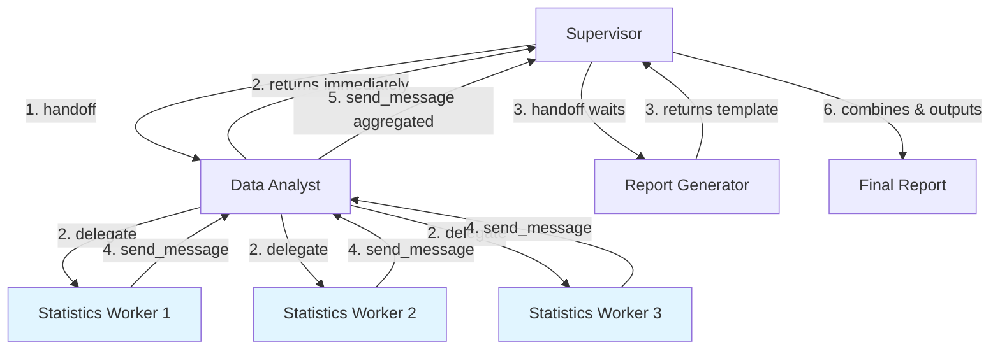
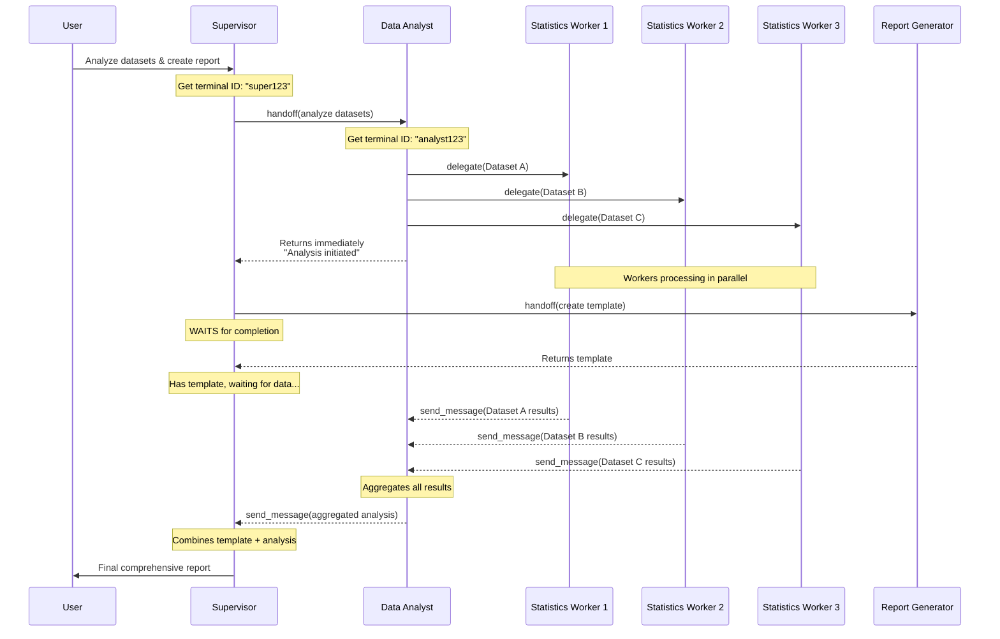

# Delegate (Async) Pattern Example

This example demonstrates a complex workflow combining **handoff** (sequential) and **delegate** (async/parallel) patterns.

## Pattern Overview

This example showcases:
- **Handoff (Sequential)**: Supervisor waits for agents to complete before proceeding
- **Delegate (Async)**: Data Analyst spawns parallel workers without blocking
- **Send Message**: Workers and agents communicate results via inbox
- **Complex orchestration**: Multi-step workflow with both sequential and parallel execution

## Example Scenario: Data Analysis with Report Generation

A supervisor orchestrates a data analysis workflow that combines parallel data processing with sequential report generation.

### Complete Workflow:



**Workflow Steps:**
1. Supervisor → Data Analyst (**handoff** - blocking initially)
2. Data Analyst → 3 Statistics Workers (**delegate** - async/parallel) and returns immediately
3. Supervisor → Report Generator (**handoff** - blocking, waits for completion)
4. Statistics Workers → Data Analyst (**send_message** - async callback)
5. Data Analyst → Supervisor (**send_message** - async callback with aggregated results)
6. Supervisor combines template + analysis into final report

### Key Characteristics:

- **Data Analyst**: Fire-and-forget agent (returns quickly, workers continue in background)
- **Report Generator**: Sequential agent (Supervisor waits for completion)
- **Statistics Workers**: Parallel workers (multiple running simultaneously)
- **Final assembly**: Supervisor combines results when Data Analyst's results arrive

## Agent Profiles

### 1. Analysis Supervisor (`analysis_supervisor.md`)
- Orchestrates the entire workflow
- Handoffs to Data Analyst (gets immediate return)
- Handoffs to Report Generator (waits for completion)
- Receives results from Data Analyst via send_message
- Combines everything into final output

### 2. Data Analyst (`data_analyst.md`)
- Receives task from Supervisor via handoff
- Delegates to multiple Statistics Workers (parallel)
- Returns immediately to Supervisor (doesn't wait for workers)
- Receives results from workers via send_message
- Sends aggregated results to Supervisor via send_message

### 3. Statistics Worker (`statistics_worker.md`)
- Performs statistical calculations
- Sends results back to Data Analyst via send_message
- Multiple workers run in parallel

### 4. Report Generator (`report_generator.md`)
- Creates report templates
- Supervisor waits for completion (handoff)
- Returns formatted report structure

## Setup

1. Start the CAO server:
```bash
cao-server
```

2. Install the agent profiles:
```bash
cao install examples/delegate-async/analysis_supervisor.md
cao install examples/delegate-async/data_analyst.md
cao install examples/delegate-async/statistics_worker.md
cao install examples/delegate-async/report_generator.md
```

3. Launch the supervisor:
```bash
cao launch --agents analysis_supervisor
```

## Usage

In the supervisor terminal, try this example task:

```
Analyze these datasets and create a comprehensive report:
- Dataset A: [1, 2, 3, 4, 5]
- Dataset B: [10, 20, 30, 40, 50]
- Dataset C: [5, 15, 25, 35, 45]

Calculate mean, median, and standard deviation for each dataset.
Generate a professional report with the analysis results.
```

## Detailed Workflow

### Step 1: Supervisor → Data Analyst (Handoff)
```
Supervisor calls handoff(agent_profile="data_analyst", message="Analyze datasets...")
Data Analyst receives task
```

### Step 2: Data Analyst → Statistics Workers (Delegate)
```
Data Analyst gets CAO_TERMINAL_ID (e.g., "analyst123")
Data Analyst delegates:
  - Worker 1: Dataset A
  - Worker 2: Dataset B
  - Worker 3: Dataset C
Data Analyst returns immediately (handoff completes)
Workers continue processing in background
```

### Step 3: Supervisor → Report Generator (Handoff)
```
Supervisor receives return from Data Analyst
Supervisor calls handoff(agent_profile="report_generator", message="Create report template...")
Supervisor WAITS for Report Generator to complete
Report Generator returns template
```

### Step 4: Statistics Workers → Data Analyst (Send Message)
```
Worker 1 completes → send_message(receiver_id="analyst123", message="Dataset A results...")
Worker 2 completes → send_message(receiver_id="analyst123", message="Dataset B results...")
Worker 3 completes → send_message(receiver_id="analyst123", message="Dataset C results...")
```

### Step 5: Data Analyst → Supervisor (Send Message)
```
Data Analyst receives all worker results
Data Analyst aggregates results
Data Analyst sends to Supervisor: send_message(receiver_id="supervisor456", message="Aggregated analysis...")
```

### Step 6: Supervisor Final Assembly
```
Supervisor receives Data Analyst results (via inbox)
Supervisor combines:
  - Report template (from Report Generator)
  - Analysis results (from Data Analyst)
Supervisor presents final comprehensive report to user
```

## Workflow Diagram



## Pattern Comparison

| Pattern | Used By | Behavior | Use Case |
|---------|---------|----------|----------|
| **Handoff** | Supervisor → Data Analyst | Blocking initially, but Data Analyst returns quickly | Initiate async work |
| **Delegate** | Data Analyst → Workers | Non-blocking, parallel execution | Independent parallel tasks |
| **Handoff** | Supervisor → Report Generator | Blocking, waits for completion | Sequential task that must complete |
| **Send Message** | Workers → Data Analyst | Async callback | Return results from parallel work |
| **Send Message** | Data Analyst → Supervisor | Async callback | Return aggregated results |

## Key Insights

1. **Handoff doesn't always mean "wait forever"**: Data Analyst returns quickly even though its workers are still running
2. **Delegate enables true parallelism**: Multiple workers process simultaneously
3. **Send message enables callbacks**: Async communication between agents
4. **Mixed patterns**: Supervisor uses both handoff patterns (quick return + wait for completion)
5. **Inbox queuing**: Messages wait if receiver is busy, delivered when IDLE

## Tips

- Data Analyst must get its terminal ID before delegating
- Data Analyst returns quickly but continues monitoring inbox for worker results
- Supervisor must get its terminal ID and include it in Data Analyst's task for callback
- Report Generator is a traditional sequential task (no async complexity)
- Final assembly happens when all async results arrive
