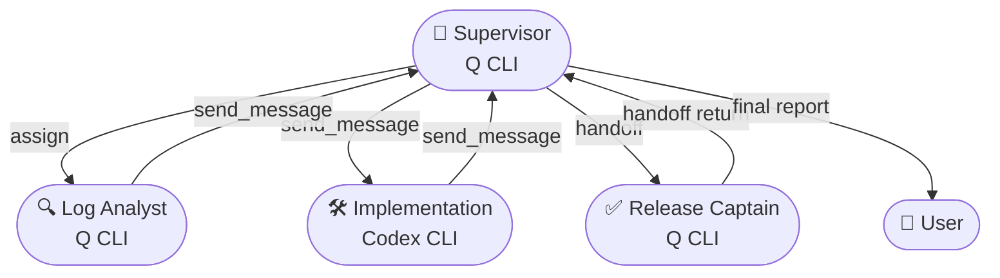

# Hybrid Q + Codex Incident Workflow

This example adapts the **assign/handoff** orchestration pattern so a Q CLI supervisor can coordinate three specialists, one of which runs on Codex CLI. Use it when customer tickets need parallel triage plus focused implementation work.

## Setup
1. Start the orchestrator backend:
   ```bash
   cao-server
   ```
2. Install the agent profiles so the CLI can reference them by name:
   ```bash
   cao install examples/hybrid-use-case/product_supervisor.md
   cao install examples/hybrid-use-case/log_analyst_q.md
   cao install examples/hybrid-use-case/implementation_codex.md
   cao install examples/hybrid-use-case/release_captain_q.md
   ```

## Agent Profiles Explained
- **Q CLI agents** (`product_supervisor`, `log_analyst_q`, `release_captain_q`) follow the same pattern as the assign example: YAML frontmatter with a descriptive `name`, optional `provider: q_cli`, and the shared `cao-mcp-server` block so they can call `assign`, `handoff`, and `send_message`.
- **Codex CLI agent** (`implementation_codex`) mirrors that structure but must declare `provider: codex_cli`. That flag instructs CAO to launch the session with the Codex binary instead of Amazon Q or Claude.

If you need a fresh Codex worker, copy the template below into a new Markdown file and adjust the description plus guardrails:

```markdown
---
name: my_codex_worker
provider: codex_cli
description: Purpose-built Codex CLI agent
mcpServers:
  cao-mcp-server:
    type: stdio
    command: uvx
    args:
      - "--from"
      - "git+https://github.com/awslabs/cli-agent-orchestrator.git@main"
      - "cao-mcp-server"
---

# MY CODEX WORKER

Document the role, startup checks, tooling, and return protocol just like the examples so collaborating agents know what to expect.
```

Install the new profile with `cao install path/to/my_codex_worker.md` before launching it via `cao launch --agents my_codex_worker --provider codex_cli`.

## Agent Roster
- `product_supervisor` (Q CLI): runs the playbook, owns communication.
- `log_analyst_q` (Q CLI): digs through metrics and traces via async `assign`.
- `implementation_codex` (Codex CLI): produces vetted patches after being briefed.
- `release_captain_q` (Q CLI): validates Codex output through a blocking `handoff`.

## Launch Cheat Sheet
1. Launch the supervisor session (explicit `--provider q_cli` keeps intent clear, but the default is already Q CLI):
   ```bash
   cao launch --agents product_supervisor --provider q_cli
   ```
2. After the tmux pane opens, paste the prompt below for the supervisor and send it as the first message:
   ```
   Customer ticket INC-4721 reports checkout failures on us-east-1. You are product_supervisor.

   Objectives:
   1. Fire off log_analyst_q via assign to inspect `payments-service` logs from the last 30 minutes. Tell them to send_message their findings back to your terminal id.
   2. Once their first report lands, brief implementation_codex (running on Codex CLI) to prepare a patch. Ask for test evidence.
   3. When Codex returns a patch, handoff to release_captain_q for validation and sign-off.
   4. Track statuses and ship a consolidated update to the user when all threads complete.

   Remember: keep a running task list, expect structured responses (Problem, Root Cause, Fix, Next Steps), and ensure no PII is shared externally.
   ```
3. The supervisor uses `assign` for the log analyst (inherits Q CLI provider automatically).
4. When a Codex specialist is required, someone on the host launches it out-of-band:
   ```bash
   cao launch --agents implementation_codex --provider codex_cli --session-name hybrid-codex
   ```
   Share the new terminal id with the supervisor (e.g., via inbox message) so they can collaborate with `send_message`.
5. For release validation, the supervisor triggers `handoff(agent_profile="release_captain_q", ...)`, receiving a blocking confirmation before closing the loop.

## End-to-End Flow


## Tips
- Always bundle your `send_message` payloads with task id, findings, and next steps so the supervisor can reconcile parallel updates quickly.
- Codex sessions behave like any other terminal from CAO's perspective—just make sure they are provisioned with the `codex_cli` provider before you route work to them.
- Keep the supervisor buffer tidy; note which agent is active, outstanding asks, and completion receipts.
- If Codex needs more context, loop in the log analyst by forwarding their findings, keeping the supervisor CC'd for traceability.

## Clean Up
When the incident wraps, exit each worker terminal (`Ctrl+C` twice for Codex CLI, `exit` for Q CLI) so tmux sessions close cleanly and do not leak resources.
