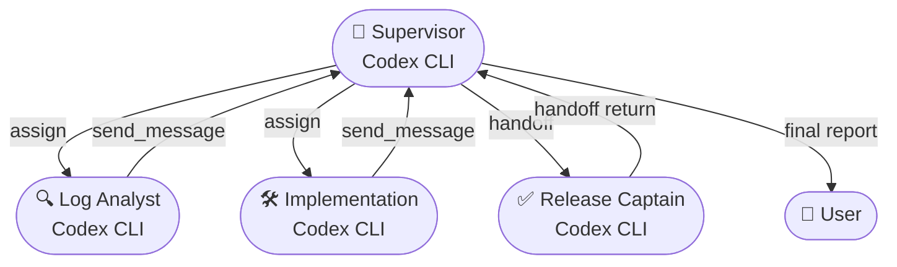

# Hybrid All-Codex Incident Workflow

This example adapts the **assign/handoff** orchestration pattern so a Codex supervisor can coordinate three Codex specialists. Use it when customer tickets need parallel triage plus focused implementation work.

## Setup
1. Start the orchestrator backend:
   ```bash
   cao-server
   ```
2. Install the agent profiles so the CLI can reference them by name:
   ```bash
   cao install examples/hybrid-use-case/product_supervisor.md
   cao install examples/hybrid-use-case/log_analyst_codex.md
   cao install examples/hybrid-use-case/implementation_codex.md
   cao install examples/hybrid-use-case/release_captain_codex.md
   ```
3. Create a workspace for generated artefacts:
   ```bash
   mkdir -p examples/hybrid-use-case/output
   ```

## Sample Artefacts
- Application logs: `examples/hybrid-use-case/logs/payments-service.log.sample`
- Aggregated metrics: `examples/hybrid-use-case/logs/payments-service-metrics.log.sample`

Agents can tail or parse those files to simulate telemetry without hitting external services. Keep them in place and write any derived analysis to `examples/hybrid-use-case/output/` instead of copying the samples around.

## Agent Profiles Explained
- **Codex supervisor** (`product_supervisor`) owns the workflow and launches workers via tools.
- **Codex specialists** (`log_analyst_codex`, `implementation_codex`, `release_captain_codex`) declare `provider: codex_cli` so every delegated terminal boots Codex automatically.

If you need a fresh Codex worker, copy the template below into a new Markdown file and adjust the description plus guardrails:

```markdown
---
name: my_codex_worker
provider: codex_cli
description: Purpose-built Codex CLI agent
mcpServers:
  cao-mcp-server:
    type: stdio
    command: uvx
    args:
      - "--from"
      - "git+https://github.com/awslabs/cli-agent-orchestrator.git@main"
      - "cao-mcp-server"
---

# MY CODEX WORKER

Document the role, startup checks, tooling, and return protocol just like the examples so collaborating agents know what to expect.
```

Install the new profile with `cao install path/to/my_codex_worker.md`; `assign` and `handoff` will honor the `provider` value.

## Agent Roster
- `product_supervisor` (Codex CLI): runs the playbook, owns communication.
- `log_analyst_codex` (Codex CLI): digs through metrics and traces via async `assign`.
- `implementation_codex` (Codex CLI): produces vetted patches after being briefed.
- `release_captain_codex` (Codex CLI): validates Codex output through a blocking `handoff`.

## Launch Cheat Sheet
1. Launch the supervisor session (the CLI detects the Codex provider from the profile automatically):
   ```bash
   cao launch --agents product_supervisor
   ```
2. After the tmux pane opens, paste the prompt below for the supervisor and send it as the first message:
   ```
   Customer ticket INC-4721 reports checkout failures on us-east-1. You are product_supervisor.

   Objectives:
   1. Fire off `log_analyst_codex` via assign to inspect `payments-service` logs from the last 30 minutes (sample data lives under `examples/hybrid-use-case/logs/`). Ask them to stash any notes in `examples/hybrid-use-case/output/` and send_message their findings back to your terminal id.
   2. Once their first report lands, brief `implementation_codex` to prepare a circuit breaker patch. Ask for test evidence and drop location details.
   3. When implementation returns a patch, handoff to `release_captain_codex` for validation and sign-off.
   4. Track statuses and ship a consolidated update to the user when all threads complete.

   Remember: keep a running task list, expect structured responses (Problem, Root Cause, Fix, Next Steps), and ensure no PII is shared externally.
   ```
3. Use `assign` for the log analyst and implementation specialist—the Codex provider defined in their profiles ensures each worker window boots Codex automatically.
4. For release validation, the supervisor triggers `handoff(agent_profile="release_captain_codex", ...)`, receiving a blocking confirmation before closing the loop.

## End-to-End Flow


## Tips
- Always bundle your `send_message` payloads with task id, findings, and next steps so the supervisor can reconcile parallel updates quickly.
- Codex sessions behave like any other terminal from CAO's perspective—just make sure every installed agent markdown keeps `provider: codex_cli` in its frontmatter.
- Keep the supervisor buffer tidy; note which agent is active, outstanding asks, and completion receipts.
- If Codex needs more context, loop in the log analyst by forwarding their findings, keeping the supervisor CC'd for traceability.

## Clean Up
When the incident wraps, exit each Codex terminal (`Ctrl+C` twice) so tmux sessions close cleanly and do not leak resources.
