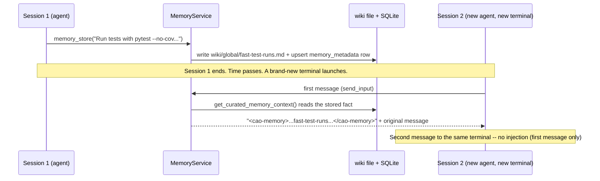

# Memory & Learning Example

CAO agents forget everything when their terminal closes -- unless they save it to
**CAO memory**. This example connects two related capabilities as one vertical:

- **Part 1 -- persistent memory.** An agent stores a durable fact during one
  session, and a brand-new agent in a brand-new session -- one that never called
  `memory_store` itself -- receives that fact automatically, prepended to its very
  first message as a `<cao-memory>` block.
- **Part 2 -- self-learning.** With `memory.learning_enabled` turned on, workers
  report task outcomes for a small fixed task corpus, a retrospector distills a
  recurring failure pattern into one durable lesson, and a later worker recalls
  that lesson from its own agent scope. `cao memory promote` then shows, as a
  reviewed dry run, how a reinforced lesson could eventually become a permanent
  part of the worker's profile.

For the full reference see [docs/memory.md](../../docs/memory.md) (scopes, types,
retention, storage layout) and [docs/self-learning.md](../../docs/self-learning.md)
(outcomes, retrospection, promotion) -- and the
[`cao-memory`](../../skills/cao-memory/SKILL.md) /
[`cao-learning`](../../skills/cao-learning/SKILL.md) skills agents load to use them
correctly.

## What this demonstrates

### Part 1 -- persistent memory

- **Storing** a durable fact with the `memory_store` MCP tool (there is no `cao memory
  store` CLI command -- see [Note on CLI vs. MCP tool](#note-on-cli-vs-mcp-tool) below).
- **Recalling** it explicitly with the `memory_recall` MCP tool.
- **Cross-session injection**: registering a second, brand-new terminal and calling
  the real `inject_memory_context()` (the exact function `send_input()` runs in
  production) to show the `<cao-memory>` block getting prepended to that terminal's
  first message -- and *not* to its second message.
- Cross-checking the same data through the real `cao memory list` / `cao memory show`
  CLI commands.

### Part 2 -- self-learning

- **Feature gate**: outcome capture and retrospector reads are disabled until
  `memory.learning_enabled` is explicitly turned on (opt-in, off by default) --
  demonstrated by attempting to report and list outcomes with the gate off (both
  rejected) before turning it on.
- **Outcome capture**: recording three structured outcomes for a small, fixed task
  corpus -- two recurring failures sharing the same root cause, and one success --
  through the real `OutcomeService` (the same class the `report_outcome` /
  `list_outcomes` MCP tools call).
- **Retrospection**: simulating the `retrospector` agent calling the real
  `store_lesson` MCP tool, authorized because the `retrospector` profile declares
  the `store_lesson` capability, to store one 1-2 sentence lesson with an
  `Applies when:` trigger in the `developer` worker's **agent** scope.
- **Scope boundary, shown not just told**: a later `developer` terminal's ambient
  first-message injection (`inject_memory_context()`) still carries Part 1's
  *global* fact but does **not** surface the *agent*-scope lesson -- by design (see
  [How it works](#how-it-works) #6) -- while an explicit
  `memory_recall(scope="agent")` call finds it. That before/after recall result is
  the sample's deterministic evidence, alongside the outcome corpus's own
  40/40/95 score pattern.
- **Promotion, reviewed dry run only**: after the lesson is reinforced (recalled
  enough times), `cao memory promote developer` prints a reviewable plan.
  `--apply` is never passed -- see [Non-goals](#non-goals).



```mermaid
sequenceDiagram
    participant W as Worker (developer)
    participant OS as OutcomeService
    participant R as Retrospector (simulated caller)
    participant MS as MemoryService
    participant W2 as Later developer terminal

    Note over OS: memory.learning_enabled=false -> report/list rejected
    W->>OS: record_outcome x3 (2 failures, same root cause + 1 success)
    R->>OS: list_outcomes(session) -- reads the 40/40/95 pattern
    R->>MS: store_lesson(target=developer, "...Applies when: ...")
    Note over MS: authorized: retrospector profile declares store_lesson capability
    W2->>MS: inject_memory_context(first message)
    MS-->>W2: global fact still injected; AGENT-scope lesson is not (by design)
    W2->>MS: memory_recall(scope="agent")
    MS-->>W2: the stored lesson
    Note over W2: cao memory promote developer -- dry-run plan only, never --apply
```

## Files

- [`run.sh`](run.sh) -- the runnable script covering both parts. Offline / CI-safe:
  no `cao-server`, tmux, or live provider CLI required. Runs the real
  `memory_store`, `memory_recall`, `inject_memory_context`, `OutcomeService`,
  `store_lesson`, and `PromotionService` code against a throwaway `CAO_HOME_DIR`
  (removed on exit), so it never touches your real memory or outcome store.

## Run

```bash
./examples/memory-learning/run.sh
```

Actual output from a real run:

```
[memory-learning] sandboxed CAO_HOME_DIR: /tmp/tmp.Fj9ERuBKcT
[1] memory_store -> {'success': True, 'key': 'fast-test-runs', 'scope': 'global', 'scope_id': None, 'file_path': '.../memory/global/wiki/global/fast-test-runs.md', 'action': 'created'}
[2] memory_recall -> {'success': True, 'memories': [{'key': 'fast-test-runs', 'content': 'Run tests with `pytest --no-cov` in this repo -- the default coverage flag adds 30-50% overhead per test.', ...}]}
[3] registered session 2 -- a brand-new terminal that stored nothing
[4] session 2's FIRST message, after inject_memory_context():
----
<cao-memory>
## Context from CAO Memory
- [global] fast-test-runs: Run tests with `pytest --no-cov` in this repo -- the default coverage flag adds 30-50% overhead per test.
</cao-memory>

I need to add a test for the new memory example. What's the fastest way to run just that test file?
----
[5] session 2's SECOND message, unchanged: 'Great, thanks!'
[memory-learning] Part 1 cross-check via the cao CLI (list / show)...
KEY                            SCOPE      TYPE         TAGS                 UPDATED
-----------------------------------------------------------------------------------
fast-test-runs                 global     feedback     testing,pytest       2026-08-14 19:46
...
[memory-learning] Part 1 PASS: store -> recall -> cross-session injection all verified.
[6] record_outcome while learning disabled -> rejected: workflow self-learning is disabled. Set memory.learning_enabled=true in settings.json (and keep memory.enabled=true) to enable outcome capture.
[7] list_outcomes while learning disabled -> {'success': False, 'disabled': True, 'error': 'workflow self-learning is disabled. Set memory.learning_enabled=true in settings.json (and keep memory.enabled=true) to enable outcome capture.', 'outcomes': []}
[8] memory.learning_enabled=true (CAO_MEMORY_LEARNING_ENABLED)
[9] list_outcomes -> 3 recorded, 2 recurring failures (score 40), 1 success (score 95)
[10] memory_recall(scope=agent) BEFORE the lesson -> []
[11] store_lesson -> {'success': True, 'key': 'paginate-limit-boundary', 'scope': 'agent', 'scope_id': 'developer', 'target_agent_profile': 'developer'}
[12] a later developer terminal's FIRST message, after inject_memory_context():
----
<cao-memory>
## Context from CAO Memory
- [global] fast-test-runs: Run tests with `pytest --no-cov` in this repo -- the default coverage flag adds 30-50% overhead per test.
</cao-memory>

Implement paginated /accounts list endpoint.
----
[13] memory_recall(scope=agent) AFTER the lesson -> [{'key': 'paginate-limit-boundary', 'content': 'Validate that `limit` equals the page size exactly before returning results; two endpoints silently returned one extra row on that boundary. Applies when: implementing paginated list endpoints.', ...}]
[14] reinforced: access_count=4 (simulates 4 later recalls)
[memory-learning] Part 2 promotion dry run (never --apply -- see README Non-goals)...
Promotion plan for 'developer' -> /tmp/tmp.Fj9ERuBKcT/agent-store/developer.md:
  [add] paginate-limit-boundary (recalled 4x)
      Validate that `limit` equals the page size exactly before returning results; two endpoints silently returned one extra row on that boundary. Applies when: implementing paginated list endpoints.

DRY RUN — nothing written. Pass --apply to promote.
[memory-learning] Part 2 PASS: gate check -> outcome capture -> retrospector lesson -> scope boundary + recall -> promotion dry-run all verified.
```

## How it works

1. **Store** -- an agent calls the `memory_store` MCP tool. `MemoryService.store()`
   writes a markdown wiki file under `memory/<scope>/wiki/...` *and* upserts a row in
   the `memory_metadata` SQLite table (metadata is the source of truth for filtered
   lookups; the wiki file holds the content).
2. **Recall** -- an agent calls `memory_recall` to search explicitly (BM25 keyword
   search over content, or SQLite-backed recency/usage ranking).
3. **Injection** -- every terminal's first `send_input()` call runs through
   `inject_memory_context()` (`services/terminal_service.py`), which calls
   `MemoryService.get_curated_memory_context()`. That method tries a curated path
   (dispatch to an IDLE `memory_manager` agent in the same session, launched via
   `cao launch --memory`) and falls back to the deterministic
   `get_memory_context_for_terminal()`, which reads **session > project > global**
   memories (each capped at `MEMORY_MAX_PER_SCOPE` entries /
   `MEMORY_SCOPE_BUDGET_CHARS` characters) and renders the
   `<cao-memory>...</cao-memory>` block. A terminal is only ever injected once --
   tracked in-memory by terminal ID (`_memory_injected_terminals`).
4. **Outcome capture** -- `report_outcome` (MCP tool) / `OutcomeService.record_outcome()`
   persist one row per unit of work: a short task label, a success flag, an
   optional 0-100 score, and short friction notes. Both capture (`record_outcome`)
   and read (`list_outcomes`) are gated on `is_learning_enabled()` -- disabled
   writes raise `LearningDisabledError`; disabled reads return an empty list with
   a `disabled: True` marker, never partial data.
5. **Retrospection** -- `store_lesson` is a *different* write path from
   `memory_store`: it targets a **named** worker profile's agent scope instead of
   the calling terminal's own scope. That cross-agent write is authorized
   server-side -- the caller's own profile (resolved from its terminal record, not
   from tool arguments) must declare the `store_lesson` capability. Only the
   built-in `retrospector` profile carries it (see
   [`agent_store/retrospector.md`](../../src/cli_agent_orchestrator/agent_store/retrospector.md)).
   A worker writing to its *own* scope needs no capability -- that's just
   `memory_store(scope="agent")`.
6. **Why the lesson isn't ambiently injected** -- step 3's deterministic fallback
   only ever reads **session > project > global** scope. **Agent** scope is
   deliberately excluded from that ambient, every-message path: a worker's
   accumulated craft lessons could otherwise flood *every* first message,
   including ones the lesson has nothing to do with. Agent-scope lessons instead
   surface through **explicit** `memory_recall(scope="agent")` (what a worker or
   retrospector does to check "do I already know this?") or, once reinforced,
   through **promotion** into the profile file itself (step 7) -- which *is*
   loaded on every session, but only after a human reviews and applies it. This
   sample's Part 2 "before/after" recall result demonstrates that boundary
   directly instead of asserting something that isn't true.
7. **Reinforcement and promotion** -- `MemoryService.recall()` bumps a
   `access_count` counter each time a memory is recalled. `PromotionService.plan()`
   finds agent-scope, `feedback`/`project`-type memories recalled at least
   `--min-recalls` times (default 3) and diffs them against the profile's
   `## Learned Patterns` block; `apply()` writes that block (additionally gated on
   `memory.instruction_promotion_enabled`). `cao memory promote <agent>` is
   dry-run by default -- it only prints the plan unless `--apply` is passed, and
   it always refuses to write into a *built-in* package profile (promotion needs a
   writable, per-operator profile file, so this sample copies the built-in
   `developer.md` into the sandboxed `CAO_HOME_DIR/agent-store/` first).

`run.sh` exercises all of the above directly and unmodified; the only thing it
doesn't do is drive a real tmux pane, provider CLI, or `cao-server` HTTP endpoint.
Both `store_lesson` and the agent-scope `memory_recall` calls resolve "who is
calling" via `_get_terminal_context_from_env()`, which normally asks a live
`cao-server` over HTTP for the calling terminal's registered profile. Since this
sample has no server, it supplies that context directly -- exactly like
[`test/services/test_learning_loop_e2e.py`](../../test/services/test_learning_loop_e2e.py)
does for the same reason. Nothing about the memory or learning logic itself is
faked. See [Run it live](#run-it-live-real-server--real-terminal) to see it
through an actual `cao launch`.

## Feature gates

See [docs/self-learning.md#feature-flags](../../docs/self-learning.md#feature-flags)
for the canonical reference; summarized here:

| Setting | Env override | Default | What it guards |
| --- | --- | --- | --- |
| `memory.enabled` | `CAO_MEMORY_ENABLED` | `true` | The whole memory subsystem (store/recall/injection). |
| `memory.learning_enabled` | `CAO_MEMORY_LEARNING_ENABLED` | `false` | Outcome capture (`report_outcome`) and reads (`list_outcomes`), plus `store_lesson`. A child of `memory.enabled`. |
| `memory.instruction_promotion_enabled` | `CAO_MEMORY_INSTRUCTION_PROMOTION_ENABLED` | `false` | `cao memory promote --apply` only. The dry-run plan (no `--apply`) works regardless -- this sample never sets this flag because it never applies. |

## Scope and type selection

- **global** (Part 1) -- facts/conventions useful to every agent regardless of
  project or profile, e.g. "run tests with `pytest --no-cov`".
- **agent** (Part 2) -- lessons about one worker profile's craft, keyed by profile
  name (`resolve_scope_id("agent", ctx) == ctx["agent_profile"]`). Written by
  `store_lesson` (cross-agent, capability-gated) or `memory_store(scope="agent")`
  (a worker writing to its own scope).
- **project** / **session** -- not exercised here; see
  [docs/memory.md](../../docs/memory.md#memory-scopes) for the full scope reference.
- **type** -- Part 1 uses `feedback` for the stored convention; Part 2's lesson is
  also `feedback` (permanent) -- `store_lesson` fixes both scope (`agent`) and
  type (`feedback`) so retrospection output is always promotable.

## Privacy boundary

Every outcome and lesson this sample writes is a short, synthetic, hand-authored
string -- task labels like `"implement paginated /items list endpoint"` and a
one-sentence lesson. Nothing here stores prompts, transcripts, terminal logs,
credentials, or fixture secrets, matching the constraints
[`agent_store/retrospector.md`](../../src/cli_agent_orchestrator/agent_store/retrospector.md)
places on the real retrospector agent ("conclusions only -- never transcripts,
logs, file contents, stack traces, credentials, or file paths outside the
project").

## Cleanup

Both parts run inside one throwaway `CAO_HOME_DIR` (`mktemp -d`), which holds the
sandboxed settings, SQLite database, memory wiki files, and the copied
`agent-store/developer.md` fixture. `run.sh` removes it on exit (`trap cleanup EXIT
INT TERM`), including on failure -- nothing persists after the script ends, and
your real `~/.aws/cli-agent-orchestrator` store is never opened.

## Note on CLI vs. MCP tool

There is no `cao memory store`, `cao memory recall`, `cao report-outcome`, or
`cao store-lesson` CLI command -- confirmed against
`src/cli_agent_orchestrator/cli/commands/memory.py` and documented in
[docs/memory.md](../../docs/memory.md#mcp-tools): storing, recalling, outcome
capture, and lesson storage are **MCP-only**. `cao memory list` / `cao memory
show` are the CLI's human-facing read path (same underlying
`MemoryService.recall()`); `cao memory promote` is the **only** CLI-side piece of
Part 2 -- the reviewed, dry-run-by-default promotion step. `run.sh` calls the MCP
tool functions directly in-process (no server needed -- the same pattern the
[`ag-ui-handoff-approval`](../ag-ui/ag-ui-handoff-approval/) example uses for its
offline mode) and then cross-checks with the real CLI.

## Run it live (real server + real terminal)

To see the `<cao-memory>` block delivered into an actual new agent session:

```bash
# 1. Start the server
cao-server &

# 2. Session 1: store a fact as if an agent learned it mid-session.
#    (uses the built-in `developer` profile -- nothing to install)
cao launch --agents developer --headless --yolo "Use the memory_store tool to save this fact: scope=global, memory_type=feedback, key=fast-test-runs, tags=testing,pytest, content='Run tests with pytest --no-cov in this repo, it is much faster.' Then call memory_recall for that key to confirm it saved, and stop."

# 3. Confirm it landed
cao memory show fast-test-runs --scope global

# 4. Session 2: launch a BRAND NEW session and stay attached to watch it --
#    cao launch only delivers a positional message in --headless mode, so
#    the prompt is sent separately below, from a second shell.
cao launch --agents developer --session-name memory-demo-2
```

In a **second shell**, send the prompt that triggers recall -- watch the first
shell's pane: the `<cao-memory>` block is pasted in before the agent's response
starts.

```bash
cao session send memory-demo-2 \
  "What's the fastest way to run the test suite locally?"
```

That agent never called `memory_store` -- it recalls what a *different* agent, in
a *different* session, learned earlier (the deterministic fallback path). Curated
injection instead requires a `memory_manager` sidecar in *Session 2's* session
(see [How it works](#how-it-works) -- a sidecar launched with Session 1 shares
Session 1's session, not Session 2's, so it would never be found). Launch Session 2
with `--memory` and wait for the sidecar to come up before sending:

```bash
cao launch --agents developer --session-name memory-demo-2 --memory
# second shell -- wait until the memory_manager row shows `idle`:
cao session status memory-demo-2 --workers
cao session send memory-demo-2 \
  "What's the fastest way to run the test suite locally?"
```

For Part 2 live, set `memory.learning_enabled: true` in `settings.json` (or export
`CAO_MEMORY_LEARNING_ENABLED=true`), have a supervisor `report_outcome` a few times
during a real workflow, hand off to a real `retrospector` terminal so it calls
`list_outcomes` and `store_lesson` itself, and then run
`cao memory promote <worker-profile>` to review what it would add -- pass `--apply`
yourself only after reading the plan.

## Non-goals

- Claiming that learning improves every task family -- this sample shows one
  recurring, well-isolated failure pattern, not a general guarantee.
- Automatically promoting untrusted agent-authored instructions -- `--apply` is
  never passed; promotion is always a reviewed, human-triggered step.
- Demonstrating the memory graph, OKF export/import, or every memory maintenance
  command -- see [docs/memory.md](../../docs/memory.md) for the full surface.

## See also

- [docs/memory.md](../../docs/memory.md) -- full reference: scopes, types, retention,
  storage layout, typed relationships.
- [docs/self-learning.md](../../docs/self-learning.md) -- full reference: outcome
  capture, the retrospector, reinforcement, and instruction promotion.
- [`skills/cao-memory/SKILL.md`](../../skills/cao-memory/SKILL.md) /
  [`skills/cao-learning/SKILL.md`](../../skills/cao-learning/SKILL.md) -- the skills
  agents load to use memory and learning correctly.
- [`agent_store/retrospector.md`](../../src/cli_agent_orchestrator/agent_store/retrospector.md) --
  the built-in retrospector profile this sample's Part 2 simulates.
- [`test/services/test_learning_loop_e2e.py`](../../test/services/test_learning_loop_e2e.py) --
  the authoritative end-to-end test for the outcomes -> lesson -> reinforcement ->
  promotion loop this sample narrates.
- [`test/providers/test_memory_injection.py`](../../test/providers/test_memory_injection.py) --
  unit tests for `inject_memory_context()`.
- [`test/services/test_memory_service.py`](../../test/services/test_memory_service.py) --
  unit tests for store/recall.
