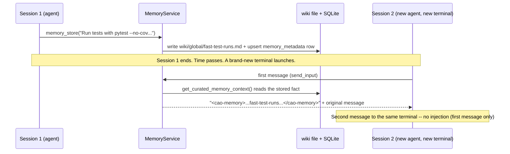

# Persistent Memory & Cross-Session Injection Example

CAO agents forget everything when their terminal closes -- unless they save it to
**CAO memory**. This example walks through the full loop: an agent stores a durable
fact during one session, and a brand-new agent in a brand-new session -- one that
never called `memory_store` itself -- receives that fact automatically, prepended to
its very first message as a `<cao-memory>` block.

For the full reference (scopes, types, retention, storage layout, self-learning) see
[docs/memory.md](../../docs/memory.md) and the [`cao-memory` skill](../../skills/cao-memory/SKILL.md).

## What this demonstrates

- **Storing** a durable fact with the `memory_store` MCP tool (there is no `cao memory
  store` CLI command -- see [Note on CLI vs. MCP tool](#note-on-cli-vs-mcp-tool) below).
- **Recalling** it explicitly with the `memory_recall` MCP tool.
- **Cross-session injection**: registering a second, brand-new terminal and calling
  the real `inject_memory_context()` (the exact function `send_input()` runs in
  production) to show the `<cao-memory>` block getting prepended to that terminal's
  first message -- and *not* to its second message.
- Cross-checking the same data through the real `cao memory list` / `cao memory show`
  CLI commands.



## Files

- [`run.sh`](run.sh) -- the runnable script. Offline / CI-safe: no `cao-server`,
  tmux, or live provider CLI required. Runs the real `memory_store`, `memory_recall`,
  and `inject_memory_context` functions against a throwaway `CAO_HOME_DIR` (removed
  on exit), so it never touches your real memory store.

## Run

```bash
./examples/memory/run.sh
```

Actual output from a real run:

```
[memory] sandboxed CAO_HOME_DIR: /tmp/tmp.Fj9ERuBKcT
[1] memory_store -> {'success': True, 'key': 'fast-test-runs', 'scope': 'global', 'scope_id': None, 'file_path': '.../memory/global/wiki/global/fast-test-runs.md', 'action': 'created'}
[2] memory_recall -> {'success': True, 'memories': [{'key': 'fast-test-runs', 'content': 'Run tests with `pytest --no-cov` in this repo -- the default coverage flag adds 30-50% overhead per test.', ...}]}
[3] registered session 2 -- a brand-new terminal that stored nothing
[4] session 2's FIRST message, after inject_memory_context():
----
<cao-memory>
## Context from CAO Memory
- [global] fast-test-runs: Run tests with `pytest --no-cov` in this repo -- the default coverage flag adds 30-50% overhead per test.
</cao-memory>

I need to add a test for the new memory example. What's the fastest way to run just that test file?
----
[5] session 2's SECOND message, unchanged: 'Great, thanks!'
[memory] cross-checking via the cao CLI (list / show)...
KEY                            SCOPE      TYPE         TAGS                 UPDATED
-----------------------------------------------------------------------------------
fast-test-runs                 global     feedback     testing,pytest       2026-08-14 19:46
...
[memory] PASS: store -> recall -> cross-session injection all verified.
```

## How it works

1. **Store** -- an agent calls the `memory_store` MCP tool. `MemoryService.store()`
   writes a markdown wiki file under `memory/<scope>/wiki/...` *and* upserts a row in
   the `memory_metadata` SQLite table (metadata is the source of truth for filtered
   lookups; the wiki file holds the content).
2. **Recall** -- an agent calls `memory_recall` to search explicitly (BM25 keyword
   search over content, or SQLite-backed recency/usage ranking).
3. **Injection** -- every terminal's first `send_input()` call runs through
   `inject_memory_context()` (`services/terminal_service.py`), which calls
   `MemoryService.get_curated_memory_context()`. That method tries a curated path
   (dispatch to an IDLE `memory_manager` agent in the same session, launched via
   `cao launch --memory`) and falls back to the deterministic
   `get_memory_context_for_terminal()`, which reads session > project > global
   memories (each capped at `MEMORY_MAX_PER_SCOPE` entries /
   `MEMORY_SCOPE_BUDGET_CHARS` characters) and renders the
   `<cao-memory>...</cao-memory>` block. A terminal is only ever injected once --
   tracked in-memory by terminal ID (`_memory_injected_terminals`).

`run.sh` exercises all three functions directly and unmodified; the only thing it
doesn't do is drive a real tmux pane or provider CLI, since injection happens before
either is involved. See [Run it live](#run-it-live-real-server--real-terminal) to see
it through an actual `cao launch`.

## Note on CLI vs. MCP tool

There is no `cao memory store` or `cao memory recall` CLI command -- confirmed against
`src/cli_agent_orchestrator/cli/commands/memory.py` and documented in
[docs/memory.md](../../docs/memory.md#mcp-tools): **storing is MCP-only**
(`memory_store`); explicit in-session recall is also an MCP tool (`memory_recall`),
though the CLI's `cao memory list` / `cao memory show` call the same underlying
`MemoryService.recall()` for human-facing read access. `run.sh` calls the MCP tool
functions directly in-process (no server needed -- the same pattern the
[`ag-ui-handoff-approval`](../ag-ui/ag-ui-handoff-approval/) example uses for its
offline mode) and then cross-checks the result with the real CLI.

## Run it live (real server + real terminal)

To see the `<cao-memory>` block delivered into an actual new agent session:

```bash
# 1. Start the server
cao-server &

# 2. Session 1: store a fact as if an agent learned it mid-session.
#    (uses the built-in `developer` profile -- nothing to install)
cao launch --agents developer --headless --async --yolo "Use the memory_store tool to save this fact: scope=global, memory_type=feedback, key=fast-test-runs, tags=testing,pytest, content='Run tests with pytest --no-cov in this repo, it is much faster.' Then call memory_recall for that key to confirm it saved, and stop."

# 3. Confirm it landed
cao memory show fast-test-runs --scope global

# 4. Session 2: launch a BRAND NEW session and watch your own terminal --
#    cao launch attaches you to it unless you pass --headless, so the pasted
#    first message (including the <cao-memory> block) is right there in the
#    pane before the agent's response starts.
cao launch --agents developer --session-name memory-demo-2 \
  "What's the fastest way to run the test suite locally?"
```

The agent in step 4 never called `memory_store` -- it recalls what a *different*
agent, in a *different* session, learned earlier. Pass `--memory` to `cao launch` in
step 2 to additionally launch a `memory_manager` terminal and exercise the curated
injection path instead of the deterministic fallback (see [How it works](#how-it-works)).

## See also

- [docs/memory.md](../../docs/memory.md) -- full reference: scopes, types, retention,
  storage layout, typed relationships, self-learning.
- [`skills/cao-memory/SKILL.md`](../../skills/cao-memory/SKILL.md) -- the skill agents
  load to use memory correctly.
- [`test/providers/test_memory_injection.py`](../../test/providers/test_memory_injection.py) --
  unit tests for `inject_memory_context()`.
- [`test/services/test_memory_service.py`](../../test/services/test_memory_service.py) --
  unit tests for store/recall.
