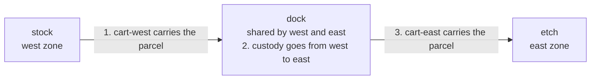
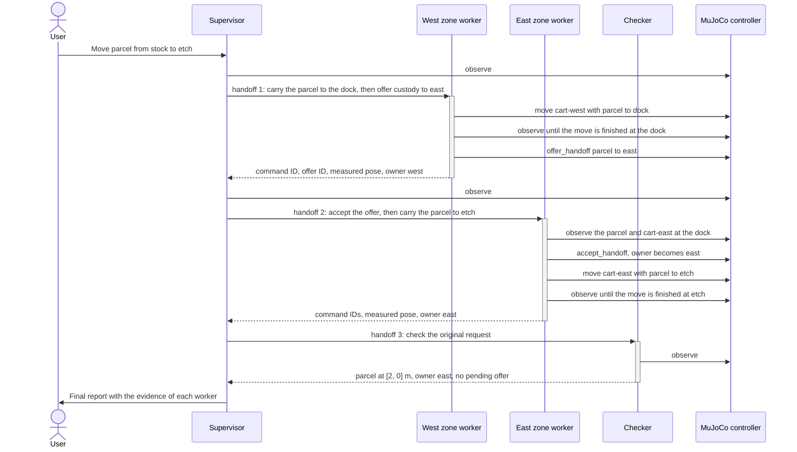
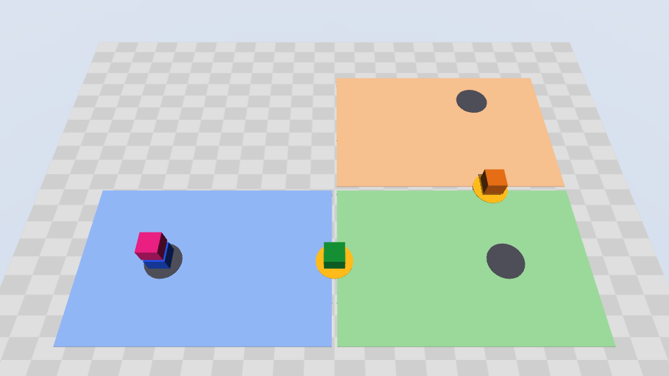
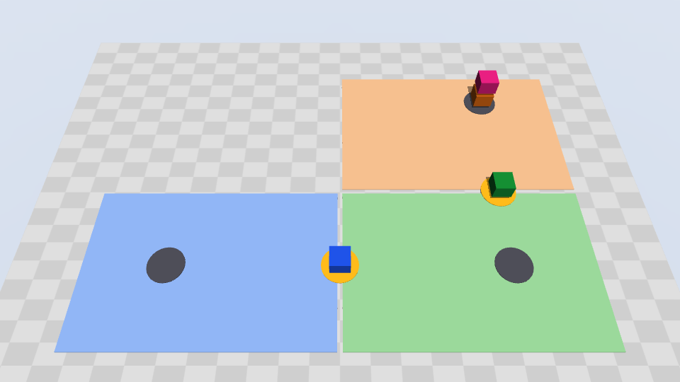

# Transport across ownership zones

In this exercise, a team of AI agents moves a parcel across a simulated
factory floor. The floor has two areas, and a different robot team works in
each area. You start the simulator and the agents on your laptop. Then you
watch the agents plan the job and divide the work. The agents pass the parcel
from one team to the other, and they check the result.

## What the exercise is about

### Areas, owners, and the job

In a large factory, warehouse, or laboratory, different robot teams often work
in different areas of the floor. In this example, each area is a **zone**.

Each zone has one **owner**. The owner is the robot team of that zone. Two
rules apply:

- Only the robots of a zone can move items in that zone.
- The owner of a zone is responsible for each item in that zone.

The example calls these zones **ownership zones**. The term is not a standard
industry term. It is the name of the example. It comes from an example of
[Strands Robots](https://github.com/strands-labs/robots). See
[Background](#background).

The job of the agents is a **transport across ownership zones**. A transport
across ownership zones is one transport job. It is not a zone. In this job,
the parcel must go from a location in one zone to a location in a different
zone. No robot can do the full trip, because each robot stays in its own zone.
Thus the job has four parts:

1. A robot of the first zone moves the parcel to a **shared dock**. The shared
   dock is a location in the two zones.
2. The first zone offers **custody** of the parcel to the second zone. Custody
   is the responsibility for the parcel. The first zone keeps custody until
   the second zone accepts it.
3. The second zone accepts custody. It can accept only when its robot and the
   parcel are at the dock.
4. A robot of the second zone moves the parcel to the destination.

In the default scene, the parcel goes from `stock` to `etch`. `stock` is in the
`west` zone, and `etch` is in the `east` zone. The parcel goes through the
shared `dock`:



### The agents

Four CAO agents do the work. Each agent is a provider CLI, for example GitHub
Copilot CLI or Claude Code, in its own CAO terminal:

- A **supervisor** reads your request, plans the job, and delegates each step
  with the CAO `handoff` tool. It cannot move a robot.
- One **zone worker** for each zone controls only the robots of its zone. The
  west zone worker carries the parcel to the dock and offers custody. The east
  zone worker accepts custody and carries the parcel to `etch`.
- An independent **checker** reads the final state and verifies the result.
  It cannot move a robot.

Each agent has a credential. The credential gives access only to the
simulator tools of the role and the zone of the agent. The simulator, not a
prompt, enforces these limits.

### The simulator: MuJoCo

[MuJoCo](https://mujoco.readthedocs.io/en/stable/overview.html) means
Multi-Joint dynamics with Contact. It is a free, open-source physics engine.
Google DeepMind maintains it. Robotics research and development use it to
simulate robots and their environment. Step 1 installs it as a Python package.
No robot hardware is necessary.

This exercise uses MuJoCo in a simple way. The robots are carts that move
along straight lines. The parcel moves with its cart. The simulator measures the
positions of the carts and the parcel. A zone can change custody only when the
measured positions show the cart and the parcel at the dock.

A local process, the **controller** (`demo.py serve`), runs the MuJoCo world.
The agents use the world only through the MCP tools of the controller.

### What you get from the exercise

- You see a CAO supervisor delegate sequential steps to workers with
  `handoff`, and get evidence back from each worker.
- You see the agents make decisions. The controller does no planning. The
  CAO supervisor finds the parcel, selects the route, and selects the zone
  worker for each leg. Two [demo scenarios](#demo-scenarios) show this: a
  parcel that starts in the east zone, and a route through three zones.
- You see how CAO agent profiles, tool allowlists, and credentials keep each
  agent in its role.
- You see a handover between two agents that depends on a measured state, not
  on the text of a message.
- You see the robots move, in pictures from the simulator. See
  [See the robots move](#see-the-robots-move).

The agents need approximately 3 to 5 minutes for a run. The exercise needs
no GPU, no display, and no robot hardware. See
[Compute and GPU](#compute-and-gpu).


## Background

This is the first physical AI example of CAO. Physical AI is AI that controls
machines in the physical world, for example robots.

The idea of the example comes from
[Strands Robots](https://github.com/strands-labs/robots). Strands Robots is an
open-source project with the Apache-2.0 license. It is a project of
[Strands Labs](https://aws.amazon.com/blogs/opensource/introducing-strands-labs-get-hands-on-today-with-state-of-the-art-experimental-approaches-to-agentic-development/),
the GitHub organization of AWS for experimental AI agent projects. With
Strands Robots, a [Strands Agents](https://aws.amazon.com/blogs/opensource/introducing-strands-agents-an-open-source-ai-agents-sdk/)
agent can control, simulate, and train robots with natural language. Strands
Agents is the open-source AI agent SDK of AWS.

This example follows the Strands Robots example
[Transport across ownership zones](https://github.com/strands-labs/robots/blob/5180ecc43eb478d84aabf9451bec742b4c2febc6/examples/fleet/02_cross_zone_transport.py).
The two examples have the same job. Each zone has an owner, and the zones have
a shared dock. The receiving zone must accept the custody handoff. The two
examples do the job in different ways:

| | Strands Robots example | This example |
| --- | --- | --- |
| Who plans the job | Python code. A coordinator function splits the request into legs with fixed rules. | A CAO agent. The CAO supervisor reads the request and the scene, and it plans the legs. |
| Who does each leg | A zone orchestrator in the same Python process, over a Zenoh mesh | A separate provider CLI agent for each zone, in its own CAO terminal |
| How the work is delegated | `mesh.send`, after a person approves each leg | CAO `handoff`. Each worker returns its evidence to the CAO supervisor. |
| Who checks the result | The coordinator code. It sends a leg only after the success reply of the leg before it. | A separate checker agent. It reads the measured state after the last leg. |

Thus this example uses CAO, a multi-agent orchestration system, to do the job.
It does not import Strands, LangGraph, Zenoh, or a robot policy. The code and
the scene are original. The example contains no robot assets or code from
Strands Robots.

## Agents

Each agent has a profile in this directory, as in
[examples/assign](../../assign/README.md). A profile has YAML frontmatter and
then the instructions of the agent:

| Agent | Profile | CAO delegation grant | Simulator access |
| --- | --- | --- | --- |
| Supervisor | [`transport_supervisor.md`](transport_supervisor.md) | `@cao-mcp-server`. The instructions use `handoff`. | Read-only: `observe` |
| Zone worker, one for each zone | [`transport_zone_worker.md`](transport_zone_worker.md) | None. CAO refuses its `assign` and `handoff` calls. | Own zone only: `observe`, `move`, `offer_handoff`, `accept_handoff` |
| Checker | [`transport_checker.md`](transport_checker.md) | None. CAO refuses its `assign` and `handoff` calls. | Read-only: `observe` |

The instructions of each profile have the same sections as the profiles of
the assign example:

| Section | Contents |
| --- | --- |
| Role and Identity | What the agent is, and what it cannot do |
| Core Responsibilities | The tasks of the agent |
| Available MCP Tools | Each tool that the credential of the agent can call, with its parameters |
| Run Bindings | The run identifiers that `demo.py prepare` adds |
| Workflow | The numbered steps of the agent, with the tool calls |
| Critical Rules | The rules for proof, retries, and safety |
| Example | One worked example, with placeholders instead of scene names |
| Final Report Format or Result Format | The items of the final response of the agent |

The supervisor profile also has a section for failures and uncertain results.
The zone worker profile also has a table of the rejection reasons of the
controller.

Do not install these files directly. Their `transport-sim` entry is a
placeholder, and the files contain no credential. `demo.py prepare` makes a
run copy of each profile for each run. See [Run copies](#run-copies).

With `site.json`, a run has four agents: the supervisor, the `west` zone
worker, the `east` zone worker, and the checker. With `return-site.json`, the
zone workers are `stores` and `assembly`.

What each agent does:

- **Supervisor.** Reads the request and the scene. Plans the legs. Sends each
  leg to the zone worker that owns it. Sends the final check to the checker.
  Reports the evidence of each worker. It cannot move a robot.
- **Zone worker.** Operates only its own zone. Selects a capable robot. Moves
  the payload and measures the arrival. Offers custody at the dock, or accepts
  an offer. A provider that enforces the allowlist blocks its shell and file
  tools. CAO refuses its `assign` and `handoff` calls.
- **Checker.** Reads fresh state. Compares the measured poses, the owner, and
  the command records with the original request. Its credential cannot move a
  robot, change custody, or stop the run. CAO refuses its `assign` and
  `handoff` calls.

All zone workers use the same profile. Each run copy adds run bindings that set
`your_zone`. The credential of the worker also sets its zone in the
controller. A prompt or a tool argument cannot give a worker access to another
zone.

You are the **operator**, not a CAO agent. You start the controller, approve
motion, read the state, and stop the run with `demo.py`.

Only a credential with the correct scope can call a simulator tool:

| Tool | Scope | Used by | Effect |
| --- | --- | --- | --- |
| `observe` | `observe` | All agents, and `demo.py status` | Returns poses, custody, capabilities, and command records. Changes nothing. |
| `move` | `act` | Zone workers | Starts one bounded leg in the zone of the caller. Returns `accepted`, not arrival. |
| `offer_handoff` | `act` | Zone workers | Offers custody at a shared dock. The sender keeps custody until the receiver accepts. |
| `accept_handoff` | `act` | Zone workers | Accepts one exact offer. The receiving robot and the payload must be at the dock. |
| `stop_simulation` | `operate` | `demo.py stop` | Stops all motion and locks the run. |

### Agent profiles

This is the frontmatter of [`transport_supervisor.md`](transport_supervisor.md):

```yaml
---
name: transport_supervisor
description: "Simulation-only cross-zone transport supervisor: plans the legs and delegates each leg with CAO handoff"
skills: []  # Show no CAO skill catalog to this agent.
allowedTools:
  - "@transport-sim"   # Simulator tools. The supervisor credential permits only observe.
  - "@cao-mcp-server"  # CAO handoff. Only the supervisor can delegate.
mcpServers:
  # Placeholder. demo.py prepare sets the Python and the credential file of the run.
  transport-sim:
    type: stdio
    command: python
    args: ["demo.py", "connect", "<run-dir>/credentials/supervisor.json"]
  cao-mcp-server:
    type: stdio
    command: cao-mcp-server
    args: []
---
```

The zone worker and checker profiles are different in these ways:

- `allowedTools` contains only `@transport-sim`.
- `mcpServers` contains only `transport-sim`.
- The credential file is `zone_<zone>.json` or `checker.json`.

The zone worker profile does not grant `@cao-mcp-server`. Thus CAO refuses
its `assign` and `handoff` calls, with this result:
`'assign' is not permitted: the calling terminal's allowed tools do not include '@cao-mcp-server'`.
The checker profile also does not grant `@cao-mcp-server`.

The instructions of the zone workers and the checker tell them to return their
evidence to the `handoff` caller. They do not need any CAO tool for this.

### Run copies

`demo.py prepare` writes one run copy of a profile for each agent of the run.
For `site.json`, it writes four copies: one supervisor, two zone workers, and
one checker. A run copy is the profile with these changes:

| Field | Profile in this directory | Run copy |
| --- | --- | --- |
| `name` | `transport_supervisor` | `transport_supervisor_<id>`, where `<id>` is random |
| `description` | The text in the profile | The same text. For a zone worker, `prepare` adds the zone, for example `(zone west)`. |
| `provider` | Not set | `copilot_cli`, or the value of `--provider` |
| `transport-sim` | A placeholder | The Python of the example `.venv`, `demo.py connect`, and the credential file of the agent |
| Instructions | The instructions of the agent | The same instructions, and then the run bindings |

The random `<id>` gives each run its own installed profile names. `handoff`
starts each worker from its installed profile when the supervisor calls it.
Thus a later run must not replace the profiles of a run that is not complete.

This is the frontmatter of the run copy for the `west` zone worker, with
shortened IDs and paths:

```yaml
---
name: transport_zone_worker_<id-1>
description: 'Simulation-only cross-zone transport zone worker: moves the payload in one zone and offers or accepts custody (zone west)'
provider: copilot_cli
skills: []
allowedTools:
- '@transport-sim'
mcpServers:
  transport-sim:
    type: stdio
    command: <example-dir>/.venv/bin/python3
    args:
    - <example-dir>/demo.py
    - connect
    - <run-dir>/credentials/zone_west.json
---
```

These are the run bindings of the `west` zone worker:

```json
{
  "run_id": "<run-id>",
  "your_zone": "west",
  "zone_profiles": {
    "west": "transport_zone_worker_<id-1>",
    "east": "transport_zone_worker_<id-2>"
  },
  "checker_profile": "transport_checker_<id>"
}
```

The supervisor and the checker have `"your_zone": null`. To see the run
copies, run `ls "$RUN_DIR/profiles"` after Step 2 of
[Run the demo](#run-the-demo).

## Orchestration

The supervisor delegates every step with `handoff`. The workflow is sequential:
each `handoff` blocks until the worker returns its evidence. Between steps, the
supervisor reads the state with `observe`. In the diagram, solid arrows are CAO
handoffs and dotted arrows are calls to the simulator.




For `site.json`, a successful run has this sequence:

1. The west zone worker selects `cart-west`. It moves `parcel` from `stock` to
   `dock`. It confirms the finished command and the measured dock position.
2. The west zone worker offers custody to `east`. West stays the owner until
   east accepts.
3. The east zone worker confirms that the parcel and `cart-east` are at the dock.
   It accepts the exact offer. Then it moves the parcel to `etch`.
4. The checker reads fresh state and compares it with the original request.

### Why handoff and not assign

The [assign example](../../assign/README.md) uses `assign` and `handoff`
together. The two tools return the result of a worker in different ways:

| Tool | Return of the result |
| --- | --- |
| `handoff` | The call blocks until the worker finishes. CAO reads the last response of the worker from its terminal and returns it as the result of the call. The worker needs no CAO tool. |
| `assign` | The call returns immediately. CAO adds this line to the task: `[Assigned by terminal <id>. When done, send results back to terminal <id> using send_message]`. The worker must call `send_message`. CAO queues the message in the inbox of the supervisor and delivers it when the supervisor is idle. |

This example uses only `handoff`, for these reasons:

- Each step needs the result of the step before it. The east zone worker can
  accept custody only after the west zone worker offers it at the dock. The
  checker can check only after the last leg. Parallel work gives no benefit.
- With `handoff`, the zone workers and the checker need no CAO tool. Their
  profiles grant only `@transport-sim`.

To use `assign`, do these changes:

1. In `transport_zone_worker.md` and `transport_checker.md`, add
   `cao-mcp-server` to `mcpServers`. CAO does not gate `send_message`, so the
   worker can then send its result. CAO still refuses `assign` and `handoff`
   from the worker.
2. Do not add `@cao-mcp-server` to `allowedTools`. That grant also lets the
   worker call `assign` and `handoff`.
3. Change the instructions in the three profiles. The supervisor must use
   `assign`, and the workers must send their results with `send_message`.
4. Prepare a new run. `prepare` reads the profiles when it makes the run
   copies.

See [Tool restrictions](../../../docs/tool-restrictions.md).

`assign` is useful for independent work, for example two payloads that never
share a dock. This example has one payload, so it uses only `handoff`.

## Requirements

### Software

| Requirement | Version | How to check |
| --- | --- | --- |
| CAO | A release that contains this example, or the latest `main` | `cao --version` |
| tmux | 3.3 or later | `tmux -V` |
| uv | A recent release | `uv --version` |
| Python | 3.10 or later | Step 1 finds or installs it with `uv` |
| MuJoCo | The version in `uv.lock` | Step 1 installs it as the Python package `mujoco`. You do not install it separately. |
| OpenGL | Only for the pictures of `--record`. No separate GPU is necessary. | On macOS, OpenGL is part of the system. On Linux without a display, see [See the robots move](#see-the-robots-move). |
| Provider CLI | A CAO provider that `prepare` accepts. GitHub Copilot CLI is the default. See [Providers](#providers). | Start the CLI one time in this repository, sign in, and accept its first-run prompts |

A CAO release that contains this example also contains the permission fix for
workflow delegation that this example uses. To install or update CAO from the
latest `main`:

```bash
uv tool install git+https://github.com/awslabs/cli-agent-orchestrator.git@main --upgrade
```

<details>
<summary>Expected output</summary>

An update of an existing installation. The packages, versions, and the commit
can be different. The last line is the important one.

```text
Resolved 91 packages in 496ms
   Updating https://github.com/awslabs/cli-agent-orchestrator.git (main)
    Updated https://github.com/awslabs/cli-agent-orchestrator.git (<commit>)
   Building cli-agent-orchestrator @ git+https://github.com/awslabs/cli-agent-orchestrator.git@<commit>
      Built cli-agent-orchestrator @ git+https://github.com/awslabs/cli-agent-orchestrator.git@<commit>
Prepared 3 packages in 4.97s
Uninstalled 3 packages in 474ms
Installed 3 packages in 395ms
 - cli-agent-orchestrator==<version> (from git+https://github.com/awslabs/cli-agent-orchestrator.git@<commit>)
 + cli-agent-orchestrator==<version> (from git+https://github.com/awslabs/cli-agent-orchestrator.git@<commit>)
 ...
Installed 4 executables: cao, cao-mcp-server, cao-ops-mcp-server, cao-server
```

</details>

For other installation methods, see [Install CAO](../../../README.md#install-cao).

The example has its own Python project and lockfile. It does not change the CAO
installation.

### Providers

Select the provider with `--provider` in Step 2. `prepare` writes it into each
run copy, so `cao install` and `cao launch` use the same provider for all the
agents.

Each agent must get the `transport-sim` server of its own run copy, with its
own credential. `prepare` refuses a provider that cannot do this:

| Provider | Reason |
| --- | --- |
| `cursor_cli` | CAO starts Cursor CLI without the instructions of the agent profile. The CAO supervisor would get neither its workflow nor its run bindings. |
| `opencode_cli` | OpenCode keeps the MCP servers of all agents in one shared configuration. All the agents would then use the same credential. |
| `hermes` | Hermes reads MCP servers only from its own Hermes profile, not from the CAO agent profile. The agents would get no simulator server. |
| `antigravity_cli` | Antigravity CLI reads the MCP servers of all CAO terminals from one shared file. An agent could then use the simulator credential and the CAO tools of another agent. |

The isolation of the zones needs a provider that enforces the tool allowlist
of each profile. CAO shows this in the `Enforcement:` line of `cao launch`. For
the enforcement of each provider, see
[Tool restrictions](../../../docs/tool-restrictions.md).

> [!WARNING]
> If the provider does not enforce the allowlist, an agent can use a shell.
> Then it can read the credential files of the other zones and act for another
> zone. `prepare` prints a warning for these providers. Use them only for a
> trusted local demo.

For the setup of each provider, see its guide in the
[CAO documentation](../../../README.md#prerequisites).

### Compute and GPU

You do not need a GPU. A laptop is enough:

- The controller sets the positions of the carts and the parcel directly, along
  straight lines. The world has no gravity and no contacts.
- With `--record`, MuJoCo renders small pictures with OpenGL. This needs no
  separate GPU. See [See the robots move](#see-the-robots-move).
- The agents are provider CLIs. The language models run on the service of the
  provider, not on your computer.
- The example needs no display and no download of a robot model.

If you change the example to do more than move carts, you can need a GPU. Use this table:

| Change to the example | GPU necessary | Why |
| --- | --- | --- |
| Simulate a robot arm that picks up an item. The arm moves its hand above the item, closes its gripper, lifts the item, and puts it down again. [Strands Robots example 18](https://github.com/strands-labs/robots/blob/ed1544d73e3bf2c7ebc599987df759e14193c96d/examples/18_so101_pick_and_lift.py) does this with a small arm. | No | The arm does not look for the item. The script puts the item at a known position, and it reads the position of the item from the simulator. Thus the arm needs no camera. The example uses a camera only to record an optional video. The CPU calculates the arm motion to that position. Example 18 reports a run time of approximately 3 seconds on a CPU. Strands Robots needs Python 3.12 or later. On a real robot, a camera or another sensor must find the item first. |
| Use a trained robot model on your computer. A trained robot model is a neural network. It reads camera images and an instruction. Then it sends motor commands to the robot many times each second. This example has no such model. | Yes | The model needs an NVIDIA GPU. For example, the AWS instance type `g6e.2xlarge` has 1 NVIDIA L40S GPU with 48 GB of memory. The model card of the model gives the GPU memory that it needs. |
| Plan arm motions that do not hit objects, with the NVIDIA library cuRobo. | Yes | cuRobo uses CUDA, so it needs an NVIDIA GPU. |

## Run the demo

Use three terminals:

| Terminal | Use |
| --- | --- |
| Terminal 1 | Prepare the run, install the profiles, launch the supervisor, and check the result |
| Terminal 2 | Run the MuJoCo controller, `demo.py serve` |
| Terminal 3 | Run `cao-server` |

Each step has an **Expected output** section that you can expand. The outputs
come from a run of this guide. In them, `<id>` is a random ID, and `<run_id>`
is the run ID. `<repo>` is the path of the repository, and `<time>` is a time
stamp. On macOS, `/tmp` can show as `/private/tmp`.

### Step 1. Install the example dependencies

In Terminal 1, from the repository root:

```bash
cd examples/robotics/cross-zone-transport
uv sync --locked
```

<details>
<summary>Expected output</summary>

The first time:

```text
Using CPython 3.10.18
Creating virtual environment at: .venv
Resolved 93 packages in 31ms
Installed 79 packages in 9.57s
 + absl-py==2.5.0
 + aiofile==3.8.8
 ...
 + websockets==16.1.1
 + zipp==4.1.1
```

Later times:

```text
Resolved 93 packages in 26ms
Audited 79 packages in 44ms
```

</details>

### Step 2. Prepare a run

In Terminal 1, run these commands. To use a provider other than Copilot CLI,
add `--provider <provider>` to the `prepare` command, for example
`--provider kiro_cli`. See [Providers](#providers).

```bash
export RUN_DIR=/tmp/cao-transport-demo
REQUEST="Move parcel from stock to etch. Coordinate the ownership handoff and have an independent checker verify delivery."
uv run --locked python demo.py prepare --run-dir "$RUN_DIR" --request "$REQUEST"
```

<details>
<summary>Expected output</summary>

```text
cao install /tmp/cao-transport-demo/profiles/transport_supervisor_<id>.md
cao install /tmp/cao-transport-demo/profiles/transport_checker_<id>.md
cao install /tmp/cao-transport-demo/profiles/transport_zone_worker_<id>.md
cao install /tmp/cao-transport-demo/profiles/transport_zone_worker_<id>.md
cao launch --agents transport_supervisor_<id> --headless --async --auto-approve --session-name cao-transport-<run_id> --working-directory <repo>/examples/robotics/cross-zone-transport -- 'Move parcel from stock to etch. Coordinate the ownership handoff and have an independent checker verify delivery.'
```

`demo.py` commands can also print this warning from a dependency. You can
ignore it:

```text
.../fastmcp/server/auth/providers/jwt.py:12: AuthlibDeprecationWarning: authlib.jose module is deprecated, please use joserfc instead.
It will be compatible before version 2.0.0.
  from authlib.jose import JsonWebKey, JsonWebToken
```

</details>

`prepare` writes these items to the run directory:

| Path | Contents |
| --- | --- |
| `profiles/` | One run copy of a profile for each agent. See [Run copies](#run-copies). |
| `credentials/` | One private credential file for each actor, readable only by you |
| `run.json` | The run ID, the profile names, and the controller URL |
| `run.env` | Shell variables for Steps 5 and 6: the profile name of each agent, the run ID, and the session name |
| `scene.json` | A copy of the scene |

`prepare` also prints the `cao install` and `cao launch` commands for this run.
Steps 5 and 6 run the same commands. They also set the variables that the
later steps use.

- `/tmp` is the folder for temporary files of macOS and Linux. It is not in
  this repository. The run directory `/tmp/cao-transport-demo` and the
  pictures of Step 3, `/tmp/cao-transport-frames`, are in `/tmp`. On macOS,
  `/tmp` is a link to `/private/tmp`, so some outputs show `/private/tmp`.
- If the run directory exists, `prepare` stops with an error. Use a new
  directory for each run.
- Do not move the example directory or its `.venv` until the cleanup. Each
  run copy starts the Python interpreter of `.venv` and `demo.py` by their
  full paths.

### Step 3. Start the MuJoCo controller

The MuJoCo controller is the simulator of this example. It holds the MuJoCo
world: the zones, the carts, and the parcel. The agents use the world only
through its MCP tools.

In Terminal 2, from the repository root:

```bash
cd examples/robotics/cross-zone-transport
export RUN_DIR=/tmp/cao-transport-demo
uv run --locked python demo.py serve --run-dir "$RUN_DIR" --allow-motion \
  --record /tmp/cao-transport-frames
```

<details>
<summary>Expected output</summary>

When the controller starts:

```text
<time> transport SIMULATION ONLY: kinematic carrying; motion approved for this scene
<time> transport Recording frames of the world to /tmp/cao-transport-frames
[<time>] INFO     Starting MCP server 'CAO cross-zone transport simulator' with transport 'http' (stateless) on http://127.0.0.1:8766/mcp
INFO:     Started server process [<pid>]
INFO:     Waiting for application startup.
<time> mcp.server.streamable_http_manager StreamableHTTP session manager started
INFO:     Application startup complete.
INFO:     Uvicorn running on http://127.0.0.1:8766 (Press CTRL+C to quit)
```

While the agents work, the controller writes one line for each tool call of
an agent. It also writes one line for each status change of a command. The line of a
tool call starts with the agent, for example `west zone worker`. These lines
come from a run with `--provider claude_code`:

```text
<time> transport supervisor called observe()
<time> transport west zone worker called observe()
<time> transport west zone worker called move(command_id=west-parcel-stock-to-dock, robot=cart-west, payload=parcel, destination=dock)
<time> transport run=<run_id> actor=west command=west-parcel-stock-to-dock operation=move status=accepted reason=None
<time> transport run=<run_id> actor=west command=west-parcel-stock-to-dock operation=move status=running reason=None
<time> transport run=<run_id> actor=west command=west-parcel-stock-to-dock operation=move status=finished reason=None
<time> transport west zone worker called observe()
<time> transport west zone worker called offer_handoff(command_id=west-offer-parcel-to-east, payload=parcel, receiver_zone=east)
<time> transport run=<run_id> actor=west command=west-offer-parcel-to-east operation=offer status=finished reason=None
<time> transport west zone worker called observe()
<time> transport supervisor called observe()
<time> transport east zone worker called observe()
<time> transport east zone worker called accept_handoff(command_id=east-accept-parcel-from-west, payload=parcel, robot=cart-east, offer_id=west-offer-parcel-to-east)
<time> transport run=<run_id> actor=east command=east-accept-parcel-from-west operation=accept status=finished reason=None
<time> transport east zone worker called move(command_id=east-parcel-dock-to-etch, robot=cart-east, payload=parcel, destination=etch)
<time> transport run=<run_id> actor=east command=east-parcel-dock-to-etch operation=move status=accepted reason=None
<time> transport run=<run_id> actor=east command=east-parcel-dock-to-etch operation=move status=running reason=None
<time> transport run=<run_id> actor=east command=east-parcel-dock-to-etch operation=move status=finished reason=None
<time> transport east zone worker called observe()
<time> transport supervisor called observe()
<time> transport checker called observe()
<time> transport checker called observe()
```

The agents choose the command IDs and the number of `observe` calls, so your
lines can be different.

</details>

Do not stop the controller until [Stop and clean up](#stop-and-clean-up). The
controller shows one log line for each command change, with the actor, command
ID, operation, status, and refusal reason.

- The controller is not `cao-server`. It owns the MuJoCo world, so the world
  stays when the short-lived workers stop.
- `--allow-motion` is your approval for bounded motion in this simulation.
  Without it, the controller rejects all `move`, `offer_handoff`, and
  `accept_handoff` calls with `motion_not_approved`.
- `--record` saves pictures of the MuJoCo world while the robots move. See
  [See the robots move](#see-the-robots-move). The directory must be new or
  empty. To run without pictures, remove `--record` and its directory.
- The controller listens only on `127.0.0.1`, port 8766 by default.

### Step 4. Start the CAO server

In Terminal 3:

```bash
cao-server
```

<details>
<summary>Expected output</summary>

```text
INFO:     Started server process [<pid>]
INFO:     Waiting for application startup.
INFO:     Application startup complete.
INFO:     Uvicorn running on http://127.0.0.1:9889 (Press CTRL+C to quit)
Server logs: ~/.aws/cli-agent-orchestrator/logs/cao_<time>.log
For debug logs: export CAO_LOG_LEVEL=DEBUG && cao-server
```

</details>

If `cao-server` already runs, skip this step. If it runs an earlier CAO
version, stop it and start it again.

### Step 5. Install the agent profiles

The three profiles of this directory give four agents: one supervisor, two
zone workers, and one checker. `prepare` wrote one run copy for each agent.
It also wrote `run.env`, which gives the name of each run copy. Install the run
copies, not the profiles of this directory.

- `source` sets the variables `SUPERVISOR`, `ZONE_WEST`, `ZONE_EAST`,
  `CHECKER`, `RUN_ID`, and `SESSION`. To see them, run
  `cat "$RUN_DIR/run.env"`.
- A scene with other zones has other zone variables. For example,
  `return-site.json` gives `ZONE_STORES` and `ZONE_ASSEMBLY`. Install one zone
  worker for each `ZONE_` variable in `run.env`.
- `tee -a` also writes the output to `install.log`. The cleanup uses the
  paths in that file.

In Terminal 1, run these commands one at a time:

```bash
source "$RUN_DIR/run.env"
cao install "$RUN_DIR/profiles/$SUPERVISOR.md" | tee -a "$RUN_DIR/install.log"
cao install "$RUN_DIR/profiles/$ZONE_WEST.md" | tee -a "$RUN_DIR/install.log"
cao install "$RUN_DIR/profiles/$ZONE_EAST.md" | tee -a "$RUN_DIR/install.log"
cao install "$RUN_DIR/profiles/$CHECKER.md" | tee -a "$RUN_DIR/install.log"
```

<details>
<summary>Expected output</summary>

Three lines for each agent, in the order of the commands. This output is from
a run with `--provider claude_code`:

```text
✓ Copied agent from file to local store
✓ Agent 'transport_supervisor_<id>' installed successfully
✓ Context file: ~/.aws/cli-agent-orchestrator/agent-context/transport_supervisor_<id>.md
✓ Copied agent from file to local store
✓ Agent 'transport_zone_worker_<id>' installed successfully
✓ Context file: ~/.aws/cli-agent-orchestrator/agent-context/transport_zone_worker_<id>.md
✓ Copied agent from file to local store
✓ Agent 'transport_zone_worker_<id>' installed successfully
✓ Context file: ~/.aws/cli-agent-orchestrator/agent-context/transport_zone_worker_<id>.md
✓ Copied agent from file to local store
✓ Agent 'transport_checker_<id>' installed successfully
✓ Context file: ~/.aws/cli-agent-orchestrator/agent-context/transport_checker_<id>.md
```

If the provider uses its own agent file, `cao install` also prints a line
`✓ <provider> agent: <path>`.

</details>

### Step 6. Launch the CAO supervisor

> [!CAUTION]
> Use `--auto-approve`. Do not use `--yolo`. `--yolo` removes the tool
> restrictions that keep each agent in its role. Do not change the generated
> allowlists, and do not add other MCP servers.

In Terminal 1, launch the CAO supervisor. `$SUPERVISOR` and `$SESSION` come
from `run.env`, which Step 5 sourced:

```bash
cao launch --agents "$SUPERVISOR" --headless --async --auto-approve \
  --session-name "$SESSION" --working-directory "$(pwd)" \
  -- "$REQUEST"
```

<details>
<summary>Expected output</summary>

This output is from a run with `--provider claude_code`. The `Blocked:` line
lists the tools of the provider, so it is different for other providers.

```text
Agent 'transport_supervisor_<id>' launching on claude_code:
  Allowed:  @transport-sim, @cao-mcp-server
  Blocked:  Agent, Bash, BashOutput, Edit, Glob, Grep, KillShell, Monitor, NotebookEdit, Read, Task, WebFetch, WebSearch, Write
  Enforcement: native (the provider refuses blocked tools)
  Directory: <repo>/examples/robotics/cross-zone-transport

  To skip this prompt next time, relaunch with --auto-approve
  To remove all restrictions, relaunch with --yolo

Session created: cao-transport-<run_id>
Terminal created: transport_supervisor_<id>-<id>
Message delivered to transport_supervisor_<id>-<id>. Running in background.
```

The two `To ...` lines are information only.

</details>

- The command prints `Session created: cao-transport-<run_id>`. The launch
  command that `prepare` printed uses the same session name. The later steps
  use `$SESSION`.
- `--async` returns when CAO delivers the request. It does not wait for the
  task. The run continues if the client times out. Do not launch the request
  again.

### Step 7. Watch the agents

Use one or more of these views:

- **Web UI.** Open `http://localhost:9889`. See [Web UI](../../../docs/web-ui.md).
- **Session status.** In Terminal 1, run:

  ```bash
  cao session status "$SESSION" --workers
  ```

  <details>
  <summary>Expected output</summary>

  After the final answer of the supervisor, from a run with
  `--provider claude_code`:

  ```text
  Session:  cao-transport-<run_id>
  Terminal: <id>
  Agent:    transport_supervisor_<id>
  Provider: claude_code
  Model:    provider default
  Honored:  yes
  Status:   completed

  Last response:
  The parcel was delivered from stock to etch, and custody passed from west to east at dock. The independent checker confirmed the result. ...
  ...

  No worker terminals
  ```

  The text after `Last response:` depends on the run.

  While a worker runs, the output ends with a table of the worker terminals.
  The table has the columns `ID`, `AGENT`, `PROVIDER`, `MODEL`, `HONORED`, and
  `STATUS`.

  </details>

- **tmux.** Run `tmux attach -t "$SESSION"`. To detach, press Ctrl+b, then d.
  Do not type in an agent window. See the [tmux guide](../../../docs/tmux.md).
- **Controller log.** Look at Terminal 2.
- **Simulator picture.** Open `/tmp/cao-transport-frames/latest.png`. The
  controller replaces it at each change. See
  [See the robots move](#see-the-robots-move).

CAO can remove a worker window after its handoff finishes. The controller keeps
the command records of that worker.

The controller state in Step 8 is the record of what the robots did. The final
answer of the supervisor is in its window.

#### What each agent does

Each agent has its own CAO terminal and its own credential. The controller
writes one line in Terminal 2 for each tool call. The line starts with the
name of the agent, for example `west zone worker called move(...)`. Thus
Terminal 2 shows which agent does each step.

| Agent | CAO terminal (tmux window) | What it does | Lines in Terminal 2 |
| --- | --- | --- | --- |
| CAO supervisor | `transport_supervisor_<id>-<4hex>` | Reads the scene and the state. Plans the legs. Hands off each leg to a zone worker, and the check to the checker. Reports the result. | `supervisor called observe()` |
| West zone worker | `transport_zone_worker_<id>-<4hex>` | Moves the parcel from `stock` to the dock with `cart-west`. Offers custody to `east`. | `west zone worker called move(...)`, `west zone worker called offer_handoff(...)` |
| East zone worker | `transport_zone_worker_<id>-<4hex>` | Accepts the custody offer at the dock. Moves the parcel from the dock to `etch` with `cart-east`. | `east zone worker called accept_handoff(...)`, `east zone worker called move(...)` |
| Checker | `transport_checker_<id>-<4hex>` | Reads the final state and compares it with the request. Moves nothing. | `checker called observe()` |

The lines with `actor=` come from the simulator. They show each status change
of a command. The tmux window of a worker closes when its handoff ends, but
its lines stay in Terminal 2.

### Step 8. Check the result

In Terminal 1:

```bash
uv run --locked python demo.py status --run-dir "$RUN_DIR"
```

<details>
<summary>Expected output</summary>

An excerpt. The output also has the `model` and `scene` fields, and more
fields for each command.

```json
{
  "run_id": "<run_id>",
  "observed_at": "<time>",
  "position_units": "m",
  "motion_approved": true,
  "stopped": false,
  "robots": {
    "cart-west": {"xy": [0.0, 0.0], "zone": "west"},
    "cart-east": {"xy": [2.0, 0.0], "zone": "east"}
  },
  "payloads": {
    "parcel": {"xy": [2.0, 0.0], "at": "etch", "owner": "east", "offer": null}
  },
  "commands": [
    {"actor": "west", "command_id": "west-parcel-stock-to-dock", "operation": "move", "status": "finished", "reason": null},
    {"actor": "west", "command_id": "west-offer-parcel-to-east", "operation": "offer", "status": "finished", "reason": null},
    {"actor": "east", "command_id": "east-accept-parcel-from-west", "operation": "accept", "status": "finished", "reason": null},
    {"actor": "east", "command_id": "east-parcel-dock-to-etch", "operation": "move", "status": "finished", "reason": null}
  ]
}
```

</details>

For `site.json`, a successful run shows these values:

| Field | Expected value |
| --- | --- |
| `payloads.parcel.xy` | `[2.0, 0.0]`, within `arrival_tolerance_m` (0.01 m) |
| `payloads.parcel.at` | `etch` |
| `payloads.parcel.owner` | `east` |
| `payloads.parcel.offer` | `null` |
| `commands` | The two `move` commands, the `offer`, and the `accept` have `"status": "finished"` |

The final answer of the supervisor names each worker, each leg, the custody
acceptance, and the evidence of the checker.

<details>
<summary>Example final answer of the CAO supervisor</summary>

An excerpt from a run with `--provider claude_code`. The words and the layout
are different in each run.

```text
The parcel was delivered from stock to etch, and custody passed from west to
east at dock. The independent checker confirmed the result.

Workers
- West zone: transport_zone_worker_<id> (cart-west)
- East zone: transport_zone_worker_<id> (cart-east)
- Checker: transport_checker_<id>

Legs
┌──────┬────────────────────────────────────────────────────────┬─────────────────────┬──────────┐
│ Leg  │                        Commands                        │ Start → destination │  Status  │
├──────┼────────────────────────────────────────────────────────┼─────────────────────┼──────────┤
│ West │ west-parcel-stock-to-dock, west-offer-parcel-to-east   │ stock → dock        │ finished │
├──────┼────────────────────────────────────────────────────────┼─────────────────────┼──────────┤
│ East │ east-accept-parcel-from-west, east-parcel-dock-to-etch │ dock → etch         │ finished │
└──────┴────────────────────────────────────────────────────────┴─────────────────────┴──────────┘

Custody: West made offer west-offer-parcel-to-east at dock. Before the east leg
started, my own observe showed the parcel at dock, still owned by west, with
that offer pending. The east worker confirmed the parcel at dock, then accepted
the offer (east-accept-parcel-from-west) before moving it.

Checker evidence: The parcel is measured at [2, 0] m, which is 0.000 m from
etch (tolerance 0.01 m). The owner is east, no offer is pending, and all four
commands are finished.
...
```

</details>

A successful tool call or test run does not prove a multi-agent run. Make sure
that each zone worker and the checker did their part.

## Stop and clean up

Do these steps in this sequence:

1. In Terminal 1, stop the simulation:

   ```bash
   uv run --locked python demo.py stop --run-dir "$RUN_DIR"
   ```

   <details>
   <summary>Expected output</summary>

   The output is the full state, as in Step 8. An excerpt:

   ```json
   {
     "run_id": "<run_id>",
     "stopped": true,
     "payloads": {
       "parcel": {"xy": [2.0, 0.0], "at": "etch", "owner": "east", "offer": null}
     }
   }
   ```

   </details>

   Make sure that the output shows `"stopped": true`. The controller stays
   available for `observe` until step 3.
2. Stop the CAO session:

   ```bash
   cao shutdown --session "$SESSION"
   ```

   <details>
   <summary>Expected output</summary>

   ```text
   ✓ Shutdown session 'cao-transport-<run_id>'
   ```

   </details>

   If the command prints `already removed`, compare `$SESSION` with the
   output of `cao session list`.
3. In Terminal 2, press Ctrl+C. The controller stops and writes
   `last-state.json` to the run directory. With `--record`, it also writes the
   animation and the picture viewer. See
   [See the robots move](#see-the-robots-move).

   <details>
   <summary>Expected output</summary>

   ```text
   INFO:     Shutting down
   INFO:     Waiting for application shutdown.
   <time> mcp.server.streamable_http_manager StreamableHTTP session manager shutting down
   INFO:     Application shutdown complete.
   INFO:     Finished server process [<pid>]
   <time> transport Recorded 14 frame(s); open /tmp/cao-transport-frames/index.html
   ```

   The number of frames depends on the run.

   </details>
4. In Terminal 1, remove the installed files of this run. `cao profile remove`
   removes the copy of a profile in the CAO profile store. The last command
   removes the other files that `cao install` wrote in Step 5. It reads their
   paths from `install.log`. These paths depend on the provider and on your
   CAO settings.

   ```bash
   cao profile remove --yes "$SUPERVISOR"
   cao profile remove --yes "$ZONE_WEST"
   cao profile remove --yes "$ZONE_EAST"
   cao profile remove --yes "$CHECKER"
   sed -n -E 's/^✓ (Context file|[a-z_]+ agent): //p' "$RUN_DIR/install.log" | tr '\n' '\0' | xargs -0 rm -f --
   ```

   <details>
   <summary>Expected output</summary>

   One line for each agent. The last command prints nothing.

   ```text
   ✓ Removed 'transport_supervisor_<id>' from ~/.aws/cli-agent-orchestrator/agent-store
   ✓ Removed 'transport_zone_worker_<id>' from ~/.aws/cli-agent-orchestrator/agent-store
   ✓ Removed 'transport_zone_worker_<id>' from ~/.aws/cli-agent-orchestrator/agent-store
   ✓ Removed 'transport_checker_<id>' from ~/.aws/cli-agent-orchestrator/agent-store
   ```

   </details>

   Remove only the files of this run.
5. Keep `last-state.json` if you need it. Then remove the run directory:

   ```bash
   rm -rf -- "${RUN_DIR:?}"
   ```

   <details>
   <summary>Expected output</summary>

   The command prints nothing.

   </details>

   The pictures are not in the run directory. When you do not need them,
   remove them with `rm -rf -- /tmp/cao-transport-frames`.

6. If you do not need `cao-server`, press Ctrl+C in Terminal 3.

   <details>
   <summary>Expected output</summary>

   ```text
   INFO:     Shutting down
   INFO:     Waiting for application shutdown.
   INFO:     Application shutdown complete.
   INFO:     Finished server process [<pid>]
   ```

   </details>

The credential files are temporary. Do not commit them, and do not attach them
to an issue or a pull request.

## See the robots move

`demo.py serve --record DIR` saves pictures of the MuJoCo world. Step 3 uses
this option. The directory must be new or empty. The pictures come from a
fixed overview camera. They do not change the simulation.

This animation comes from a run of [Run the demo](#run-the-demo) with
`--provider claude_code`:


The controller checks the measured state two times each second. It saves a
picture after each of these changes:

- A robot or a payload moves to a new position, measured to 1 cm.
- The owner or the offer of a payload changes.
- A command changes its status.
- The operator stops the run.

The pictures do not show the owner and the offer. The captions in
`index.html` give them.

| Picture | State |
| --- | --- |
|  | 1. Start. The parcel is on `cart-west` at `stock`, owner `west`. `cart-east` waits at the dock. |
|  | 2. The west zone worker moves `cart-west` with the parcel to the dock. |
|  | 3. The parcel is at the dock, above the two carts. West offers custody to east, and east accepts. The owner changes from `west` to `east`. |
|  | 4. The east zone worker moves `cart-east` with the parcel to `etch`. `cart-west` stays at the dock. |
|  | 5. Delivered. The parcel is at `etch`, owner `east`. |

| In the picture | Item |
| --- | --- |
| Light blue area, light green area | Zone `west`, zone `east` |
| Strong blue box, strong green box | `cart-west`, `cart-east`. A robot has the strong color of its zone. |
| Pink box | `parcel` |
| Amber disc | `dock`, the shared dock of the two zones |
| Dark grey discs | `stock` and `etch` |

The controller writes these files to the directory:

| File | Written | Contents |
| --- | --- | --- |
| `latest.png` | At each change | The last picture |
| `frame-0001.png`, `frame-0002.png`, ... | At each change | One picture for each change |
| `animation.png` | At Ctrl+C | An animated PNG of all the pictures. Open it in a web browser. |
| `frames.json` | At Ctrl+C | The file, time, caption, and measured positions of each picture |
| `index.html` | At Ctrl+C | A page that shows each picture with its caption. Use **Previous**, **Play**, **Next**, or the slider. |

To open the page on macOS, run this command. On Linux, use `xdg-open`
instead of `open`.

```bash
open /tmp/cao-transport-frames/index.html
```

<details>
<summary>Expected output</summary>

The command prints nothing. Your web browser shows the page.

</details>

The pictures need OpenGL, but no separate GPU:

- On macOS, the pictures work with no settings.
- On Linux, MuJoCo uses GLFW by default, and GLFW needs a display. Without a
  display, set `MUJOCO_GL` in Terminal 2 before Step 3.
  `export MUJOCO_GL=egl` uses an EGL driver. `export MUJOCO_GL=osmesa` uses
  OSMesa, a software renderer on the CPU. Install the OSMesa library of your
  Linux distribution first.
- If the renderer does not start, the controller logs `Recording is off:` and
  continues without pictures. At Ctrl+C, it logs `Recorded no frames`. The
  simulation and the agents work as usual.

## Demo scenarios

Use a new run for each scenario. A run cannot start again: `serve` refuses a
run directory that it started before.

To run a scenario:

1. Stop and clean up the previous run. See [Stop and clean up](#stop-and-clean-up).
   This removes the run directory and makes port 8766 available.
2. If the scenario uses `/tmp/heavy-site.json` or `/tmp/slow-site.json`,
   create the scene file. Use the commands after the table.
3. Do Steps 2 to 8 of [Run the demo](#run-the-demo). In Step 2, set
   `REQUEST` to the request of the scenario. If the table gives `prepare`
   options, add them to the `prepare` command. In Step 3, give `--record` a
   new directory, or remove the directory of the previous run first.

To run two scenarios at the same time, give each run a different `RUN_DIR`.
Also add a different `--port <port>` to each `prepare` command, and give each
`serve` a different `--record` directory.

| Scenario | `prepare` options | Request | Expected result |
| --- | --- | --- | --- |
| Cross-zone delivery | None | `Move parcel from stock to etch. Coordinate the ownership handoff and have an independent checker verify delivery.` | Both zone workers contribute. The parcel arrives at the dock before east accepts custody. The checker confirms the parcel at `etch`, owner `east`. |
| Same-zone leg | None | `Move parcel from stock to dock only. Have an independent checker verify the result.` | One west leg and no custody offer. The owner stays `west`. |
| Unavailable destination | None | `Move parcel from stock to cleanroom. Have an independent checker verify the result.` | The agents report that `cleanroom` is not available. They do not invent a location or deliver to a different one. The parcel stays at `stock`, owner `west`. |
| Robot of another zone | None | `Use cart-east to move parcel from stock to dock. Have an independent checker verify the result.` | The agents refuse, or the controller rejects the call, for example with `not_robot_owner`. The parcel does not move. |
| Receiving robot too weak | `--scene /tmp/heavy-site.json` | Same as cross-zone delivery | `cart-east` (5 kg limit) cannot carry the 6 kg parcel. The agents refuse before motion, or the controller rejects `accept_handoff` with `payload_too_heavy`. A rejected acceptance keeps the offer pending, so the parcel stays at `dock`, owner `west`, until the run ends. |
| Different scene | `--scene return-site.json` | `Return sample-tray from rack to inspection. Coordinate the ownership handoff and have an independent checker verify delivery.` | The `stores` and `assembly` zone workers contribute. The tray stops within 0.01 m of `[1, -1]`, owner `assembly`. |
| Operator stop | `--scene /tmp/slow-site.json` | Same as cross-zone delivery | Stop the run while the first move is `running`. The move becomes `interrupted`, reason `operator_stop`. The parcel stays between locations (`"at": null`), owner `west`. The controller rejects all later actions. |
| Parcel starts in the east zone | `--scene /tmp/east-start-site.json` | `Move parcel to stock. Coordinate the ownership handoff and have an independent checker verify delivery.` | The request does not give the start. The CAO supervisor finds the parcel at `etch` with `observe`, and it plans the job from east to west. The east zone worker moves the parcel to the dock and offers custody to `west`. The west zone worker accepts custody and moves the parcel to `stock`. The checker confirms the parcel at `stock`, owner `west`. |
| Three zones | `--scene /tmp/three-zone-site.json` | `Move parcel from stock to warehouse. Coordinate the ownership handoffs and have an independent checker verify delivery.` | The request does not give the route. The CAO supervisor finds a route through two shared docks: `dock` (zones `west` and `east`) and `north-dock` (zones `east` and `north`). Three zone workers move the parcel. Custody changes two times: from `west` to `east`, then from `east` to `north`. The checker confirms the parcel at `warehouse`, owner `north`. |

In Terminal 1, create the scene files of the scenarios that use `/tmp/...-site.json`:

```bash
# Receiving robot too weak: cart-east carries 5 kg, and the parcel is 6 kg.
uv run --locked python - <<'EOF'
import json
scene = json.load(open("site.json"))
scene["payloads"]["parcel"]["mass_kg"] = 6
json.dump(scene, open("/tmp/heavy-site.json", "w"), indent=2)
EOF

# Operator stop: the first 2 m leg takes approximately 20 seconds.
uv run --locked python - <<'EOF'
import json
scene = json.load(open("site.json"))
scene["robots"]["cart-west"]["speed_m_s"] = 0.1
scene["action_timeout_seconds"] = 30
json.dump(scene, open("/tmp/slow-site.json", "w"), indent=2)
EOF

# Parcel starts in the east zone: the parcel and cart-east are at etch, and
# cart-west waits at the dock.
uv run --locked python - <<'EOF'
import json
scene = json.load(open("site.json"))
scene["robots"]["cart-east"]["at"] = "etch"
scene["robots"]["cart-west"]["at"] = "dock"
scene["payloads"]["parcel"].update({"at": "etch", "owner": "east"})
json.dump(scene, open("/tmp/east-start-site.json", "w"), indent=2)
EOF

# Three zones: zone north, with north-dock (shared with east) and warehouse.
uv run --locked python - <<'EOF'
import json
scene = json.load(open("site.json"))
scene["zones"]["north"] = {"bounds": [0, 1, 3, 3]}
scene["locations"]["north-dock"] = {"xy": [2, 1], "zones": ["east", "north"], "handoff": True}
scene["locations"]["warehouse"] = {"xy": [2, 2.5], "zones": ["north"]}
scene["robots"]["cart-east"]["locations"].append("north-dock")
scene["robots"]["cart-north"] = {
    "zone": "north", "at": "north-dock", "locations": ["north-dock", "warehouse"],
    "payload_kg": 8, "fixtures": ["parcel_clamp"], "speed_m_s": 1,
}
json.dump(scene, open("/tmp/three-zone-site.json", "w"), indent=2)
EOF
```

<details>
<summary>Expected output</summary>

The commands print nothing. They write `/tmp/heavy-site.json`,
`/tmp/slow-site.json`, `/tmp/east-start-site.json`, and
`/tmp/three-zone-site.json`.

</details>

These pictures come from a run of the three-zone scenario with
`--provider claude_code`. The orange area is zone `north`, and the orange box
is `cart-north`. The agents moved the parcel through the two amber docks:

| Start | Delivered |
| --- | --- |
|  |  |


To stop the run during a move:

1. Look at Terminal 2. Wait for a log line with `operation=move status=running`.
2. In Terminal 1, stop the run:

   ```bash
   uv run --locked python demo.py stop --run-dir "$RUN_DIR"
   ```

   <details>
   <summary>Expected output</summary>

   An excerpt. The position of the parcel depends on the time of the stop.

   ```json
   {
     "stopped": true,
     "payloads": {
       "parcel": {"xy": [-1.862, 0.0], "at": null, "owner": "west", "offer": null}
     },
     "commands": [
       {"actor": "west", "command_id": "west-parcel-stock-to-dock", "operation": "move", "status": "interrupted", "reason": "operator_stop"}
     ]
   }
   ```

   </details>

3. Make sure that the output shows `"stopped": true` and a move with
   `"status": "interrupted"`.

If the move finished before the stop, the result is not an interrupted
transport. Prepare a new run and try again.

## From the simulation to real robots

This example does not control real robots. It has no robot driver and no
connection to robot hardware. It simulates the **coordination layer** above
the robots. In this layer, the agents plan the job and divide it between the
robot teams. Then they check the custody handoff and the result.

### What the simulation stands for

Real sites have the same problem. Different transport systems serve different
areas. An item must pass from one system to the next. These are three
examples:

- **Semiconductor factory.** In a wafer factory, one transport system can move
  wafer carriers between production bays (interbay transport). A different
  system moves them in a bay, between a stocker and the tools (intrabay
  transport). The stocker of a bay is the place where the systems pass the
  carriers. See
  [US patent application 2005/0191162](https://patents.google.com/patent/US20050191162A1/en).
  At a tool, the transport vehicle and the tool exchange signals that confirm
  that the tool is ready. Then the signals follow the handoff until it is
  complete. The standard for these signals is
  [SEMI E84](https://www.peergroup.com/definition-of-standard/semi-e84/).
- **Robot fleets from different vendors in one building.**
  [Open-RMF](https://www.open-rmf.org/) is free, open-source software. It lets
  fleets of robots from different vendors share one building, with its doors
  and elevators.
- **Factory transport vehicles.** [VDA 5050](https://github.com/VDA5050/VDA5050)
  is a standard interface between a central fleet control and mobile robots.
  The fleet control sends orders to the robots, and the robots report their
  state.

In each example, a handoff is complete only when the systems confirm it. A
message alone is not sufficient. This example uses the same rule. Custody
changes only when the measured positions show the parcel and the receiving
robot at the dock.

### How the parts of the example map to a real site

| In this example | On a real site |
| --- | --- |
| The MuJoCo world in the controller | The real floor. The robots and the sensors measure the positions. |
| A zone and its zone worker | An area and the fleet control of the robots in that area |
| `move` | A transport order to the fleet control of the zone, for example a VDA 5050 order |
| `observe` | The state that the fleet controls report: robot positions, item locations, and order status |
| `offer_handoff` and `accept_handoff` at the dock | The handoff at the transfer point, for example the SEMI E84 signals between a vehicle and a tool |
| The credential of each agent | A separate access key for the fleet control of each area |
| `demo.py stop` | A stop request in software. It does not replace the emergency stop and the safety system of the robots. |

The CAO parts can stay the same. These parts are the CAO supervisor, the zone
workers, the checker, `handoff`, the agent profiles, and the tool allowlists. Only the MCP
server behind `transport-sim` changes. Instead of the MuJoCo world, it calls
the fleet control of each area. MCP servers that connect AI agents to robots
exist, for example
[ROS-MCP-Server](https://github.com/robotmcp/ros-mcp-server) for robots that
use ROS. This example does not include such a server.

### What real robots need in addition

This example does not supply these items:

- A connection from the MCP server to the fleet control of each area.
- A safety system on the robots. The agents do not make the robots safe. The
  robots and their fleet controls must stop for people and obstacles without
  the agents. For example, ISO 3691-4 gives the safety requirements for
  [driverless industrial trucks](https://www.iso.org/standard/88615.html).
  Automated guided vehicles and autonomous mobile robots are examples of these
  trucks.
- Tests on the real site, with people who monitor the robots.

## Safety and limits

### Simulation only

- The robots are kinematic cart proxies. MuJoCo mocap positions move along
  straight segments. The parcel moves with its cart (idealized rigid carry).
- There are no wheel dynamics, grasps, collision avoidance, physical docking,
  or real-world safety claims.
- Custody changes only on measured MuJoCo positions. A message from an agent
  cannot change custody.
- The robots must start at the pickup and receiving locations. The example does
  not move empty robots into position.
- There is no hardware driver, robot network discovery, or hardware endpoint.

### Trust model

- The example trusts the private run directory and your local user account.
  It is not an OS sandbox, and it is not a multi-tenant authorization system
  for production. A process with full access to your account can read the
  credentials.
- The credential sets the access of each agent. A tool argument or a prompt
  cannot give an agent more access. The supervisor and the checker have
  read-only credentials.
- Only the supervisor can delegate. CAO checks the profile grant of the
  caller. It refuses `assign`, `handoff`, and workflow runs from the zone
  workers and the checker.
- If the provider enforces the allowlist, it blocks the shell and file tools
  of the zone workers and the checker.
- If the provider does not enforce the allowlist, only the instructions forbid
  the shell and file tools. An agent can then read the credential files of the
  other zones. See [Providers](#providers).
- The tokens do not appear in output, profile text, or process arguments. Each
  stdio connection reads only its own credential file.
- The controller uses the FastMCP static-token verifier. Use it only for this
  short local demo.
- The MCP connections ignore proxy settings and HTTP redirects.

### Failures and recovery

- An accepted move continues to its bounded result, even if its worker stops or
  the MCP connection closes.
- Each move has the wall-clock timeout of the scene, `action_timeout_seconds`.
- A lost reply is `unknown`. It does not give permission for another move. Read
  the original `(actor, command_id)` with `observe`. A repeat of the identical
  call returns the recorded state and does not move again. The controller
  rejects a different operation with the same command ID.
- On a timeout, an interruption, or a failure, the agents report the state.
  They do not try again automatically.
- `demo.py stop` marks active commands `interrupted`. It keeps the actual
  positions and custody, and it locks the run permanently. A parcel between
  named locations shows `"at": null`.
- After a crash or a forced stop, `last-state.json` can be old. An old file
  does not prove the current state or a stop.
- The controller replaces `last-state.json` atomically. A failed write keeps
  the last complete snapshot.

### Scene files

- Identifiers use lowercase letters, digits, `_`, and `-`. They start with a
  letter and have a maximum of 64 characters.
- All values must be finite. Masses are in kilograms, positions and tolerance
  in metres, and steps and timeouts in seconds.
- Zones are axis-aligned rectangles. Each location must be in all of its zones.
  A handoff location must belong to two or more zones. The arrival regions of
  two locations must not overlap.
- Each robot lists its exact locations and fixtures, a positive payload limit,
  and a positive speed. A robot can serve only the locations of its own zone.

## Files and tests

| File | Contents |
| --- | --- |
| `demo.py` | The operator commands `prepare`, `serve`, `status`, and `stop`, and the `connect` stdio relay that the profiles start. `prepare` also writes `run.env`. |
| `simulation.py` | The shared MuJoCo world: ownership and capability checks, bounded motion, command history, and custody changes |
| `transport_mcp.py` | The authenticated FastMCP server and its scoped tools. It writes one log line for each tool call, with the agent that made the call. It does no planning and no language interpretation. |
| `recorder.py` | The optional pictures of `serve --record`: PNG frames, the animated PNG, `frames.json`, and `index.html` |
| `transport_supervisor.md` | Agent profile of the supervisor |
| `transport_zone_worker.md` | Agent profile of the zone workers. All zones use this profile. |
| `transport_checker.md` | Agent profile of the checker |
| `site.json` | Default scene: zones `west` and `east`, parcel from `stock` to `etch` |
| `return-site.json` | Alternative scene: zones `stores` and `assembly`, tray from `rack` to `inspection` |
| `images/` | The pictures in [See the robots move](#see-the-robots-move) and [Demo scenarios](#demo-scenarios), from runs of this guide |
| `tests/` | Simulator, MCP, recorder, and setup tests |

To run the tests:

```bash
uv run --locked pytest
```

<details>
<summary>Expected output</summary>

The dots show the tests that pass. The warning is the `AuthlibDeprecationWarning`
of Step 2. The number of tests and the time can be different.

```text
........................................................................ [ 63%]
.........................................                                [100%]
=============================== warnings summary ===============================
...
113 passed, 1 warning in 11.39s
```

</details>

- The tests use real headless MuJoCo and authenticated loopback MCP. They need
  no provider credentials.
- CI runs them in the **Robotics transport example** workflow on Python 3.10
  and 3.12.
- They check measured arrival, early and stale handoffs, ownership, and
  capacity limits. They also check read-only credentials, duplicate and
  concurrent calls, disconnects, timeouts, the independent stop, profile
  schemas, and alternative scenes.
- The tests do not run the CLI agents. A multi-agent run needs an authenticated
  provider and is a separate acceptance step.

The controller is not a coordinator. Goal interpretation, route planning,
robot selection, delegation, and evaluation stay in the CLI agents. The only
CAO core change for this example closes a bypass of the allowlist for workflow
delegation. No robotics logic is in CAO core. There is no new driver, provider, workflow
engine, or dependency for the normal CAO installation.
