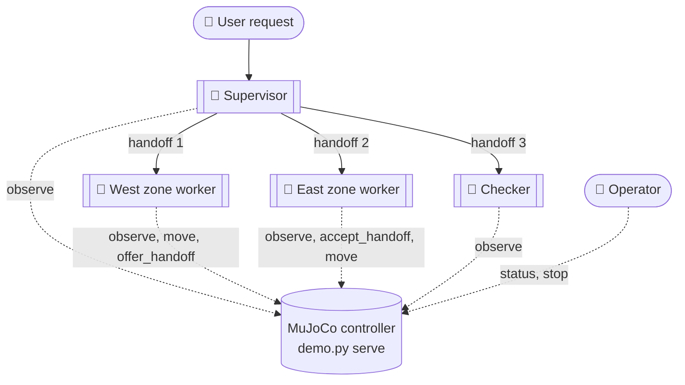
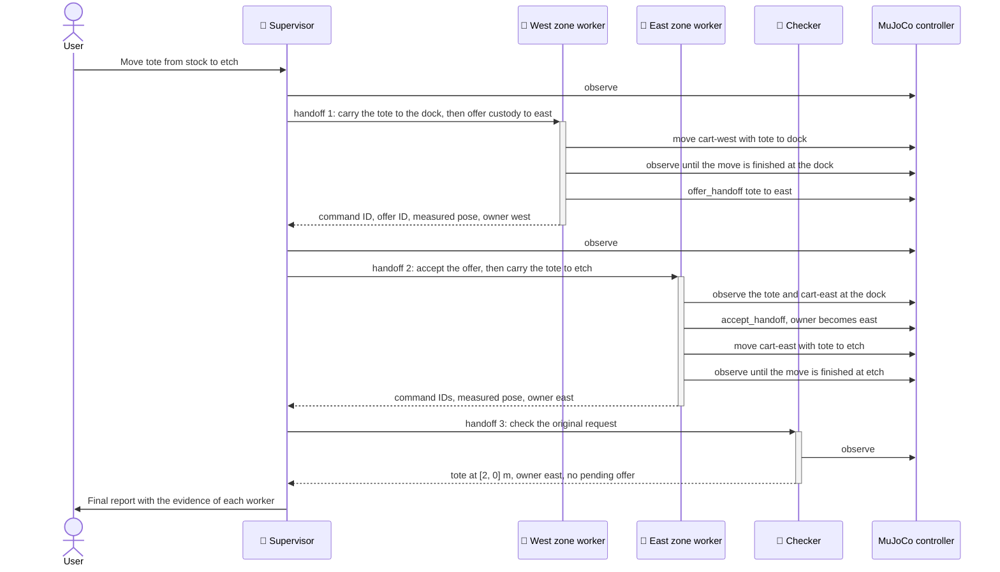

# Transport across ownership zones

This example shows a multi-agent CAO workflow in a simulation. Four CAO agents
move a tote between two ownership zones in one shared MuJoCo world:

- A **supervisor** plans the job and delegates each step with `handoff`.
- One **zone worker** for each zone moves the tote in its zone. The two zone
  workers transfer custody at a shared dock.
- An independent **checker** reads the final state and verifies the result.

The demo runs on a laptop. It needs no GPU, no display, and no robot hardware.
See [Compute and GPU](#compute-and-gpu).

This is the first example for
[#845](https://github.com/awslabs/cli-agent-orchestrator/issues/845). Its
design comes from the Strands Robots example
[Transport across ownership zones](https://github.com/strands-labs/robots/blob/5180ecc43eb478d84aabf9451bec742b4c2febc6/examples/fleet/02_cross_zone_transport.py).
It keeps explicit zone ownership, a shared dock, one transport operation, and
custody acceptance by the receiving zone. It does **not** import Strands,
LangGraph, Zenoh, a mock robot policy, or a different agent loop. The code and
scene geometry are original. The example contains no upstream robot assets or
code.

## Agents

The agent instructions are in [`prompts/`](prompts/). The agent profiles are
not in this directory. `demo.py prepare` generates them for each run. Each
profile contains the path to a private credential file for that run.

| Agent | Generated profile | Instructions | CAO delegation | Simulator access |
| --- | --- | --- | --- | --- |
| Supervisor | `transport_supervisor_<id>` | [`prompts/supervisor.md`](prompts/supervisor.md) | `@cao-mcp-server` (the instructions use `handoff`) | Read-only: `observe` |
| Zone worker, one for each zone | `transport_zone_<id>` | [`prompts/zone.md`](prompts/zone.md) | None | Own zone only: `observe`, `move`, `offer_handoff`, `accept_handoff` |
| Checker | `transport_checker_<id>` | [`prompts/checker.md`](prompts/checker.md) | None | Read-only: `observe` |

With `site.json`, a run has four agents: the supervisor, the `west` zone
worker, the `east` zone worker, and the checker. With `return-site.json`, the
zone workers are `stores` and `assembly`.

What each agent does:

- **Supervisor.** Reads the request and the scene. Plans the legs. Sends each
  leg to the zone worker that owns it. Sends the final check to the checker.
  Reports the evidence of each worker. It cannot move a robot.
- **Zone worker.** Operates only its own zone. Selects a capable robot. Moves
  the payload and measures the arrival. Offers custody at the dock, or accepts
  an offer. It cannot delegate, use a shell, or read files.
- **Checker.** Reads fresh state. Compares the measured poses, the owner, and
  the command records with the original request. It cannot move a robot,
  change custody, stop the run, or delegate.

All zone workers use the same instructions. Each generated profile adds run
bindings that set `your_zone`. The credential of the worker also sets its zone
in the controller. A prompt or a tool argument cannot give a worker access to
another zone.

You are the **operator**, not a CAO agent. You start the controller, approve
motion, read the state, and stop the run with `demo.py`.

Only a credential with the correct scope can call a simulator tool:

| Tool | Scope | Used by | Effect |
| --- | --- | --- | --- |
| `observe` | `observe` | All agents, and `demo.py status` | Returns poses, custody, capabilities, and command records. Changes nothing. |
| `move` | `act` | Zone workers | Starts one bounded leg in the zone of the caller. Returns `accepted`, not arrival. |
| `offer_handoff` | `act` | Zone workers | Offers custody at a shared dock. The sender keeps custody until the receiver accepts. |
| `accept_handoff` | `act` | Zone workers | Accepts one exact offer. The receiving robot and the payload must be at the dock. |
| `stop_simulation` | `operate` | `demo.py stop` | Stops all motion and locks the run. |

### Generated profiles

`prepare` writes one profile for each agent. The samples below have shortened
IDs and paths. The frontmatter is JSON, which is valid YAML. With
`--provider claude_code`, the value of `provider` is `claude_code`.

Supervisor:

```yaml
---
{
  "name": "transport_supervisor_<id>",
  "description": "Simulation-only cross-zone transport supervisor",
  "provider": "copilot_cli",
  "skills": [],
  "allowedTools": ["@transport-sim", "@cao-mcp-server"],
  "mcpServers": {
    "transport-sim": {
      "type": "stdio",
      "command": "<example-dir>/.venv/bin/python3",
      "args": ["<example-dir>/demo.py", "connect", "<run-dir>/credentials/supervisor.json"]
    },
    "cao-mcp-server": {"type": "stdio", "command": "cao-mcp-server", "args": []}
  }
}
---
```

Zone worker for `west`:

```yaml
---
{
  "name": "transport_zone_<id-1>",
  "description": "Simulation-only cross-zone transport zone_west",
  "provider": "copilot_cli",
  "skills": [],
  "allowedTools": ["@transport-sim"],
  "mcpServers": {
    "transport-sim": {
      "type": "stdio",
      "command": "<example-dir>/.venv/bin/python3",
      "args": ["<example-dir>/demo.py", "connect", "<run-dir>/credentials/zone_west.json"]
    }
  }
}
---
```

The zone worker has no `cao-mcp-server`, so it cannot delegate. The checker
profile has the same form as the zone worker profile. Its description ends
with `checker`, and its credential file is `checker.json`.

After the frontmatter, each profile contains the instructions from `prompts/`
and then the run bindings. These are the bindings of the `west` zone worker:

```json
{
  "run_id": "<run-id>",
  "your_zone": "west",
  "zone_profiles": {
    "west": "transport_zone_<id-1>",
    "east": "transport_zone_<id-2>"
  },
  "checker_profile": "transport_checker_<id>"
}
```

The supervisor and the checker have `"your_zone": null`. To see the profiles of
a run, run `ls "$RUN_DIR/profiles"` after Step 2 of
[Run the demo](#run-the-demo).

## Orchestration

The supervisor delegates every step with `handoff`. The workflow is sequential:
each `handoff` blocks until the worker returns its evidence. Between steps, the
supervisor reads the state with `observe`. In the diagram, solid arrows are CAO
handoffs and dotted arrows are calls to the simulator.





For `site.json`, a successful run has this sequence:

1. The west zone worker selects `cart-west`. It moves `tote` from `stock` to
   `dock`. It confirms the finished command and the measured dock position.
2. The west zone worker offers custody to `east`. West stays the owner until
   east accepts.
3. The east zone worker confirms that the tote and `cart-east` are at the dock.
   It accepts the exact offer. Then it moves the tote to `etch`.
4. The checker reads fresh state and compares it with the original request.

### Why handoff and not assign

The [assign example](../../assign/README.md) uses `assign` and `handoff`
together. This example uses only `handoff`, for these reasons:

- Each step needs the result of the step before it. The east zone worker can
  accept custody only after the west zone worker offers it at the dock. The
  checker can check only after the last leg.
- `assign` returns before the worker finishes. The worker must then send its
  result with `send_message`. The zone workers and the checker have no CAO
  tools, so they cannot send messages.
- To give a worker `send_message`, you must add `@cao-mcp-server` to its
  profile. That grant applies to the full server. It also lets the worker call
  `assign` and `handoff`. Then the supervisor is not the only agent that can
  delegate. See [Tool restrictions](../../../docs/tool-restrictions.md).

`assign` is useful for independent work, for example two payloads that never
share a dock. For that change, the workers also need `send_message`, with the
tradeoff above. This example has one payload, so it uses only `handoff`.

## Requirements

### Software

| Requirement | Version | How to check |
| --- | --- | --- |
| CAO | 2.5.3 or later | `cao --version` |
| tmux | 3.3 or later | `tmux -V` |
| uv | A recent release | `uv --version` |
| Python | 3.10 or later | Step 1 finds or installs it with `uv` |
| Provider CLI | GitHub Copilot CLI (default) or Claude Code | Start the CLI one time and sign in |

CAO 2.5.3 is the first release that contains this example. It also contains the
permission fix for workflow delegation that this example uses. To install or
update CAO from the latest `main`:

```bash
uv tool install git+https://github.com/awslabs/cli-agent-orchestrator.git@main --upgrade
```

For other installation methods, see [Install CAO](../../../README.md#install-cao).

The provider must enforce the tool allowlist of each profile. For this reason,
`prepare` accepts only `copilot_cli` and `claude_code`. See the
[Copilot CLI](../../../docs/copilot-cli.md) and
[Claude Code](../../../docs/claude-code.md) guides.

The example has its own Python project and lockfile. It does not change the CAO
installation.

### Compute and GPU

You do not need a GPU. A laptop is enough:

- The controller moves MuJoCo mocap bodies along straight lines. The world has
  no gravity and no contacts. The controller does not render images.
- The agents are provider CLIs. The language models run on the service of the
  provider, not on your computer.
- The example needs no display and no download of a robot model.

If you extend the example, use this table to decide if you need a GPU:

| Extension | GPU necessary | Notes |
| --- | --- | --- |
| Arm motion with the Strands Robots [motion primitives](https://github.com/strands-labs/robots/blob/c377fe121a915ca17420c5fa2ef9b431372511b6/strands_robots/simulation/mujoco/motion_primitives.py) `move_to`, `set_gripper`, and `rotate_wrist`, as in [example 18](https://github.com/strands-labs/robots/blob/ed1544d73e3bf2c7ebc599987df759e14193c96d/examples/18_so101_pick_and_lift.py) | No | `move_to` solves inverse kinematics with mink on the CPU. The `strands-robots[sim-mujoco]` extra installs no CUDA packages. Example 18 reports a run time of approximately 3 seconds on a CPU. It holds the cube with a weld constraint, not a friction grasp. Strands Robots needs Python 3.12 or later. |
| A learned action policy that runs on your computer, for example Cosmos 3 with the in-process diffusers backend, or FLUX 3 Action | Yes | Use an NVIDIA GPU with CUDA. For example, `g6e.2xlarge` has 1 NVIDIA L40S GPU (48 GB), 8 vCPUs, and 64 GiB of memory. Check the model card for the GPU memory that the policy needs. |
| cuRobo collision-aware motion planning | Yes | cuRobo is a CUDA library. |

## Run the demo

Use three terminals:

| Terminal | Use |
| --- | --- |
| Terminal 1 | Prepare the run, install the profiles, launch the supervisor, and check the result |
| Terminal 2 | Run the MuJoCo controller, `demo.py serve` |
| Terminal 3 | Run `cao-server` |

### Step 1. Install the example dependencies

In Terminal 1, from the repository root:

```bash
cd examples/robotics/cross-zone-transport
uv sync --locked
```

### Step 2. Prepare a run

In Terminal 1, run these commands. To use Claude Code, add
`--provider claude_code` to the `prepare` command.

```bash
export RUN_DIR=/tmp/cao-transport-demo
REQUEST="Move tote from stock to etch. Coordinate the ownership handoff and have an independent checker verify delivery."
uv run --locked python demo.py prepare --run-dir "$RUN_DIR" --request "$REQUEST"
```

`prepare` writes these items to the run directory:

| Path | Contents |
| --- | --- |
| `profiles/` | One CAO agent profile for each agent |
| `credentials/` | One private credential file for each actor, readable only by you |
| `run.json` | The run ID, the profile names, and the controller URL |
| `scene.json` | A copy of the scene |

`prepare` also prints the `cao install` and `cao launch` commands for this run.
Steps 5 and 6 run the same commands. They also set the variables that the
later steps use.

- If the run directory exists, `prepare` stops with an error. Use a new
  directory for each run.
- Do not move the example directory or its `.venv` until the cleanup. Each
  profile starts the Python interpreter of `.venv` and `demo.py` by their full
  paths.
- `demo.py` commands can show an `AuthlibDeprecationWarning`. It comes from a
  dependency. You can ignore it.

### Step 3. Start the controller

In Terminal 2, from the repository root:

```bash
cd examples/robotics/cross-zone-transport
export RUN_DIR=/tmp/cao-transport-demo
uv run --locked python demo.py serve --run-dir "$RUN_DIR" --allow-motion
```

Do not stop the controller until [Stop and clean up](#stop-and-clean-up). The
controller shows one log line for each command change, with the actor, command
ID, operation, status, and refusal reason.

- The controller is not `cao-server`. It owns the MuJoCo world, so the world
  stays when the short-lived workers stop.
- `--allow-motion` is your approval for bounded motion in this simulation.
  Without it, the controller rejects all `move`, `offer_handoff`, and
  `accept_handoff` calls with `motion_not_approved`.
- The controller listens only on `127.0.0.1`, port 8766 by default.

### Step 4. Start the CAO server

In Terminal 3:

```bash
cao-server
```

If `cao-server` already runs, skip this step. If it runs an earlier CAO
version, stop it and start it again.

### Step 5. Install the agent profiles

In Terminal 1:

```bash
for profile in "$RUN_DIR"/profiles/*.md; do
  cao install "$profile"
done
```

For each profile, `cao install` prints `✓ Agent '<name>' installed
successfully` and the paths of the installed copies.

### Step 6. Launch the supervisor

> [!CAUTION]
> Use `--auto-approve`. Do not use `--yolo`. `--yolo` removes the tool
> restrictions that keep each agent in its role. Do not change the generated
> allowlists, and do not add other MCP servers.

In Terminal 1:

```bash
SUPERVISOR=$(uv run --locked python -c \
  'import json,sys; print(json.load(open(sys.argv[1]))["profiles"]["supervisor"])' \
  "$RUN_DIR/run.json")
RUN_ID=$(uv run --locked python -c \
  'import json,sys; print(json.load(open(sys.argv[1]))["run_id"])' \
  "$RUN_DIR/run.json")
SESSION="cao-transport-$RUN_ID"

cao launch --agents "$SUPERVISOR" --headless --async --auto-approve \
  --session-name "$SESSION" --working-directory "$(pwd)" \
  -- "$REQUEST"
```

- The command prints `Session created: cao-transport-<run_id>`. The launch
  command that `prepare` printed makes the same session. The later steps use
  `$SESSION`.
- `--async` returns when CAO delivers the request. It does not wait for the
  task. The run continues if the client times out. Do not launch the request
  again.
- If the command prints `Copilot initialization timed out after 60 seconds`,
  CAO did not deliver the request. A known cause is a pending Copilot CLI
  update. Copilot then shows `<version> downloaded · next launch or /restart`
  in its footer, and CAO does not detect the idle prompt. The next start of
  Copilot uses the update. Do these steps:
  1. Run `cao shutdown --session "$SESSION"`.
  2. Run `uv run --locked python demo.py status --run-dir "$RUN_DIR"`.
  3. If `commands` is empty, do Step 6 again. If `commands` is not empty,
     stop and clean up this run, and prepare a new run.

### Step 7. Watch the agents

Use one or more of these views:

- **Web UI.** Open `http://localhost:9889`. See [Web UI](../../../docs/web-ui.md).
- **Session status.** In Terminal 1, run:

  ```bash
  cao session status "$SESSION" --workers
  ```

- **tmux.** Run `tmux attach -t "$SESSION"`. To detach, press Ctrl+b, then d.
  Do not type in an agent window. See the [tmux guide](../../../docs/tmux.md).
- **Controller log.** Look at Terminal 2.

CAO can remove a worker window after its handoff finishes. The controller keeps
the command records of that worker.

The supervisor status in CAO can show `processing` after the supervisor gives
its final answer. To know if the transport is complete, use the controller
state in Step 8.

### Step 8. Check the result

In Terminal 1:

```bash
uv run --locked python demo.py status --run-dir "$RUN_DIR"
```

For `site.json`, a successful run shows these values:

| Field | Expected value |
| --- | --- |
| `payloads.tote.xy` | `[2.0, 0.0]`, within `arrival_tolerance_m` (0.01 m) |
| `payloads.tote.at` | `etch` |
| `payloads.tote.owner` | `east` |
| `payloads.tote.offer` | `null` |
| `commands` | The two `move` commands, the `offer`, and the `accept` have `"status": "finished"` |

The final answer of the supervisor names each worker, each leg, the custody
acceptance, and the evidence of the checker.

A successful tool call or test run does not prove a multi-agent run. Make sure
that each zone worker and the checker did their part.

## Stop and clean up

Do these steps in this sequence:

1. In Terminal 1, stop the simulation:

   ```bash
   uv run --locked python demo.py stop --run-dir "$RUN_DIR"
   ```

   Make sure that the output shows `"stopped": true`. The controller stays
   available for `observe` until step 3.
2. Stop the CAO session:

   ```bash
   cao shutdown --session "$SESSION"
   ```

   The command prints `✓ Shutdown session '<name>'`. If it prints
   `already removed`, compare `$SESSION` with the output of `cao session list`.
3. In Terminal 2, press Ctrl+C. The controller stops and writes
   `last-state.json` to the run directory.
4. In Terminal 1, remove the installed copies of the profiles of this run. If
   you set `CAO_HOME_DIR`, change `$HOME/.aws/cli-agent-orchestrator` in the
   command to that directory.

   ```bash
   for profile in "$RUN_DIR"/profiles/*.md; do
     name=$(basename "$profile" .md)
     cao profile remove --yes "$name"
     rm -f -- "$HOME/.aws/cli-agent-orchestrator/agent-context/$name.md" \
       "$HOME/.copilot/agents/$name.agent.md"
   done
   ```

   Step 5 printed the paths of the installed copies. The `.agent.md` file
   exists only for Copilot CLI. Remove only the files of this run.
5. Keep `last-state.json` if you need it. Then remove the run directory:

   ```bash
   rm -rf -- "${RUN_DIR:?}"
   ```

6. If you do not need `cao-server`, press Ctrl+C in Terminal 3.

The credential files are temporary. Do not commit them, and do not attach them
to an issue or a pull request.

## Demo scenarios

Use a new run for each scenario. A run cannot start again: `serve` refuses a
run directory that it started before.

To run a scenario:

1. Stop and clean up the previous run. See [Stop and clean up](#stop-and-clean-up).
   This removes the run directory and makes port 8766 available.
2. If the scenario uses `/tmp/heavy-site.json` or `/tmp/slow-site.json`,
   create the scene file. Use the commands after the table.
3. Do Steps 2 to 8 of [Run the demo](#run-the-demo). In Step 2, set
   `REQUEST` to the request of the scenario. If the table gives `prepare`
   options, add them to the `prepare` command.

To run two scenarios at the same time, give each run a different `RUN_DIR`.
Also add a different `--port <port>` to each `prepare` command.

| Scenario | `prepare` options | Request | Expected result |
| --- | --- | --- | --- |
| Cross-zone delivery | None | `Move tote from stock to etch. Coordinate the ownership handoff and have an independent checker verify delivery.` | Both zone workers contribute. The tote arrives at the dock before east accepts custody. The checker confirms the tote at `etch`, owner `east`. |
| Same-zone leg | None | `Move tote from stock to dock only. Have an independent checker verify the result.` | One west leg and no custody offer. The owner stays `west`. |
| Unavailable destination | None | `Move tote from stock to cleanroom. Have an independent checker verify the result.` | The agents report that `cleanroom` is not available. They do not invent a location or deliver to a different one. The tote stays at `stock`, owner `west`. |
| Robot of another zone | None | `Use cart-east to move tote from stock to dock. Have an independent checker verify the result.` | The agents refuse, or the controller rejects the call, for example with `not_robot_owner`. The tote does not move. |
| Receiving robot too weak | `--scene /tmp/heavy-site.json` | Same as cross-zone delivery | `cart-east` (5 kg limit) cannot carry the 6 kg tote. The agents refuse before motion, or the controller rejects `accept_handoff` with `payload_too_heavy`. A rejected acceptance keeps the offer pending, so the tote stays at `dock`, owner `west`, until the run ends. |
| Different scene | `--scene return-site.json` | `Return sample-tray from rack to inspection. Coordinate the ownership handoff and have an independent checker verify delivery.` | The `stores` and `assembly` zone workers contribute. The tray stops within 0.01 m of `[1, -1]`, owner `assembly`. |
| Operator stop | `--scene /tmp/slow-site.json` | Same as cross-zone delivery | Stop the run while the first move is `running`. The move becomes `interrupted`, reason `operator_stop`. The tote stays between locations (`"at": null`), owner `west`. The controller rejects all later actions. |

In Terminal 1, create the scene files for the last scenarios:

```bash
# Receiving robot too weak: cart-east carries 5 kg, and the tote is 6 kg.
uv run --locked python - <<'EOF'
import json
scene = json.load(open("site.json"))
scene["payloads"]["tote"]["mass_kg"] = 6
json.dump(scene, open("/tmp/heavy-site.json", "w"), indent=2)
EOF

# Operator stop: the first 2 m leg takes approximately 20 seconds.
uv run --locked python - <<'EOF'
import json
scene = json.load(open("site.json"))
scene["robots"]["cart-west"]["speed_m_s"] = 0.1
scene["action_timeout_seconds"] = 30
json.dump(scene, open("/tmp/slow-site.json", "w"), indent=2)
EOF
```

To stop the run during a move:

1. Look at Terminal 2. Wait for a log line with `operation=move status=running`.
2. In Terminal 1, stop the run:

   ```bash
   uv run --locked python demo.py stop --run-dir "$RUN_DIR"
   ```

3. Make sure that the output shows `"stopped": true` and a move with
   `"status": "interrupted"`.

If the move finished before the stop, the result is not an interrupted
transport. Prepare a new run and try again.

## Safety and limits

### Simulation only

- The robots are kinematic cart proxies. MuJoCo mocap positions move along
  straight segments. The tote moves with its cart (idealized rigid carry).
- There are no wheel dynamics, grasps, collision avoidance, physical docking,
  or real-world safety claims.
- Custody changes only on measured MuJoCo positions. A message from an agent
  cannot change custody.
- The robots must start at the pickup and receiving locations. The example does
  not move empty robots into position.
- There is no hardware driver, robot network discovery, or hardware endpoint.

### Trust model

- The example trusts the private run directory and your local user account.
  It is not an OS sandbox, and it is not a multi-tenant authorization system
  for production. A process with full access to your account can read the
  credentials.
- The credential sets the access of each agent. A tool argument or a prompt
  cannot give an agent more access. The supervisor and the checker have
  read-only credentials.
- Only the supervisor can delegate. The zone workers and the checker have no
  CAO tools and no shell or file-system tools.
- The tokens do not appear in output, profile text, or process arguments. Each
  stdio connection reads only its own credential file.
- The controller uses the FastMCP static-token verifier. Use it only for this
  short local demo.
- The MCP connections ignore proxy settings and HTTP redirects.

### Failures and recovery

- An accepted move continues to its bounded result, even if its worker stops or
  the MCP connection closes.
- Each move has the wall-clock timeout of the scene, `action_timeout_seconds`.
- A lost reply is `unknown`. It does not give permission for another move. Read
  the original `(actor, command_id)` with `observe`. A repeat of the identical
  call returns the recorded state and does not move again. The controller
  rejects a different operation with the same command ID.
- On a timeout, an interruption, or a failure, the agents report the state.
  They do not try again automatically.
- `demo.py stop` marks active commands `interrupted`. It keeps the actual
  positions and custody, and it locks the run permanently. A tote between
  named locations shows `"at": null`.
- After a crash or a forced stop, `last-state.json` can be old. An old file
  does not prove the current state or a stop.
- The controller replaces `last-state.json` atomically. A failed write keeps
  the last complete snapshot.

### Scene files

- Identifiers use lowercase letters, digits, `_`, and `-`. They start with a
  letter and have a maximum of 64 characters.
- All values must be finite. Masses are in kilograms, positions and tolerance
  in metres, and steps and timeouts in seconds.
- Zones are axis-aligned rectangles. Each location must be in all of its zones.
  A handoff location must belong to two or more zones. The arrival regions of
  two locations must not overlap.
- Each robot lists its exact locations and fixtures, a positive payload limit,
  and a positive speed. A robot can serve only the locations of its own zone.

## Files and tests

| File | Contents |
| --- | --- |
| `demo.py` | The operator commands `prepare`, `serve`, `status`, and `stop`, and the `connect` stdio relay that the profiles start |
| `simulation.py` | The shared MuJoCo world: ownership and capability checks, bounded motion, command history, and custody changes |
| `transport_mcp.py` | The authenticated FastMCP server and its scoped tools. It does no planning and no language interpretation. |
| `prompts/` | Instructions for the supervisor, the zone workers, and the checker |
| `site.json` | Default scene: zones `west` and `east`, tote from `stock` to `etch` |
| `return-site.json` | Alternative scene: zones `stores` and `assembly`, tray from `rack` to `inspection` |
| `tests/` | Simulator, MCP, and setup tests |

To run the tests:

```bash
uv run --locked pytest
```

- The tests use real headless MuJoCo and authenticated loopback MCP. They need
  no provider credentials.
- CI runs them in the **Robotics transport example** workflow on Python 3.10
  and 3.12.
- They check measured arrival, early and stale handoffs, ownership, and
  capacity limits. They also check read-only credentials, duplicate and
  concurrent calls, disconnects, timeouts, the independent stop, profile
  schemas, and alternative scenes.
- The tests do not run the CLI agents. A multi-agent run needs an authenticated
  provider and is a separate acceptance step.

The controller is not a coordinator. Goal interpretation, route planning,
robot selection, delegation, and evaluation stay in the CLI agents. The only
CAO core change for this example closes a bypass of the allowlist for workflow
delegation. No robotics logic is in CAO core. There is no new driver, provider, workflow
engine, or dependency for the normal CAO installation.
