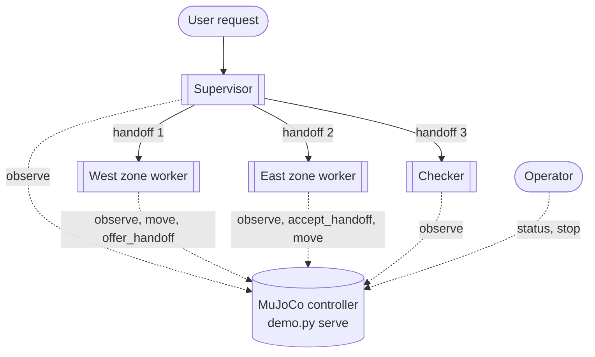
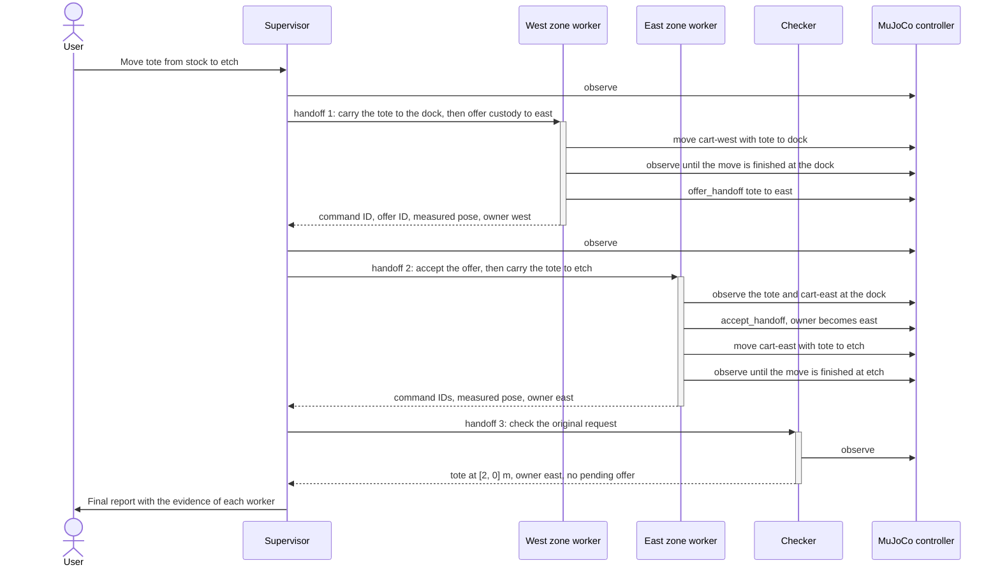
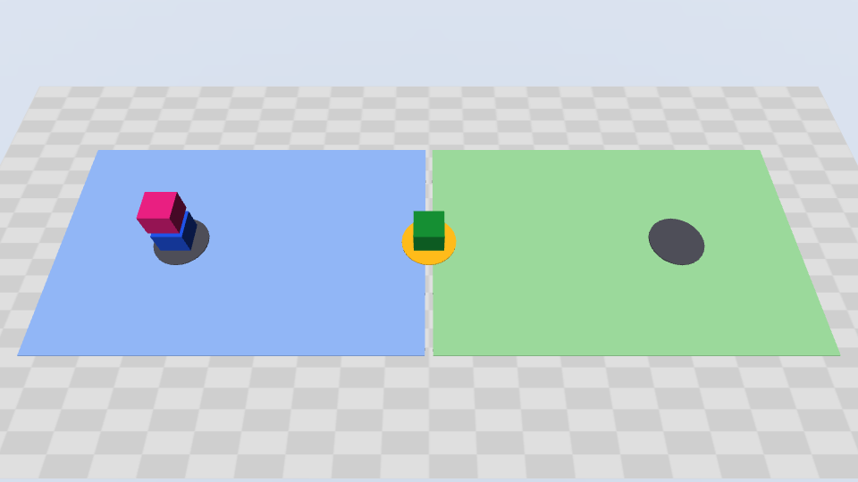
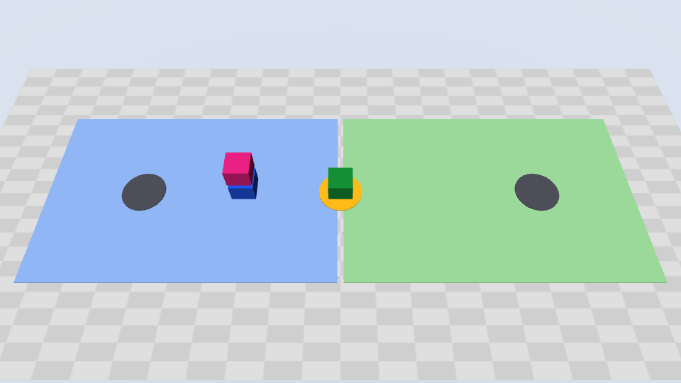
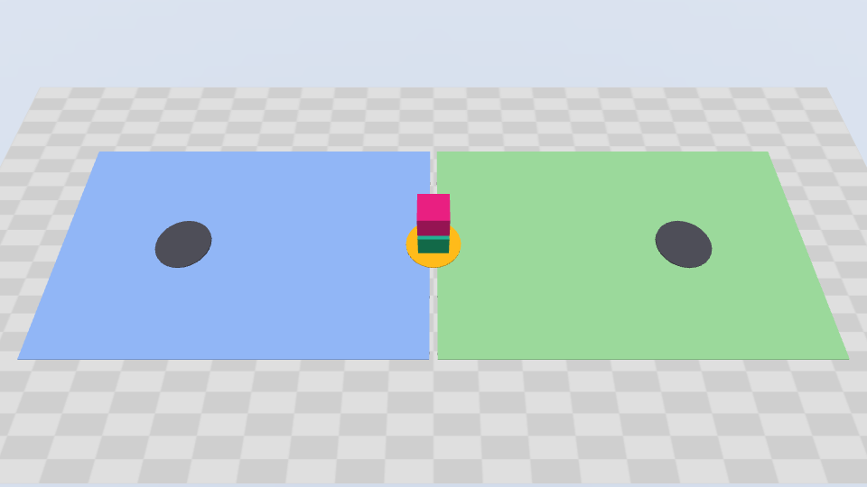
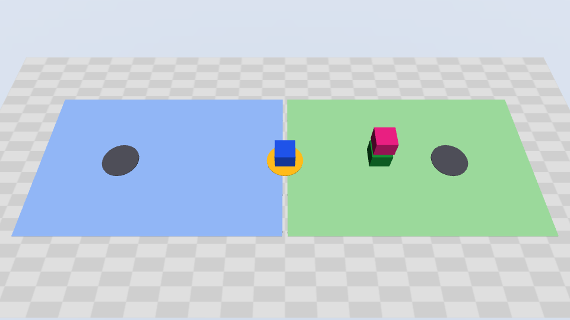
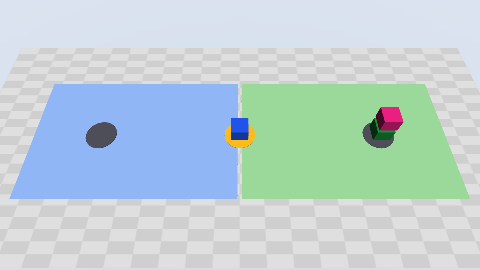

# Transport across ownership zones

This example shows a multi-agent CAO workflow in a simulation. Four CAO agents
move a tote between two ownership zones in one shared MuJoCo world:

- A **supervisor** plans the job and delegates each step with `handoff`.
- One **zone worker** for each zone moves the tote in its zone. The two zone
  workers transfer custody at a shared dock.
- An independent **checker** reads the final state and verifies the result.

The demo runs on a laptop. It needs no GPU, no display, and no robot hardware.
See [Compute and GPU](#compute-and-gpu).

This is the first example for
[#845](https://github.com/awslabs/cli-agent-orchestrator/issues/845). Its
design comes from the Strands Robots example
[Transport across ownership zones](https://github.com/strands-labs/robots/blob/5180ecc43eb478d84aabf9451bec742b4c2febc6/examples/fleet/02_cross_zone_transport.py).
It keeps explicit zone ownership, a shared dock, one transport operation, and
custody acceptance by the receiving zone. It does **not** import Strands,
LangGraph, Zenoh, a mock robot policy, or a different agent loop. The code and
scene geometry are original. The example contains no upstream robot assets or
code.

## Agents

Each agent has a profile in this directory, as in
[examples/assign](../../assign/README.md). A profile has YAML frontmatter and
then the instructions of the agent:

| Agent | Profile | CAO delegation grant | Simulator access |
| --- | --- | --- | --- |
| Supervisor | [`transport_supervisor.md`](transport_supervisor.md) | `@cao-mcp-server`. The instructions use `handoff`. | Read-only: `observe` |
| Zone worker, one for each zone | [`transport_zone_worker.md`](transport_zone_worker.md) | None. CAO refuses its `assign` and `handoff` calls. | Own zone only: `observe`, `move`, `offer_handoff`, `accept_handoff` |
| Checker | [`transport_checker.md`](transport_checker.md) | None. CAO refuses its `assign` and `handoff` calls. | Read-only: `observe` |

The instructions of each profile have the same sections as the profiles of
the assign example:

| Section | Contents |
| --- | --- |
| Role and Identity | What the agent is, and what it cannot do |
| Core Responsibilities | The tasks of the agent |
| Available MCP Tools | Each tool that the credential of the agent can call, with its parameters |
| Run Bindings | The run identifiers that `demo.py prepare` adds |
| Workflow | The numbered steps of the agent, with the tool calls |
| Critical Rules | The rules for proof, retries, and safety |
| Example | One worked example, with placeholders instead of scene names |
| Final Report Format or Result Format | The items of the final response of the agent |

The supervisor profile also has a section for failures and uncertain results.
The zone worker profile also has a table of the rejection reasons of the
controller.

Do not install these files directly. Their `transport-sim` entry is a
placeholder, and the files contain no credential. `demo.py prepare` makes a
run copy of each profile for each run. See [Run copies](#run-copies).

With `site.json`, a run has four agents: the supervisor, the `west` zone
worker, the `east` zone worker, and the checker. With `return-site.json`, the
zone workers are `stores` and `assembly`.

What each agent does:

- **Supervisor.** Reads the request and the scene. Plans the legs. Sends each
  leg to the zone worker that owns it. Sends the final check to the checker.
  Reports the evidence of each worker. It cannot move a robot.
- **Zone worker.** Operates only its own zone. Selects a capable robot. Moves
  the payload and measures the arrival. Offers custody at the dock, or accepts
  an offer. The provider blocks its shell and file tools. CAO refuses its
  `assign` and `handoff` calls.
- **Checker.** Reads fresh state. Compares the measured poses, the owner, and
  the command records with the original request. Its credential cannot move a
  robot, change custody, or stop the run. CAO refuses its `assign` and
  `handoff` calls.

All zone workers use the same profile. Each run copy adds run bindings that set
`your_zone`. The credential of the worker also sets its zone in the
controller. A prompt or a tool argument cannot give a worker access to another
zone.

You are the **operator**, not a CAO agent. You start the controller, approve
motion, read the state, and stop the run with `demo.py`.

Only a credential with the correct scope can call a simulator tool:

| Tool | Scope | Used by | Effect |
| --- | --- | --- | --- |
| `observe` | `observe` | All agents, and `demo.py status` | Returns poses, custody, capabilities, and command records. Changes nothing. |
| `move` | `act` | Zone workers | Starts one bounded leg in the zone of the caller. Returns `accepted`, not arrival. |
| `offer_handoff` | `act` | Zone workers | Offers custody at a shared dock. The sender keeps custody until the receiver accepts. |
| `accept_handoff` | `act` | Zone workers | Accepts one exact offer. The receiving robot and the payload must be at the dock. |
| `stop_simulation` | `operate` | `demo.py stop` | Stops all motion and locks the run. |

### Agent profiles

This is the frontmatter of [`transport_supervisor.md`](transport_supervisor.md):

```yaml
---
name: transport_supervisor
description: "Simulation-only cross-zone transport supervisor: plans the legs and delegates each leg with CAO handoff"
skills: []  # Show no CAO skill catalog to this agent.
allowedTools:
  - "@transport-sim"   # Simulator tools. The supervisor credential permits only observe.
  - "@cao-mcp-server"  # CAO handoff. Only the supervisor can delegate.
mcpServers:
  # Placeholder. demo.py prepare sets the Python and the credential file of the run.
  transport-sim:
    type: stdio
    command: python
    args: ["demo.py", "connect", "<run-dir>/credentials/supervisor.json"]
  cao-mcp-server:
    type: stdio
    command: cao-mcp-server
    args: []
---
```

The zone worker and checker profiles are different in these ways:

- `allowedTools` contains only `@transport-sim`.
- `mcpServers` contains only `transport-sim`.
- The credential file is `zone_<zone>.json` or `checker.json`.

The zone worker profile does not grant `@cao-mcp-server`. Thus CAO refuses
its `assign` and `handoff` calls, with this result:
`'assign' is not permitted: the calling terminal's allowed tools do not include '@cao-mcp-server'`.
The checker profile also does not grant `@cao-mcp-server`.

The instructions of the zone workers and the checker tell them to return their
evidence to the `handoff` caller. They do not need any CAO tool for this.

### Run copies

`demo.py prepare` writes one run copy of a profile for each agent of the run.
For `site.json`, it writes four copies: one supervisor, two zone workers, and
one checker. A run copy is the profile with these changes:

| Field | Profile in this directory | Run copy |
| --- | --- | --- |
| `name` | `transport_supervisor` | `transport_supervisor_<id>`, where `<id>` is random |
| `description` | The text in the profile | The same text. For a zone worker, `prepare` adds the zone, for example `(zone west)`. |
| `provider` | Not set | `copilot_cli`, or the value of `--provider` |
| `transport-sim` | A placeholder | The Python of the example `.venv`, `demo.py connect`, and the credential file of the agent |
| Instructions | The instructions of the agent | The same instructions, and then the run bindings |

The random `<id>` gives each run its own installed profile names. `handoff`
starts each worker from its installed profile when the supervisor calls it.
Thus a later run must not replace the profiles of a run that is not complete.

This is the frontmatter of the run copy for the `west` zone worker, with
shortened IDs and paths:

```yaml
---
name: transport_zone_worker_<id-1>
description: 'Simulation-only cross-zone transport zone worker: moves the payload in one zone and offers or accepts custody (zone west)'
provider: copilot_cli
skills: []
allowedTools:
- '@transport-sim'
mcpServers:
  transport-sim:
    type: stdio
    command: <example-dir>/.venv/bin/python3
    args:
    - <example-dir>/demo.py
    - connect
    - <run-dir>/credentials/zone_west.json
---
```

These are the run bindings of the `west` zone worker:

```json
{
  "run_id": "<run-id>",
  "your_zone": "west",
  "zone_profiles": {
    "west": "transport_zone_worker_<id-1>",
    "east": "transport_zone_worker_<id-2>"
  },
  "checker_profile": "transport_checker_<id>"
}
```

The supervisor and the checker have `"your_zone": null`. To see the run
copies, run `ls "$RUN_DIR/profiles"` after Step 2 of
[Run the demo](#run-the-demo).

## Orchestration

The supervisor delegates every step with `handoff`. The workflow is sequential:
each `handoff` blocks until the worker returns its evidence. Between steps, the
supervisor reads the state with `observe`. In the diagram, solid arrows are CAO
handoffs and dotted arrows are calls to the simulator.





For `site.json`, a successful run has this sequence:

1. The west zone worker selects `cart-west`. It moves `tote` from `stock` to
   `dock`. It confirms the finished command and the measured dock position.
2. The west zone worker offers custody to `east`. West stays the owner until
   east accepts.
3. The east zone worker confirms that the tote and `cart-east` are at the dock.
   It accepts the exact offer. Then it moves the tote to `etch`.
4. The checker reads fresh state and compares it with the original request.

### Why handoff and not assign

The [assign example](../../assign/README.md) uses `assign` and `handoff`
together. The two tools return the result of a worker in different ways:

| Tool | Return of the result |
| --- | --- |
| `handoff` | The call blocks until the worker finishes. CAO reads the last response of the worker from its terminal and returns it as the result of the call. The worker needs no CAO tool. |
| `assign` | The call returns immediately. CAO adds this line to the task: `[Assigned by terminal <id>. When done, send results back to terminal <id> using send_message]`. The worker must call `send_message`. CAO queues the message in the inbox of the supervisor and delivers it when the supervisor is idle. |

This example uses only `handoff`, for these reasons:

- Each step needs the result of the step before it. The east zone worker can
  accept custody only after the west zone worker offers it at the dock. The
  checker can check only after the last leg. Parallel work gives no benefit.
- With `handoff`, the zone workers and the checker need no CAO tool. Their
  profiles grant only `@transport-sim`.

To use `assign`, do these changes:

1. In `transport_zone_worker.md` and `transport_checker.md`, add
   `cao-mcp-server` to `mcpServers`. CAO does not gate `send_message`, so the
   worker can then send its result. CAO still refuses `assign` and `handoff`
   from the worker.
2. Do not add `@cao-mcp-server` to `allowedTools`. That grant also lets the
   worker call `assign` and `handoff`.
3. Change the instructions in the three profiles. The supervisor must use
   `assign`, and the workers must send their results with `send_message`.
4. Prepare a new run. `prepare` reads the profiles when it makes the run
   copies.

See [Tool restrictions](../../../docs/tool-restrictions.md).

`assign` is useful for independent work, for example two payloads that never
share a dock. This example has one payload, so it uses only `handoff`.

## Requirements

### Software

| Requirement | Version | How to check |
| --- | --- | --- |
| CAO | A release that contains this example, or the latest `main` | `cao --version` |
| tmux | 3.3 or later | `tmux -V` |
| uv | A recent release | `uv --version` |
| Python | 3.10 or later | Step 1 finds or installs it with `uv` |
| Provider CLI | Any CAO provider. GitHub Copilot CLI is the default. | Start the CLI one time in this repository, sign in, and accept its first-run prompts |

A CAO release that contains this example also contains the permission fix for
workflow delegation that this example uses. To install or update CAO from the
latest `main`:

```bash
uv tool install git+https://github.com/awslabs/cli-agent-orchestrator.git@main --upgrade
```

For other installation methods, see [Install CAO](../../../README.md#install-cao).

The example works with every CAO provider. See [Providers](#providers).

The example has its own Python project and lockfile. It does not change the CAO
installation.

### Providers

Select the provider with `--provider` in Step 2. `prepare` writes it into each
run copy, so `cao install` and `cao launch` use the same provider for all the
agents.

The isolation of the zones needs a provider that enforces the tool allowlist
of each profile. CAO shows this in the `Enforcement:` line of `cao launch`. For
the enforcement of each provider, see
[Tool restrictions](../../../docs/tool-restrictions.md).

> [!WARNING]
> If the provider does not enforce the allowlist, an agent can use a shell and
> read the credential files of the other zones. Then it can act for another
> zone. `prepare` prints a warning for these providers. Use them only for a
> trusted local demo.

For the setup of each provider, see its guide in the
[CAO documentation](../../../README.md#prerequisites).

### Compute and GPU

You do not need a GPU. A laptop is enough:

- The controller moves MuJoCo mocap bodies along straight lines. The world has
  no gravity and no contacts.
- With `--record`, MuJoCo renders small pictures with OpenGL. This needs no
  separate GPU. See [See the robots move](#see-the-robots-move).
- The agents are provider CLIs. The language models run on the service of the
  provider, not on your computer.
- The example needs no display and no download of a robot model.

If you extend the example, use this table to decide if you need a GPU:

| Extension | GPU necessary | Notes |
| --- | --- | --- |
| Arm motion with the Strands Robots [motion primitives](https://github.com/strands-labs/robots/blob/c377fe121a915ca17420c5fa2ef9b431372511b6/strands_robots/simulation/mujoco/motion_primitives.py) `move_to`, `set_gripper`, and `rotate_wrist`, as in [example 18](https://github.com/strands-labs/robots/blob/ed1544d73e3bf2c7ebc599987df759e14193c96d/examples/18_so101_pick_and_lift.py) | No | `move_to` solves inverse kinematics with mink on the CPU. The `strands-robots[sim-mujoco]` extra installs no CUDA packages. Example 18 reports a run time of approximately 3 seconds on a CPU. It holds the cube with a weld constraint, not a friction grasp. Strands Robots needs Python 3.12 or later. |
| A learned action policy that runs on your computer, for example Cosmos 3 with the in-process diffusers backend, or FLUX 3 Action | Yes | Use an NVIDIA GPU with CUDA. For example, `g6e.2xlarge` has 1 NVIDIA L40S GPU (48 GB), 8 vCPUs, and 64 GiB of memory. Check the model card for the GPU memory that the policy needs. |
| cuRobo collision-aware motion planning | Yes | cuRobo is a CUDA library. |

## Run the demo

Use three terminals:

| Terminal | Use |
| --- | --- |
| Terminal 1 | Prepare the run, install the profiles, launch the supervisor, and check the result |
| Terminal 2 | Run the MuJoCo controller, `demo.py serve` |
| Terminal 3 | Run `cao-server` |

Each step has an **Expected output** section that you can expand. The outputs
come from a run of this guide. In them, `<id>` is a random ID, and `<run_id>`
is the run ID. `<repo>` is the path of the repository, and `<time>` is a time
stamp. On macOS, `/tmp` can show as `/private/tmp`.

### Step 1. Install the example dependencies

In Terminal 1, from the repository root:

```bash
cd examples/robotics/cross-zone-transport
uv sync --locked
```

<details>
<summary>Expected output</summary>

The first time:

```text
Using CPython 3.10.18
Creating virtual environment at: .venv
Resolved 93 packages in 31ms
Installed 79 packages in 9.57s
 + absl-py==2.5.0
 + aiofile==3.8.8
 ...
 + websockets==16.1.1
 + zipp==4.1.1
```

Later times:

```text
Resolved 93 packages in 26ms
Audited 79 packages in 44ms
```

</details>

### Step 2. Prepare a run

In Terminal 1, run these commands. To use a provider other than Copilot CLI,
add `--provider <provider>` to the `prepare` command, for example
`--provider kiro_cli`. See [Providers](#providers).

```bash
export RUN_DIR=/tmp/cao-transport-demo
REQUEST="Move tote from stock to etch. Coordinate the ownership handoff and have an independent checker verify delivery."
uv run --locked python demo.py prepare --run-dir "$RUN_DIR" --request "$REQUEST"
```

<details>
<summary>Expected output</summary>

```text
cao install /tmp/cao-transport-demo/profiles/transport_supervisor_<id>.md
cao install /tmp/cao-transport-demo/profiles/transport_checker_<id>.md
cao install /tmp/cao-transport-demo/profiles/transport_zone_worker_<id>.md
cao install /tmp/cao-transport-demo/profiles/transport_zone_worker_<id>.md
cao launch --agents transport_supervisor_<id> --headless --async --auto-approve --session-name cao-transport-<run_id> --working-directory <repo>/examples/robotics/cross-zone-transport -- 'Move tote from stock to etch. Coordinate the ownership handoff and have an independent checker verify delivery.'
```

`demo.py` commands can also print this warning from a dependency. You can
ignore it:

```text
.../fastmcp/server/auth/providers/jwt.py:12: AuthlibDeprecationWarning: authlib.jose module is deprecated, please use joserfc instead.
It will be compatible before version 2.0.0.
  from authlib.jose import JsonWebKey, JsonWebToken
```

</details>

`prepare` writes these items to the run directory:

| Path | Contents |
| --- | --- |
| `profiles/` | One run copy of a profile for each agent. See [Run copies](#run-copies). |
| `credentials/` | One private credential file for each actor, readable only by you |
| `run.json` | The run ID, the profile names, and the controller URL |
| `scene.json` | A copy of the scene |

`prepare` also prints the `cao install` and `cao launch` commands for this run.
Steps 5 and 6 run the same commands. They also set the variables that the
later steps use.

- If the run directory exists, `prepare` stops with an error. Use a new
  directory for each run.
- Do not move the example directory or its `.venv` until the cleanup. Each
  run copy starts the Python interpreter of `.venv` and `demo.py` by their
  full paths.

### Step 3. Start the controller

In Terminal 2, from the repository root:

```bash
cd examples/robotics/cross-zone-transport
export RUN_DIR=/tmp/cao-transport-demo
uv run --locked python demo.py serve --run-dir "$RUN_DIR" --allow-motion \
  --record /tmp/cao-transport-frames
```

<details>
<summary>Expected output</summary>

When the controller starts:

```text
<time> transport SIMULATION ONLY: kinematic carrying; motion approved for this scene
<time> transport Recording frames of the world to /tmp/cao-transport-frames
[<time>] INFO     Starting MCP server 'CAO cross-zone transport simulator' with transport 'http' (stateless) on http://127.0.0.1:8766/mcp
INFO:     Started server process [<pid>]
INFO:     Waiting for application startup.
<time> mcp.server.streamable_http_manager StreamableHTTP session manager started
INFO:     Application startup complete.
INFO:     Uvicorn running on http://127.0.0.1:8766 (Press CTRL+C to quit)
```

While the agents work, one line for each command change:

```text
<time> transport run=<run_id> actor=west command=west-tote-stock-to-dock operation=move status=accepted reason=None
<time> transport run=<run_id> actor=west command=west-tote-stock-to-dock operation=move status=running reason=None
<time> transport run=<run_id> actor=west command=west-tote-stock-to-dock operation=move status=finished reason=None
<time> transport run=<run_id> actor=west command=west-offer-tote-to-east operation=offer status=finished reason=None
<time> transport run=<run_id> actor=east command=east-accept-tote-at-dock operation=accept status=finished reason=None
<time> transport run=<run_id> actor=east command=east-tote-dock-to-etch operation=move status=accepted reason=None
<time> transport run=<run_id> actor=east command=east-tote-dock-to-etch operation=move status=running reason=None
<time> transport run=<run_id> actor=east command=east-tote-dock-to-etch operation=move status=finished reason=None
```

The agents choose the command IDs, so your IDs can be different.

</details>

Do not stop the controller until [Stop and clean up](#stop-and-clean-up). The
controller shows one log line for each command change, with the actor, command
ID, operation, status, and refusal reason.

- The controller is not `cao-server`. It owns the MuJoCo world, so the world
  stays when the short-lived workers stop.
- `--allow-motion` is your approval for bounded motion in this simulation.
  Without it, the controller rejects all `move`, `offer_handoff`, and
  `accept_handoff` calls with `motion_not_approved`.
- `--record` saves pictures of the MuJoCo world while the robots move. See
  [See the robots move](#see-the-robots-move). The directory must be new or
  empty. To run without pictures, remove `--record` and its directory.
- The controller listens only on `127.0.0.1`, port 8766 by default.

### Step 4. Start the CAO server

In Terminal 3:

```bash
cao-server
```

<details>
<summary>Expected output</summary>

```text
INFO:     Started server process [<pid>]
INFO:     Waiting for application startup.
INFO:     Application startup complete.
INFO:     Uvicorn running on http://127.0.0.1:9889 (Press CTRL+C to quit)
Server logs: ~/.aws/cli-agent-orchestrator/logs/cao_<time>.log
For debug logs: export CAO_LOG_LEVEL=DEBUG && cao-server
```

</details>

If `cao-server` already runs, skip this step. If it runs an earlier CAO
version, stop it and start it again.

### Step 5. Install the agent profiles

In Terminal 1, install the run copies, not the profiles in this directory:

```bash
for profile in "$RUN_DIR"/profiles/*.md; do
  cao install "$profile"
done | tee "$RUN_DIR/install.log"
```

<details>
<summary>Expected output</summary>

These lines repeat for each of the four run copies. This output is from a run
with `--provider claude_code`:

```text
✓ Copied agent from file to local store
✓ Agent 'transport_checker_<id>' installed successfully
✓ Context file: ~/.aws/cli-agent-orchestrator/agent-context/transport_checker_<id>.md
```

If the provider uses its own agent file, `cao install` also prints a line
`✓ <provider> agent: <path>`.

</details>

For each run copy, `cao install` prints lines that start with `✓`, for example
`✓ Agent '<name>' installed successfully`. Some lines give the paths of the
files that it writes. `tee` also writes this output to `install.log`. The
cleanup uses these paths.

### Step 6. Launch the supervisor

> [!CAUTION]
> Use `--auto-approve`. Do not use `--yolo`. `--yolo` removes the tool
> restrictions that keep each agent in its role. Do not change the generated
> allowlists, and do not add other MCP servers.

In Terminal 1:

```bash
SUPERVISOR=$(uv run --locked python -c \
  'import json,sys; print(json.load(open(sys.argv[1]))["profiles"]["supervisor"])' \
  "$RUN_DIR/run.json")
RUN_ID=$(uv run --locked python -c \
  'import json,sys; print(json.load(open(sys.argv[1]))["run_id"])' \
  "$RUN_DIR/run.json")
SESSION="cao-transport-$RUN_ID"

cao launch --agents "$SUPERVISOR" --headless --async --auto-approve \
  --session-name "$SESSION" --working-directory "$(pwd)" \
  -- "$REQUEST"
```

<details>
<summary>Expected output</summary>

This output is from a run with `--provider claude_code`. The `Blocked:` line
lists the tools of the provider, so it is different for other providers.

```text
Agent 'transport_supervisor_<id>' launching on claude_code:
  Allowed:  @transport-sim, @cao-mcp-server
  Blocked:  Agent, Bash, BashOutput, Edit, Glob, Grep, KillShell, Monitor, NotebookEdit, Read, Task, WebFetch, WebSearch, Write
  Enforcement: native (the provider refuses blocked tools)
  Directory: <repo>/examples/robotics/cross-zone-transport

  To skip this prompt next time, relaunch with --auto-approve
  To remove all restrictions, relaunch with --yolo

Session created: cao-transport-<run_id>
Terminal created: transport_supervisor_<id>-<id>
Message delivered to transport_supervisor_<id>-<id>. Running in background.
```

The two `To ...` lines are information only.

</details>

- The command prints `Session created: cao-transport-<run_id>`. The launch
  command that `prepare` printed uses the same session name. The later steps
  use `$SESSION`.
- `--async` returns when CAO delivers the request. It does not wait for the
  task. The run continues if the client times out. Do not launch the request
  again.

### Step 7. Watch the agents

Use one or more of these views:

- **Web UI.** Open `http://localhost:9889`. See [Web UI](../../../docs/web-ui.md).
- **Session status.** In Terminal 1, run:

  ```bash
  cao session status "$SESSION" --workers
  ```

  <details>
  <summary>Expected output</summary>

  After the final answer of the supervisor, from a run with
  `--provider claude_code`:

  ```text
  Session:  cao-transport-<run_id>
  Terminal: <id>
  Agent:    transport_supervisor_<id>
  Provider: claude_code
  Model:    provider default
  Honored:  yes
  Status:   completed

  Last response:
  Delivered. tote is at etch, owner east, no pending offer — confirmed by my own observe and independently by the checker.
  ...

  No worker terminals
  ```

  While a worker runs, the output ends with a table of the worker terminals.
  The table has the columns `ID`, `AGENT`, `PROVIDER`, `MODEL`, `HONORED`, and
  `STATUS`.

  </details>

- **tmux.** Run `tmux attach -t "$SESSION"`. To detach, press Ctrl+b, then d.
  Do not type in an agent window. See the [tmux guide](../../../docs/tmux.md).
- **Controller log.** Look at Terminal 2.
- **Simulator picture.** Open `/tmp/cao-transport-frames/latest.png`. The
  controller replaces it at each change. See
  [See the robots move](#see-the-robots-move).

CAO can remove a worker window after its handoff finishes. The controller keeps
the command records of that worker.

The controller state in Step 8 is the record of what the robots did. The final
answer of the supervisor is in its window.

### Step 8. Check the result

In Terminal 1:

```bash
uv run --locked python demo.py status --run-dir "$RUN_DIR"
```

<details>
<summary>Expected output</summary>

An excerpt. The output also has the `model` and `scene` fields, and more
fields for each command.

```json
{
  "run_id": "<run_id>",
  "observed_at": "<time>",
  "position_units": "m",
  "motion_approved": true,
  "stopped": false,
  "robots": {
    "cart-west": {"xy": [0.0, 0.0], "zone": "west"},
    "cart-east": {"xy": [2.0, 0.0], "zone": "east"}
  },
  "payloads": {
    "tote": {"xy": [2.0, 0.0], "at": "etch", "owner": "east", "offer": null}
  },
  "commands": [
    {"actor": "west", "command_id": "west-tote-stock-to-dock", "operation": "move", "status": "finished", "reason": null},
    {"actor": "west", "command_id": "west-offer-tote-to-east", "operation": "offer", "status": "finished", "reason": null},
    {"actor": "east", "command_id": "east-accept-tote-at-dock", "operation": "accept", "status": "finished", "reason": null},
    {"actor": "east", "command_id": "east-tote-dock-to-etch", "operation": "move", "status": "finished", "reason": null}
  ]
}
```

</details>

For `site.json`, a successful run shows these values:

| Field | Expected value |
| --- | --- |
| `payloads.tote.xy` | `[2.0, 0.0]`, within `arrival_tolerance_m` (0.01 m) |
| `payloads.tote.at` | `etch` |
| `payloads.tote.owner` | `east` |
| `payloads.tote.offer` | `null` |
| `commands` | The two `move` commands, the `offer`, and the `accept` have `"status": "finished"` |

The final answer of the supervisor names each worker, each leg, the custody
acceptance, and the evidence of the checker.

A successful tool call or test run does not prove a multi-agent run. Make sure
that each zone worker and the checker did their part.

## Stop and clean up

Do these steps in this sequence:

1. In Terminal 1, stop the simulation:

   ```bash
   uv run --locked python demo.py stop --run-dir "$RUN_DIR"
   ```

   <details>
   <summary>Expected output</summary>

   The output is the full state, as in Step 8. An excerpt:

   ```json
   {
     "run_id": "<run_id>",
     "stopped": true,
     "payloads": {
       "tote": {"xy": [2.0, 0.0], "at": "etch", "owner": "east", "offer": null}
     }
   }
   ```

   </details>

   Make sure that the output shows `"stopped": true`. The controller stays
   available for `observe` until step 3.
2. Stop the CAO session:

   ```bash
   cao shutdown --session "$SESSION"
   ```

   <details>
   <summary>Expected output</summary>

   ```text
   ✓ Shutdown session 'cao-transport-<run_id>'
   ```

   </details>

   If the command prints `already removed`, compare `$SESSION` with the
   output of `cao session list`.
3. In Terminal 2, press Ctrl+C. The controller stops and writes
   `last-state.json` to the run directory. With `--record`, it also writes the
   animation and the picture viewer. See
   [See the robots move](#see-the-robots-move).

   <details>
   <summary>Expected output</summary>

   ```text
   INFO:     Shutting down
   INFO:     Waiting for application shutdown.
   <time> mcp.server.streamable_http_manager StreamableHTTP session manager shutting down
   INFO:     Application shutdown complete.
   INFO:     Finished server process [<pid>]
   <time> transport Recorded 14 frame(s); open /tmp/cao-transport-frames/index.html
   ```

   The number of frames depends on the run.

   </details>
4. In Terminal 1, remove the installed files of this run. `cao profile remove`
   removes the copy in the CAO profile store. Then the loop reads
   `install.log` and removes each other path that `cao install` printed in
   Step 5. These paths depend on the provider and on your CAO settings.

   ```bash
   for profile in "$RUN_DIR"/profiles/*.md; do
     cao profile remove --yes "$(basename "$profile" .md)"
   done
   sed -n -E 's/^✓ (Context file|[a-z_]+ agent): //p' "$RUN_DIR/install.log" |
     while IFS= read -r path; do rm -f -- "$path"; done
   ```

   <details>
   <summary>Expected output</summary>

   One line for each of the four run copies. The `sed` loop prints nothing.

   ```text
   ✓ Removed 'transport_checker_<id>' from ~/.aws/cli-agent-orchestrator/agent-store
   ✓ Removed 'transport_supervisor_<id>' from ~/.aws/cli-agent-orchestrator/agent-store
   ✓ Removed 'transport_zone_worker_<id>' from ~/.aws/cli-agent-orchestrator/agent-store
   ✓ Removed 'transport_zone_worker_<id>' from ~/.aws/cli-agent-orchestrator/agent-store
   ```

   </details>

   Remove only the files of this run.
5. Keep `last-state.json` if you need it. Then remove the run directory:

   ```bash
   rm -rf -- "${RUN_DIR:?}"
   ```

   The command prints nothing. The pictures are not in the run directory. When
   you do not need them, remove them with `rm -rf -- /tmp/cao-transport-frames`.

6. If you do not need `cao-server`, press Ctrl+C in Terminal 3.

The credential files are temporary. Do not commit them, and do not attach them
to an issue or a pull request.

## See the robots move

`demo.py serve --record DIR` saves pictures of the MuJoCo world. Step 3 uses
this option. The directory must be new or empty. The pictures come from a
fixed overview camera. They do not change the simulation.

This animation comes from a run of [Run the demo](#run-the-demo) with
`--provider claude_code`:



The controller checks the measured state two times each second. It saves a
picture after each of these changes:

- A robot or a payload moves to a new position, measured to 1 cm.
- The owner or the offer of a payload changes.
- A command changes its status.
- The operator stops the run.

The pictures do not show the owner and the offer. The captions in
`index.html` give them.

| Picture | State |
| --- | --- |
|  | 1. Start. The tote is on `cart-west` at `stock`, owner `west`. `cart-east` waits at the dock. |
|  | 2. The west zone worker moves `cart-west` with the tote to the dock. |
|  | 3. The tote is at the dock, above the two carts. West offers custody to east, and east accepts. The owner changes from `west` to `east`. |
|  | 4. The east zone worker moves `cart-east` with the tote to `etch`. `cart-west` stays at the dock. |
|  | 5. Delivered. The tote is at `etch`, owner `east`. |

| In the picture | Item |
| --- | --- |
| Light blue area, light green area | Zone `west`, zone `east` |
| Strong blue box, strong green box | `cart-west`, `cart-east`. A robot has the strong color of its zone. |
| Pink box | `tote` |
| Amber disc | `dock`, the shared dock of the two zones |
| Dark grey discs | `stock` and `etch` |

The controller writes these files to the directory:

| File | Written | Contents |
| --- | --- | --- |
| `latest.png` | At each change | The last picture |
| `frame-0001.png`, `frame-0002.png`, ... | At each change | One picture for each change |
| `animation.png` | At Ctrl+C | An animated PNG of all the pictures. Open it in a web browser. |
| `frames.json` | At Ctrl+C | The file, time, caption, and measured positions of each picture |
| `index.html` | At Ctrl+C | A page that shows each picture with its caption. Use **Previous**, **Play**, **Next**, or the slider. |

To open the page on macOS, run this command. On Linux, use `xdg-open`
instead of `open`.

```bash
open /tmp/cao-transport-frames/index.html
```

<details>
<summary>Expected output</summary>

The command prints nothing. Your web browser shows the page.

</details>

The pictures need OpenGL, but no separate GPU:

- On macOS, the pictures work with no settings.
- On Linux, MuJoCo uses GLFW by default, and GLFW needs a display. Without a
  display, set `MUJOCO_GL` in Terminal 2 before Step 3.
  `export MUJOCO_GL=egl` uses an EGL driver. `export MUJOCO_GL=osmesa` uses
  OSMesa, a software renderer on the CPU. Install the OSMesa library of your
  Linux distribution first.
- If the renderer does not start, the controller logs `Recording is off:` and
  continues without pictures. At Ctrl+C, it logs `Recorded no frames`. The
  simulation and the agents work as usual.

## Demo scenarios

Use a new run for each scenario. A run cannot start again: `serve` refuses a
run directory that it started before.

To run a scenario:

1. Stop and clean up the previous run. See [Stop and clean up](#stop-and-clean-up).
   This removes the run directory and makes port 8766 available.
2. If the scenario uses `/tmp/heavy-site.json` or `/tmp/slow-site.json`,
   create the scene file. Use the commands after the table.
3. Do Steps 2 to 8 of [Run the demo](#run-the-demo). In Step 2, set
   `REQUEST` to the request of the scenario. If the table gives `prepare`
   options, add them to the `prepare` command.

To run two scenarios at the same time, give each run a different `RUN_DIR`.
Also add a different `--port <port>` to each `prepare` command.

| Scenario | `prepare` options | Request | Expected result |
| --- | --- | --- | --- |
| Cross-zone delivery | None | `Move tote from stock to etch. Coordinate the ownership handoff and have an independent checker verify delivery.` | Both zone workers contribute. The tote arrives at the dock before east accepts custody. The checker confirms the tote at `etch`, owner `east`. |
| Same-zone leg | None | `Move tote from stock to dock only. Have an independent checker verify the result.` | One west leg and no custody offer. The owner stays `west`. |
| Unavailable destination | None | `Move tote from stock to cleanroom. Have an independent checker verify the result.` | The agents report that `cleanroom` is not available. They do not invent a location or deliver to a different one. The tote stays at `stock`, owner `west`. |
| Robot of another zone | None | `Use cart-east to move tote from stock to dock. Have an independent checker verify the result.` | The agents refuse, or the controller rejects the call, for example with `not_robot_owner`. The tote does not move. |
| Receiving robot too weak | `--scene /tmp/heavy-site.json` | Same as cross-zone delivery | `cart-east` (5 kg limit) cannot carry the 6 kg tote. The agents refuse before motion, or the controller rejects `accept_handoff` with `payload_too_heavy`. A rejected acceptance keeps the offer pending, so the tote stays at `dock`, owner `west`, until the run ends. |
| Different scene | `--scene return-site.json` | `Return sample-tray from rack to inspection. Coordinate the ownership handoff and have an independent checker verify delivery.` | The `stores` and `assembly` zone workers contribute. The tray stops within 0.01 m of `[1, -1]`, owner `assembly`. |
| Operator stop | `--scene /tmp/slow-site.json` | Same as cross-zone delivery | Stop the run while the first move is `running`. The move becomes `interrupted`, reason `operator_stop`. The tote stays between locations (`"at": null`), owner `west`. The controller rejects all later actions. |

In Terminal 1, create the scene files for the last scenarios:

```bash
# Receiving robot too weak: cart-east carries 5 kg, and the tote is 6 kg.
uv run --locked python - <<'EOF'
import json
scene = json.load(open("site.json"))
scene["payloads"]["tote"]["mass_kg"] = 6
json.dump(scene, open("/tmp/heavy-site.json", "w"), indent=2)
EOF

# Operator stop: the first 2 m leg takes approximately 20 seconds.
uv run --locked python - <<'EOF'
import json
scene = json.load(open("site.json"))
scene["robots"]["cart-west"]["speed_m_s"] = 0.1
scene["action_timeout_seconds"] = 30
json.dump(scene, open("/tmp/slow-site.json", "w"), indent=2)
EOF
```

<details>
<summary>Expected output</summary>

The commands print nothing. They write `/tmp/heavy-site.json` and
`/tmp/slow-site.json`.

</details>

To stop the run during a move:

1. Look at Terminal 2. Wait for a log line with `operation=move status=running`.
2. In Terminal 1, stop the run:

   ```bash
   uv run --locked python demo.py stop --run-dir "$RUN_DIR"
   ```

   <details>
   <summary>Expected output</summary>

   An excerpt. The position of the tote depends on the time of the stop.

   ```json
   {
     "stopped": true,
     "payloads": {
       "tote": {"xy": [-1.862, 0.0], "at": null, "owner": "west", "offer": null}
     },
     "commands": [
       {"actor": "west", "command_id": "west-tote-stock-to-dock", "operation": "move", "status": "interrupted", "reason": "operator_stop"}
     ]
   }
   ```

   </details>

3. Make sure that the output shows `"stopped": true` and a move with
   `"status": "interrupted"`.

If the move finished before the stop, the result is not an interrupted
transport. Prepare a new run and try again.

## Safety and limits

### Simulation only

- The robots are kinematic cart proxies. MuJoCo mocap positions move along
  straight segments. The tote moves with its cart (idealized rigid carry).
- There are no wheel dynamics, grasps, collision avoidance, physical docking,
  or real-world safety claims.
- Custody changes only on measured MuJoCo positions. A message from an agent
  cannot change custody.
- The robots must start at the pickup and receiving locations. The example does
  not move empty robots into position.
- There is no hardware driver, robot network discovery, or hardware endpoint.

### Trust model

- The example trusts the private run directory and your local user account.
  It is not an OS sandbox, and it is not a multi-tenant authorization system
  for production. A process with full access to your account can read the
  credentials.
- The credential sets the access of each agent. A tool argument or a prompt
  cannot give an agent more access. The supervisor and the checker have
  read-only credentials.
- Only the supervisor can delegate. CAO checks the profile grant of the
  caller. It refuses `assign`, `handoff`, and workflow runs from the zone
  workers and the checker.
- If the provider enforces the allowlist, it blocks the shell and file tools
  of the zone workers and the checker.
- If the provider does not enforce the allowlist, only the instructions forbid
  the shell and file tools. An agent can then read the credential files of the
  other zones. See [Providers](#providers).
- The tokens do not appear in output, profile text, or process arguments. Each
  stdio connection reads only its own credential file.
- The controller uses the FastMCP static-token verifier. Use it only for this
  short local demo.
- The MCP connections ignore proxy settings and HTTP redirects.

### Failures and recovery

- An accepted move continues to its bounded result, even if its worker stops or
  the MCP connection closes.
- Each move has the wall-clock timeout of the scene, `action_timeout_seconds`.
- A lost reply is `unknown`. It does not give permission for another move. Read
  the original `(actor, command_id)` with `observe`. A repeat of the identical
  call returns the recorded state and does not move again. The controller
  rejects a different operation with the same command ID.
- On a timeout, an interruption, or a failure, the agents report the state.
  They do not try again automatically.
- `demo.py stop` marks active commands `interrupted`. It keeps the actual
  positions and custody, and it locks the run permanently. A tote between
  named locations shows `"at": null`.
- After a crash or a forced stop, `last-state.json` can be old. An old file
  does not prove the current state or a stop.
- The controller replaces `last-state.json` atomically. A failed write keeps
  the last complete snapshot.

### Scene files

- Identifiers use lowercase letters, digits, `_`, and `-`. They start with a
  letter and have a maximum of 64 characters.
- All values must be finite. Masses are in kilograms, positions and tolerance
  in metres, and steps and timeouts in seconds.
- Zones are axis-aligned rectangles. Each location must be in all of its zones.
  A handoff location must belong to two or more zones. The arrival regions of
  two locations must not overlap.
- Each robot lists its exact locations and fixtures, a positive payload limit,
  and a positive speed. A robot can serve only the locations of its own zone.

## Files and tests

| File | Contents |
| --- | --- |
| `demo.py` | The operator commands `prepare`, `serve`, `status`, and `stop`, and the `connect` stdio relay that the profiles start |
| `simulation.py` | The shared MuJoCo world: ownership and capability checks, bounded motion, command history, and custody changes |
| `transport_mcp.py` | The authenticated FastMCP server and its scoped tools. It does no planning and no language interpretation. |
| `recorder.py` | The optional pictures of `serve --record`: PNG frames, the animated PNG, `frames.json`, and `index.html` |
| `transport_supervisor.md` | Agent profile of the supervisor |
| `transport_zone_worker.md` | Agent profile of the zone workers. All zones use this profile. |
| `transport_checker.md` | Agent profile of the checker |
| `site.json` | Default scene: zones `west` and `east`, tote from `stock` to `etch` |
| `return-site.json` | Alternative scene: zones `stores` and `assembly`, tray from `rack` to `inspection` |
| `images/` | The pictures in [See the robots move](#see-the-robots-move), from a run of this guide |
| `tests/` | Simulator, MCP, recorder, and setup tests |

To run the tests:

```bash
uv run --locked pytest
```

- The tests use real headless MuJoCo and authenticated loopback MCP. They need
  no provider credentials.
- CI runs them in the **Robotics transport example** workflow on Python 3.10
  and 3.12.
- They check measured arrival, early and stale handoffs, ownership, and
  capacity limits. They also check read-only credentials, duplicate and
  concurrent calls, disconnects, timeouts, the independent stop, profile
  schemas, and alternative scenes.
- The tests do not run the CLI agents. A multi-agent run needs an authenticated
  provider and is a separate acceptance step.

The controller is not a coordinator. Goal interpretation, route planning,
robot selection, delegation, and evaluation stay in the CLI agents. The only
CAO core change for this example closes a bypass of the allowlist for workflow
delegation. No robotics logic is in CAO core. There is no new driver, provider, workflow
engine, or dependency for the normal CAO installation.
